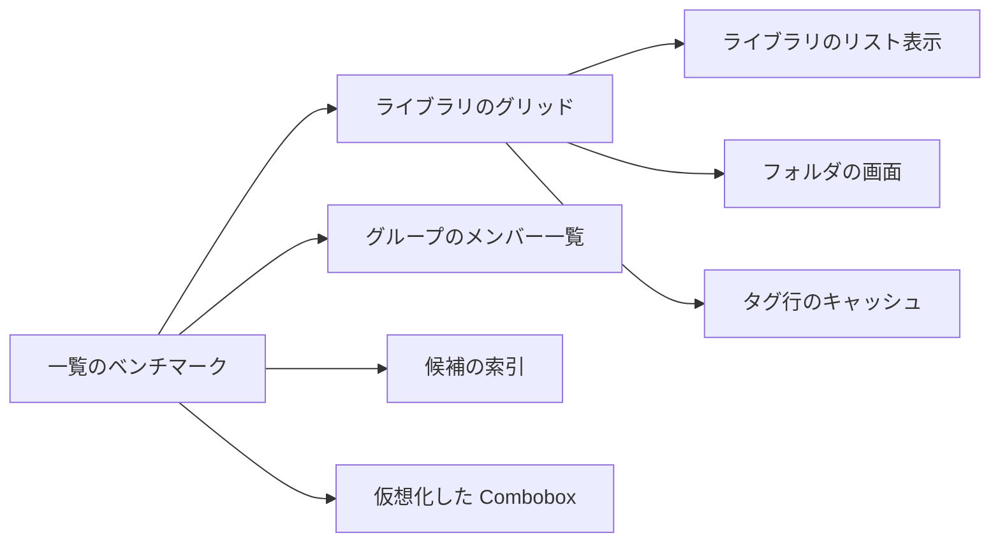

# 実装計画: 数千件でも応答性を保つ長い一覧 {#implementation-plan-long-lists-that-stay-responsive-at-thousands-of-items}

**ブランチ**: `feature/040-long-list-rendering` | **親 Issue**: #675

**入力**: 親 Issue。これがこの機能の仕様である。

## 概要 {#summary}

ライブラリ、フォルダ、フォルダ検索のグリッド、ライブラリのリスト表示、動画ページのグループのメンバー一覧、タグの候補は、動画 30,000 件、動画 6,000 件のグループ、タグ 3,000 件でも応答性を保ち、カードの見た目と並び順は変えない (#675)。長い一覧はそれぞれ、036 からすでに依存関係にある `@tanstack/react-virtual` を使い、ビューポート付近の項目だけを描画する。一覧の位置は項目のアンカーになり、戻る、ズーム、幅の変更で同じカードに着地する。タグの候補は、タグ一覧ごとに 1 回準備した索引を絞り込む。サーバーの遅延は #674 が扱い、範囲外である。

## 技術的な背景 {#technical-context}

**正本の定義**: [ARCHITECTURE.md, Web layer](../../ARCHITECTURE.md#web-layer)、[library-ui.md](../../docs/design-docs/library-ui.md) (スクロールの所有者としてのウィンドウ、共有のグリッド、カード)、[014 UI 設計](../014-video-tags/ui-design.md) (タグ行のあふれ、Combobox)、[017 UI 設計, Member list](../017-folder-groups/ui-design.md) と [017 の契約](../017-folder-groups/contracts/folder-groups-api.md) (#674 によるグループのウィンドウ)、[014 list-url.md](../014-video-tags/contracts/list-url.md) (一覧のスナップショット)、`web/package.json`、`task check`。

**この機能に固有の背景**:

- 規模と予算は親 Issue の受け入れ条件から来る。動画 10,000 件と 30,000 件、タグ 3,000 件、動画 6,000 件のグループ、1280×800 のヘッドレス Chromium、50 ms を超えるフレーム、戻るまで 0.5 秒、候補の 0.2 秒と 0.1 秒である。
- API、スキーマ、依存関係の変更はない。サーバーはすでに一覧を 60 件ずつ、グループを 100 件ずつページ分けしている (#674)。
- これは [library-ui.md, No virtual scrolling](../../docs/design-docs/library-ui.md#no-virtual-scrolling) を覆す。その文書自身の条件は「何が遅いかを測ってから見直す」で、#675 がその測定である ([R-1](research.md#r-1-the-card-grid-draws-only-the-rows-near-the-viewport))。

## 原則の確認 {#constitution-check}

| 規則 | 出典 | 判定 |
| --- | --- | --- |
| ページとコンポーネントは `fetch` を呼ばない | [ARCHITECTURE.md, Web layer](../../ARCHITECTURE.md#web-layer) | 適合: 新しいリクエストはない。グループの一覧は `api/` の `listVideoGroupMembers` を使い続ける |
| スクロールはウィンドウが所有する | [library-ui.md](../../docs/design-docs/library-ui.md#the-window-owns-scrolling) | 適合: グリッドは `useWindowVirtualizer` を使う。`lg` でのグループの列はすでに専用のコンテナを持つ |
| 見た目の値は `@theme` からだけ取る | [library-ui.md](../../docs/design-docs/library-ui.md#visual-values-in-one-css-location-with-contrast-guaranteed-by-tests) | 適合: 新しい色はない。ぼかしは残す ([R-4](research.md#r-4-the-duration-badge-keeps-its-blur)) |
| 文書は振る舞いと一緒に変える | [AGENTS.md](../../AGENTS.md) | 下の各単位が更新する文書を挙げる |
| 依存関係の更新は Renovate に従う | [dependency-updates.md](../../docs/how-to/dependency-updates.md) | 該当しない: 新しい依存関係はない |

## プロジェクトの構成 {#project-structure}

### 文書 (この機能) {#documentation-this-feature}

```text
specs/040-long-list-rendering/
├── plan.md          # This file
├── research.md      # R-1..R-8
└── quickstart.md    # Benchmark scenes per acceptance criterion
```

`data-model.md` はない。データの変更はクライアント側の一覧のスナップショットだけで、`scrollY` の代わりにアンカーを保存する ([R-3](research.md#r-3-one-item-anchor-restores-the-position-after-return-zoom-width-change-and-reload))。`contracts/` はない。HTTP や URL の契約は変わらない。

### ソースコード {#source-code}

**影響する境界**:

| パス | 変更 |
| --- | --- |
| `web/src/videoList/` | `VirtualGrid`、`useListAnchor` (`useZoomAnchor` を置き換える) |
| `web/src/api/listSnapshot.ts` | `scrollY` の代わりにアンカー |
| `web/src/library/` | 仮想化を通すグリッドとリスト表示。タグ行のキャッシュ。候補を作る 1 つのビルダー |
| `web/src/folders/` | サブフォルダ、動画、検索のグリッドを `VirtualGrid` で描画 |
| `web/src/player/` | 仮想化したメンバー一覧。`VideoTags` は共有のビルダーを使う |
| `web/src/ui/Combobox.tsx` | 仮想化したリストボックス |
| `scripts/` | `benchkit` (`tagsbench` から移したランナー)、`listsbench` |
| `web/bench/` | `lists.bench.ts` |

**構成の決定**: `VirtualGrid` は `web/src/videoList/` の `Grid` の隣に置く。ライブラリとフォルダの画面が共有するためである ([ARCHITECTURE.md, Web layer](../../ARCHITECTURE.md#web-layer))。メンバー一覧の仮想化は `RelatedVideos.tsx` の中に留める。幅によってスクロールの所有者が切り替わる一覧を持つ画面はほかにない。

## 実装作業 {#implementation-work}

単位と、先に入る必要があるもの:



### ライブラリ、フォルダ、グループ、タグの候補の画面を規模のデータで測る {#measure-the-library-folder-group-and-tag-suggestion-screens-with-scale-data}

**範囲**: ランナーを `scripts/tagsbench` から `scripts/benchkit` に移し、`tagsbench` のフラグと出力は変えない。`scripts/listsbench`、そのシード、[quickstart.md](quickstart.md) のすべての場面を持つ `web/bench/lists.bench.ts` を追加する。`docs/how-to/tags-admin-benchmark.md` の隣に手順書を追加し、そこからリンクする ([R-8](research.md#r-8-a-list-benchmark-shares-the-tag-benchmarks-runner))。

**依存**: なし

**受け入れ**: `go run ./scripts/listsbench -videos 10000` が quickstart の手順ごとに 1 行を持つ `result.md` を書く。`go run ./scripts/tagsbench -scale 1000` は以前と同じ表を書き続ける。PR 本文に、現在の `main` の両方の規模での基準値を記録する。

### ライブラリのグリッドで見えるカード行だけを描画し、位置を項目で保つ {#draw-only-the-visible-card-rows-in-the-library-grid-and-keep-the-position-by-item}

**範囲**: [R-1](research.md#r-1-the-card-grid-draws-only-the-rows-near-the-viewport) の列の規則を持ち、読み込み中のプレースホルダーを行の項目として扱う `VirtualGrid`。戻る、ズーム、列数の変更、`onBundled` のための、[R-3](research.md#r-3-one-item-anchor-restores-the-position-after-return-zoom-width-change-and-reload) の `useListAnchor` とスナップショットのアンカー。ライブラリのグリッド表示は両方を使う。library-ui.md の "No virtual scrolling" を仮想化したグリッドの説明に書き直し、そこへのリンク (014 UI 設計 "Overflow"、036 research) を直し、014 list-url.md のスナップショットの文を更新する。

**依存**: ライブラリ、フォルダ、グループ、タグの候補の画面を規模のデータで測る

**受け入れ**: 単体テストで、375、1280、1920 px での各ズームの列数、戻る、ズームの変更、列数の変更の後にアンカーの項目が上端に戻ること、スクロールで外れて戻ったカードの選択が保たれることを示す。`listsbench` のライブラリのグリッドの場面が両方のズームで受け入れ条件 1、2、5 を満たす。375 px と 1280 px での目視の確認で、カード、中央に寄せた最後の行、プレースホルダーが以前のとおりであることを示す。

### ライブラリのリスト表示で見える行だけを描画する {#draw-only-the-visible-rows-in-the-library-list-view}

**範囲**: リスト表示の `tbody` を、スペーサー行と [R-2](research.md#r-2-the-list-view-draws-only-the-rows-near-the-viewport-striped-by-item-index) の項目の番号による縞を使ってウィンドウの仮想化に通し、同じアンカーを使う。

**依存**: ライブラリのグリッドで見えるカード行だけを描画し、位置を項目で保つ

**受け入れ**: 単体テストで、スクロールをまたいで項目の番号による縞が交互になることと、戻った後にアンカーが復元されることを示す。`listsbench` のリスト表示の場面が受け入れ条件 1 を満たす。375 px と 1280 px での目視の確認で、列と縞が以前のとおりであることを示す。

### フォルダの画面とフォルダの検索結果で見えるカードだけを描画する {#draw-only-the-visible-cards-on-the-folder-screen-and-in-folder-search-results}

**範囲**: `FolderContents` (サブフォルダと動画)、`RootSearchResults`、`FolderSearchResults` は `VirtualGrid` で描画し、フォルダの画面はアンカーで復元する。library-ui.md のフォルダの画面のスクロール復元の記述が `scrollY` を挙げていれば更新する。

**依存**: ライブラリのグリッドで見えるカード行だけを描画し、位置を項目で保つ

**受け入れ**: フォルダの画面のテストで、戻った後とズームの変更後にアンカーの項目があることを示す。`listsbench` のフォルダの場面が最小のズームで受け入れ条件 1 を満たす。サブフォルダと動画を持つフォルダと、両方の検索結果を 375 px と 1280 px で目視で確認する。

### カードを再び描画するときにタグ行の測定を再利用する {#reuse-the-tag-row-measurement-when-a-card-is-drawn-again}

**範囲**: `TagRowMeasureProvider` にある、一覧ごとの見えるチップ数のキャッシュと、`CardTagRow` でのその利用 ([R-5](research.md#r-5-a-cards-tag-row-reuses-its-measurement-when-it-is-drawn-again))。014 UI 設計 "Overflow" の observer の文を更新する。

**依存**: ライブラリのグリッドで見えるカード行だけを描画し、位置を項目で保つ

**受け入れ**: 単体テストで、同じタグと幅で再マウントした行がチップの幅を読まないことと、幅が変わると測り直すことを示す。最小のズームでの目視の確認で `+N` が以前のとおりである。

### 動画ページのグループ一覧で見えるメンバーだけを描画し、現在のメンバーへ移動する {#draw-only-the-visible-members-in-the-video-pages-group-list-and-jump-to-the-current-member}

**範囲**: [R-6](research.md#r-6-the-group-member-list-virtualizes-the-loaded-members-and-the-position-jumps-to-the-current-member) の 2 つのスクロールの所有者で仮想化したメンバー一覧、仮想化を通した開いたときのスクロール、先頭への追加時の補正の維持、位置を、アクセシブルな名前を `web/src/i18n/en.ts` に持つボタンにすること。017 UI 設計 "Member list" と library-ui.md "Group members" を更新する。

**依存**: ライブラリ、フォルダ、グループ、タグの候補の画面を規模のデータで測る

**受け入れ**: 単体テストで、1,000 件のメンバーを読み込んだ後も描画する行に上限があること、両方の幅で位置を押した後に現在のメンバーが描画されること、先頭への追加の後に見ていた行が動かないことを示す。`listsbench` のグループの場面が受け入れ条件 3 を満たす。375 px と 1280 px での目視の確認で、行と位置が以前のとおりであることを示す。

### タグの候補をタグ一覧ごとに 1 回準備し、動画ページと選択バーで共有する {#prepare-tag-suggestions-once-per-tag-list-shared-by-the-video-page-and-the-selection-bar}

**範囲**: [R-7](research.md#r-7-tag-suggestions-filter-a-prepared-index-and-draw-only-the-visible-rows) の準備した索引を持つ `tagChoices.tsx` の 1 つのビルダー、動画ページのための除外する ID の引数、`VideoTags` 独自の `buildOptions` の削除。

**依存**: ライブラリ、フォルダ、グループ、タグの候補の画面を規模のデータで測る

**受け入れ**: 単体テストで、一連の入力 (空、前方一致、同義語、大文字と小文字、自然な順序、除外する ID) について、新しいビルダーの選択肢と完全一致の選択肢を現在の実装のものと比べ、等しいことを確かめる。`listsbench` のキー入力ごとの場面が受け入れ条件 4 を満たす。

### Combobox で見えるタグの候補だけを描画する {#draw-only-the-visible-tag-suggestions-in-the-combobox}

**範囲**: `Combobox` のリストボックス (ポップアップと `inline`) を `useVirtualizer` に通し、アクティブな選択肢を描画したままにし、`aria-setsize` と `aria-posinset` を保ち、矢印キーのスクロールを仮想化に通す ([R-7](research.md#r-7-tag-suggestions-filter-a-prepared-index-and-draw-only-the-visible-rows))。014 UI 設計 "Combobox" を描画する範囲と集合の大きさで更新する。

**依存**: ライブラリ、フォルダ、グループ、タグの候補の画面を規模のデータで測る

**受け入れ**: Combobox のテストで、3,000 件の選択肢に対して描画する選択肢が最大 1 画面分であること、↓ で最後の選択肢まで進むとそれが描画されて `aria-activedescendant` が解決すること、作成の行が最後のままであることを示す。`listsbench` の開く場面が受け入れ条件 4 を満たす。動画ページ、選択バー、統合のダイアログの一覧を目視で確認する。
