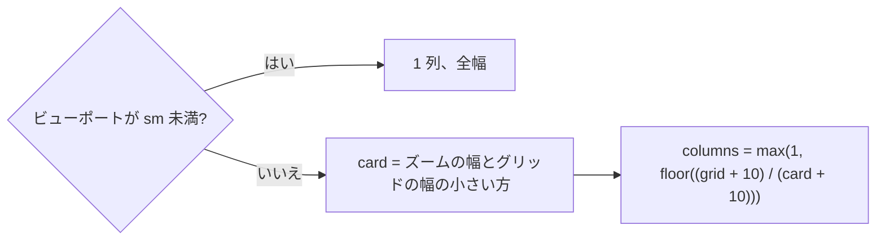
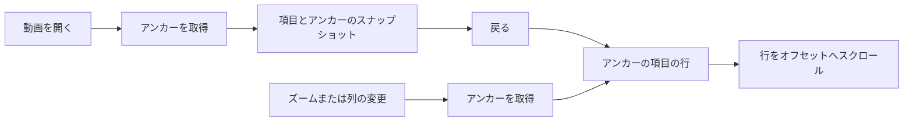

# 調査: 数千件でも応答性を保つ長い一覧 {#research-long-lists-that-stay-responsive-at-thousands-of-items}

引き継ぐ決定: Web 層とそのディレクトリ ([ARCHITECTURE.md, Web layer](../../ARCHITECTURE.md#web-layer))、スクロールの所有者としてのウィンドウと共有のグリッド ([library-ui.md](../../docs/design-docs/library-ui.md))、`@tanstack/react-virtual` の依存関係とタグ管理の一覧でのその利用 ([036 research R-2](../036-tag-admin-scale/research.md#r-2-rows-are-virtualized-with-usewindowvirtualizer-from-tanstackreact-virtual))、グループのメンバーのウィンドウと `GET /api/videos/{id}/group-members` (#674、[017 の契約](../017-folder-groups/contracts/folder-groups-api.md))、規模のデータによるベンチマークの型 ([036 research R-9](../036-tag-admin-scale/research.md#r-9-scriptstagsbench-builds-scale-data-and-a-playwright-script-measures-the-production-build))。このファイルは、この機能が追加する決定だけを記録する。

## R-1: カードのグリッドはビューポート付近の行だけを描画する {#r-1-the-card-grid-draws-only-the-rows-near-the-viewport}

**決定**: ライブラリのグリッド、フォルダのサブフォルダと動画、両方のフォルダの検索結果は、`useWindowVirtualizer` の上に作った 1 つの仮想化したグリッド (`web/src/videoList/VirtualGrid.tsx`) で描画する。このグリッドは項目を計算した列数の行に分け、ビューポート内の行と、上下それぞれ 2 行のオーバースキャンだけを描画する。

| 案 | カード 1,000 枚後の要素 | 動画ページから戻る | 判定 |
| --- | --- | --- | --- |
| **計算した幅の行、`useWindowVirtualizer`、測定した高さ** | 約 1 画面分のカード | 1 画面分を描画する | 採用 |
| 各カードに `content-visibility: auto` | カードごとに増える (1 枚あたり約 55) | React は依然としてすべてのカードを描画する (3.9 秒のタスク) | 不採用: 受け入れ条件 2 と 5 を満たさない |
| ビューポート付近のページだけを保持し、残りを取得し直す | 1 から 3 ページ | 取得し直す | 不採用: 取り込みの後に取得し直すと別の順序が返ることがあり、復元したカードと位置が食い違う (Edge Case "next page loading") |
| `react-window` のグリッド | 1 画面分 | 1 画面分を描画する | 不採用: 固定の行の高さが必要だが、カードの行はタイトルの折り返しとタグ行で高さが異なる |

**理由**: [library-ui.md, No virtual scrolling](../../docs/design-docs/library-ui.md#no-virtual-scrolling) が挙げた 2 つの理由はもう成り立たない。#675 はカード 900 枚で 50,000 の要素と 93 の長いフレームを測定し、列数は 2 つの幅の式で求まる (下記)。各仮想行は現在の `Grid` の行 (`flex justify-center gap-2.5`) なので、端数の最後の行は中央に寄ったままで、カードの見た目と並び順は今とまったく同じである (要件 5)。

列数は、現在 flex のグリッドが行う折り返しに従う:

`grid` は `ResizeObserver` から得るグリッド要素の幅、`card` はズームの段階の `--spacing-card-N` をピクセルに解決したもの、10 は `gap-2.5` である。次のページの読み込み中に表示するプレースホルダーのカードは同じ行の項目なので、今と同じく最後のカードの後に流れる。選択、プレビュー、無限スクロールの番兵は状態をカードの外に持つので、描画する範囲から外れたカードは何も失わない (Edge Case "select all, then scroll")。

## R-2: リスト表示はビューポート付近の行だけを描画し、項目の番号で縞を付ける {#r-2-the-list-view-draws-only-the-rows-near-the-viewport-striped-by-item-index}

**決定**: ライブラリのリスト表示は `table` を保ち、同じ `useWindowVirtualizer` で `tbody` の行を仮想化し、描画する行の上と下にスペーサー行を 1 つずつ使う。ゼブラの縞は `nth-child` ではなく項目の番号から決める。

| 案 | 判定 |
| --- | --- |
| **`tbody` の中のスペーサー行、番号からの縞** | 採用 |
| `nth-child(odd)` を保つ | 不採用: スペーサー行と、動く最初の描画行のせいで、スクロール中に縞が反転する |
| テーブルを絶対配置の `div` の行に置き換える | 不採用: テーブルの意味と、ヘッダーと共有する列の幅を失う |

**理由**: リスト表示は行あたりが軽い (540 行で 8,000 要素だった) が、受け入れ条件 5 はすべての表示に当てはまる。タイトル以外のすべての列は幅が固定なので、描画する行が変わっても列は動かない。

## R-3: 1 つの項目のアンカーで、戻る、ズーム、幅の変更、再読み込みの後の位置を復元する {#r-3-one-item-anchor-restores-the-position-after-return-zoom-width-change-and-reload}

**決定**: 一覧の位置はアンカー、つまり最上部に見える項目のキーと上部バーからのオフセットである。1 つのフック (`useListAnchor`、`useZoomAnchor` を置き換える) が取得し、その項目を今持つ仮想行へスクロールして復元する。一覧のスナップショットは `scrollY` の代わりにこのアンカーを保存する。

| 案 | 判定 |
| --- | --- |
| **項目のアンカー、仮想化を通して復元する** | 採用 |
| 今と同じく `scrollY` を復元する | 不採用: 描画していない行は推定の高さを持つので、同じ `scrollY` が別のカードに着地する |
| 仮想化の測定キャッシュをスナップショットに保存する | 不採用: 動画ページを開いている間の幅やサイドバーの変更は列数を変え、キャッシュした行の高さが行と合わなくなる |

**理由**: 戻る操作 (要件 2)、ズームの変更、列数を変えるウィンドウのリサイズ (Edge Case "width or zoom") はすべて「上端にあったのはどの項目か」という同じ問いを持ち、項目の番号は、ピクセルのオフセットと違い、列数が変わっても有効なままである。スナップショットは項目、総数、カーソルを保つので、[014 list-url.md](../014-video-tags/contracts/list-url.md) と同じく、戻るときに一覧のリクエストはない。`onBundled` の再読み込みとフォルダの画面も同じアンカーを使う。

## R-4: 再生時間のバッジはぼかしを保つ {#r-4-the-duration-badge-keeps-its-blur}

**決定**: 動画とグループのカードの再生時間のバッジに `backdrop-blur-sm` を残す。

| 案 | 判定 |
| --- | --- |
| **ぼかしを保つ。仮想化がレイヤーを描画したカードに限る** | 採用 |
| ぼかしを外す | 不採用: 要件 5 が保つカードの見た目が変わる |

**理由**: #675 での Layerize の 3.25 秒は、文書内のカードの数 (1 枚に 1 つの合成レイヤー) に応じて増える。R-1 の後、その数は約 1 画面分とオーバースキャンになる。最小のズームで、Layerize による 50 ms を超えるフレームをベンチマークがまだ示すなら、見た目の変更は実装の PR で行わず、この Plan に戻す。

## R-5: カードのタグ行は、再び描画されるときに測定を再利用する {#r-5-a-cards-tag-row-reuses-its-measurement-when-it-is-drawn-again}

**決定**: `TagRowMeasureProvider` は、計算した見えるチップ数をタグ一覧と行の幅ごとに保持し、既知の組でマウントする `CardTagRow` は、チップの幅を読まずにその数を取る。

| 案 | 判定 |
| --- | --- |
| **一覧のプロバイダーで、タグ ID と行の幅でキャッシュする** | 採用 |
| 今と同じくマウントのたびに測る | 不採用: 仮想化ではスクロールで戻るたびに行を再びマウントし、それぞれがレイアウトの読み取りを強いる (#675 で 0.5 秒) |
| canvas のテキストの計測からチップの幅を計算する | 不採用: チップの幅にはパディング、アイコン、フォルダ由来の枠線も含まれ、2 つ目の幅のモデルがそれらを追う必要がある |

**理由**: 行の幅とタグが数を決めるので、その組は完全なキーである。プロバイダーは一覧ごとなので、キャッシュは一覧とともに消え、キー以外の無効化は要らない。

## R-6: グループのメンバー一覧は読み込んだメンバーを仮想化し、位置は現在のメンバーへ移動する {#r-6-the-group-member-list-virtualizes-the-loaded-members-and-the-position-jumps-to-the-current-member}

**決定**: メンバー一覧は、表示付近の読み込んだメンバーだけを描画する。`lg` 以上では列のスクロールコンテナに `useVirtualizer` を、`lg` 未満では `useWindowVirtualizer` を使う。`3 / 12` の位置は、現在のメンバーを表示までスクロールするボタンになる。

| 案 | 判定 |
| --- | --- |
| **読み込んだメンバーを仮想化する。読み込みは #674 のウィンドウのまま** | 採用 |
| すべての位置 (`total`) に行を作り、描画する範囲が必要とするページを読み込む | 不採用: `lg` 未満ではページが数千行の高さになり、関連動画に届かない |
| 移動の操作なしに、現在のメンバーの行を常に描画する | 不採用: 行は存在するが、ユーザーにはそこへ戻る手段がまだない (Edge Case "current video off screen") |
| 別の `Jump to current` ボタン | 不採用: 列のヘッダーに操作が増える。位置がすでに現在のメンバーを示している |

**理由**: #674 で最初の表示は 100 メンバーになったが、スクロールするとすべてを読み込み、各行はホバーのプレビュー、スクラブの帯、ウィンドウの `resize` リスナーを持つ。2 つのスクロールの所有者は幅で異なる (読み込みの方向がすでにそうであるように) ので、仮想化した一覧は `useWideScreen` で選ぶ 2 つのコンポーネントである。`lg` での開いたときのスクロールは `scrollIntoView` の代わりに `align: "auto"` 付きの `scrollToIndex` を使い、先頭への追加時の補正は、仮想化の全体の高さが先頭に追加した行とともに増えるので動き続ける。

## R-7: タグの候補は準備した索引を絞り込み、見える行だけを描画する {#r-7-tag-suggestions-filter-a-prepared-index-and-draw-only-the-visible-rows}

**決定**: 1 つのビルダー (`web/src/library/tagChoices.tsx`) が動画ページと選択バーに使われる。ビルダーはタグ一覧ごとに 1 回、各タグの畳み込んだ名前と同義語を自然な順序で準備し、キー入力ごとに前方一致を先にする安定な分割でその順序を絞り込む。`Combobox` は一覧に `useVirtualizer` を使い、見える選択肢だけを描画する。

| 案 | タグ 3,000 件で開く | キー入力ごと | 判定 |
| --- | --- | --- | --- |
| **準備した索引 + 仮想化したリストボックス** | 約 10 行を描画 | 線形走査、並べ替えなし | 採用 |
| 統合のダイアログと同じサーバー検索 (`GET /api/tags?q=…&limit=`) | 1 回のリクエスト | 1 回のリクエスト。タグ数の集計が大半を占める | 不採用: キー入力ごとの 0.1 秒を満たさず、一致の方法が `includes` からサーバーの畳み込みに変わる |
| 最初の N 件の一致だけを表示する | N 行 | 線形走査 | 不採用: 入力が空のとき、ほとんどのタグに一覧から届かなくなる |
| `useDeferredValue` だけ | 3,000 行を描画 | 遅延するが、依然として並べ替える | 不採用: 開くこと自体が 0.9 から 1.2 秒のタスクである |

**理由**: 結果の順序は変わらない ([014 UI 設計, Combobox](../014-video-tags/ui-design.md#combobox))。自然な順序は 1 回だけ計算し、前方一致による安定な分割が各部分の中でその順序を保つ。アクティブな選択肢は常に描画する範囲にある (`rangeExtractor`) ので、`aria-activedescendant` は要素を指す。各選択肢は `aria-setsize` と `aria-posinset` を持つので、支援技術は全体の数を引き続き読み上げる。統合のダイアログのサーバーに基づく一覧は同じ `Combobox` を通り、変更は要らない。

## R-8: 一覧のベンチマークはタグのベンチマークのランナーを共有する {#r-8-a-list-benchmark-shares-the-tag-benchmarks-runner}

**決定**: `scripts/tagsbench` のランナー (シード、コピー、`bin/mdm` の起動、Playwright のファイルの実行、`result.md` の書き込み) は `scripts/benchkit` に移り、新しい `scripts/listsbench` が独自のシードと `web/bench/lists.bench.ts` とともにそれを使う。

| 案 | 判定 |
| --- | --- |
| **共有のランナー、別のコマンドとシード** | 採用 |
| `tagsbench` にフラグを増やす | 不採用: そのデータの名前、既定値、文書はタグの規模についてのもので、一覧の場面にはそれが作らないフォルダの配置が要る |
| #674 のときのようにリポジトリの外に置くスクリプト | 不採用: 受け入れは測定であり、これらの画面への次の変更はそれを繰り返す必要がある |

**理由**: シードは、動画 6,000 件を 1 つの末端のフォルダ (グループ) に、3,000 件を子フォルダを持つフォルダ (グループではない。フォルダの画面用) に、残りをメディアフォルダの直下に置き、タグは `tagsbench` の計画から 3,000 件とする。起動時にフォルダの索引を作るので、シードは `tagsbench` と同じく、`internal/store` のロールの型を通して、動画、場所、タグの行だけを書く。動画 10,000 件と 30,000 件で実行し、`task check` や CI には含まれない。
