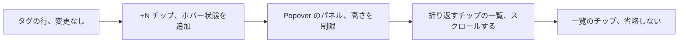
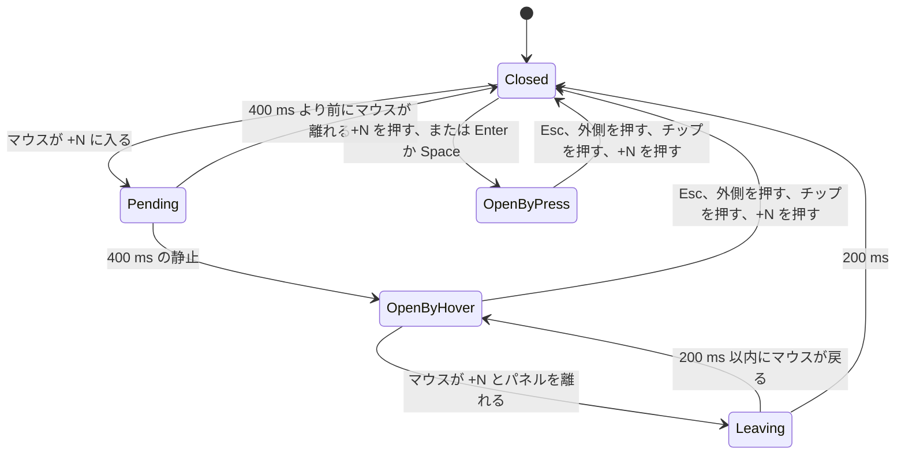

# UI 設計: カードの `+N` の裏に隠れたタグを、何個でも見えて押せるようにする {#ui-design-hidden-tags-behind-a-cards-n-visible-and-pressable-at-any-count}

**機能**: [親 Issue #813](https://github.com/syudead/vv/issues/813) · [plan.md](plan.md) · [research.md R-1](research.md#r-1-resting-the-mouse-on-n-opens-the-same-popover-that-pressing-opens) · [R-2](research.md#r-2-the-list-is-a-wrapping-row-of-chips-that-scrolls-inside-the-viewport) · [R-3](research.md#r-3-chips-in-the-list-never-truncate-a-long-name-wraps-inside-its-chip) · [R-4](research.md#r-4-the-list-is-derived-from-the-current-tags-never-copied-when-it-opens) · [quickstart.md](quickstart.md)

すでに決めている出典。ここでは繰り返さずにリンクする。

| 項目 | 出典 |
| --- | --- |
| トークン、閉じたスケール、浮いた層にだけ付く影 | [design-system.md、基礎](../../docs/design-docs/design-system.md#foundations)。[`web/src/ui/tokens.css`](../../web/src/ui/tokens.css) の `@theme` の値。ここでは名前で示し、決してコピーしない |
| `Popover` と `Badge`: 何に使うか、既定の幅、バリアント | [components.md、Popover](../../web/registry/rules/components.md#popover) と [Badge](../../web/registry/rules/components.md#badge)。[`popover.tsx`](../../web/src/ui/shadcn/popover.tsx) (パネルの面、角丸、影、オフセット、衝突時の余白) |
| タグの行、`+N` チップ、何個のチップが収まるか、押す操作、選択 | [014 UI 設計、タグの行](../014-video-tags/ui-design.md#tag-row)、[あふれ](../014-video-tags/ui-design.md#overflow)、[カードの構造と押す操作](../014-video-tags/ui-design.md#card-structure-and-pressing)。現在の [`CardTagRow.tsx`](../../web/src/library/CardTagRow.tsx) |
| フォルダ由来のチップと仮のマーク | [017 UI 設計、フォルダ由来のタグのチップ](../017-folder-groups/ui-design.md#folder-derived-tag-chip)、[031 UI 設計、仮のマーク](../031-tentative-tags/ui-design.md#tentative-mark) |
| ホバーで何かを見せる前の、マウスだけの 400 ms の静止。カードのホバープレビュー | [010 UI 設計、操作](../010-hover-video-preview/ui-design.md#interaction) |
| 操作の状態、CSS で読む幅、カード | [library-ui.md、操作の状態](../../docs/design-docs/library-ui.md#interaction-states)、[幅のブレークポイントは CSS に置き、サイドバーは例外とする](../../docs/design-docs/library-ui.md#width-breakpoints-in-css-and-the-sidebar-exception)、[カード](../../docs/design-docs/library-ui.md#cards) |
| 画面の文言 | [`web/src/i18n/en.ts`](../../web/src/i18n/en.ts) (`library.tagRow`)。この機能は何も加えない |

この機能が変えるコンポーネントは `CardTagRow` の 1 つで、動画のカード、グループのカード、フォルダ画面のカードがこれを描画する。図はその部品と、どれが変わるかを示す。

変わらないもの: 行がどのタグを示し何個収まるか、行のチップ、選択中の `+N` (ただのチップで、一覧はない)、リスト表示、動画ページのタグ (親 Issue の範囲外の一覧)。

## この形にする理由 {#why-this-shape}

一覧は `+N` に固定した `Popover` のままなので、見る人がタグを読む間もカードは見えたままである。中のチップは、1 行に 1 つではなく折り返すグリッドに並べた行のチップである。30 個のチップの列は目で追えず、ビューポートからはみ出す。同じチップを折り返すかたまりにし、Radix が報告する空きに高さを制限して中でスクロールさせれば、どのタグにも届き、大半を一目で見られる (R-2)。`Dialog` や `Sheet` はカードを隠し、行をその場で伸ばすと後ろのカードがすべて動く (どちらも R-2 で採用しなかった)。

一覧はカードのすべてのタグを一度に並べる唯一の場所なので、長い名前を全部読むのはここである。行では幅を他のチップと分け合うので、省略を続ける (R-3)。止まったマウスで開くときは、製品がホバーで何かを見せる前にすでに使っている 400 ms の静止を使う。そのため一覧は 3 つ目のタイミングを加えず、ホバープレビューやツールチップと同じように振る舞う (R-1)。

## 文言 {#words}

| 場所 | 文言 | 備考 |
| --- | --- | --- |
| なし | | `+N` は文言とアクセシブルな名前を `library.tagRow.more` と `showMore` から取り続ける。チップは `filterBy` とその派生を使い続ける |

## `+N` チップ {#the-n-chip}

チップは 014 の行のチップの形を保つ。状態が 1 つ加わる。一覧が開いている間は、ホバーでも押す操作でも、`+N` をホバーの見た目 (`bg-accent`、`text-foreground`、トリガーの `data-open` バリアントを通す) で描く。そうすると開いたパネルが出元のチップと目に見えて結び付き、ポインタがチップを離れてパネルへ移るときにチップの見た目がちらつかない。

| 状態 | チップが示すもの |
| --- | --- |
| 静止 | 行のチップの静止時の見た目 (`secondary` の面、`text-muted-foreground`) |
| マウスが上にあり、一覧はまだ開いていない | 行のチップのホバーの見た目。開く途中であることは何も知らせない |
| 一覧が開いている (ホバーまたは押す操作) | ホバーの見た目。一覧が閉じるまで保つ |
| キーボードのフォーカス | 共通のフォーカスの輪郭。014 と同じくチップの内側に描く |
| 選択中 | ボタンではないただのチップ。ホバーの見た目も一覧もない (014) |

チップには何も加えない。キャレットも下線もツールチップもない。チップの文言がすでにほかにもタグがあることを示しており、静止から開くまでの遅れは、見る人がヒントを読むのにかかる時間より短い。

## 一覧 {#the-list}

パネルはデザインシステムの `Popover` のパネルである。`bg-popover`、`rounded-lg`、`shadow-elevated` で、自前の枠線はなく、コンポーネントの既定のオフセットと衝突時の余白で、`+N` の下に `align="start"` で開く。その中で、隠れたタグは行の順に並んだ行のチップで、必要なだけの行に折り返し、チップの間は縦横とも `gap-1` である。

| 観点 | 規則 |
| --- | --- |
| 幅 | チップの幅に合わせ、最大で `max-w-popover`。短い名前が 1 つなら小さなパネルになり、チップがおよそ 3 個からパネルがその段階に達してチップが折り返す |
| 高さ | Radix が利用可能と報告する高さ (`--radix-popover-content-available-height`。`PopoverContent` がすべてのポップオーバーに設定する) に制限する。チップの一覧はパネルの中で縦にスクロールする |
| 余白 | `p-2`。スクロール領域の外に置くので、チップはパネルの縁に決して触れず、スクロールバーはチップの上ではなく、チップの横の余白の内側に収まる |
| 位置 | 収まるなら `+N` の下、収まらなければ上。パネルがビューポートの縁から `collisionPadding` 離れるように横にずらす (Radix) |
| 内容 | チップだけ。見出しも、数も、閉じる操作も、`Show all` のリンクもない (`UI品質`、操作の優先順位) |
| スクロールの手がかり | スクロールバーだけ。下端のフェードは付けない。014 が行のフェードを採用しなかったのと同じ理由で、フェードはほかに続きがあるかを示さない |

一覧は描画のたびに行の現在のタグから導く (R-4)。一覧が開いている間に外したタグは一覧から消え、収まるようになったタグは行に移り、何も隠れていなければ `+N` とパネルがともに消える。

### 一覧のチップ {#list-chip}

一覧のチップは行のチップ (`Badge` の `secondary`、またはフォルダ由来のタグなら破線の `outline` の形で、名前の後に仮のマークが付く) で、違いは 1 つだけである。決して省略しない。

| 名前 | チップ |
| --- | --- |
| パネルの内側の幅に収まる | 行のチップの高さと文字で、行とまったく同じ。幅は名前の幅 |
| パネルの内側の幅より広い | チップはパネルの内側の幅いっぱいに広がる。名前はチップの中で次の行へ折り返し、区切れる空白がなければ単語の途中で区切り、左揃えにする。チップの高さはその行の分だけ増える |
| フォルダ由来または仮 | 名前の前のフォルダのマークと名前の後の仮のマークは 1 行目に留まる |

折り返したチップは例外であり、一覧の形ではない。`max-w-popover` ではおよそ 40 文字の名前もまだ 1 行に収まるので、普通のタグは行のチップの大きさを保ち、一覧は行の続きとして読める。チップの `title` は、どのチップでもそうであるように名前を保つが、それに頼るものは何もない (要件 5)。

### 操作 {#interaction}

図は一覧がどう開き、どう閉じるかを示す。

| 出来事 | 振る舞い |
| --- | --- |
| マウスのポインタ (`pointerType` が `mouse`) が `+N` の上で 400 ms 止まる | 一覧が開く。フォーカスは動かない。`+N` はホバーの見た目を保つ |
| マウスが `+N` を横切り、400 ms 以内に離れる | 何も開かない (受け入れ条件 3) |
| マウスが `+N` からパネルへ移る | 一覧は開いたまま。両者の間の 6 px の隙間は 200 ms の閉じる遅れで補う (要件 2) |
| マウスが `+N` とパネルを 200 ms 離れる | 一覧が閉じる。`+N` は静止に戻る |
| タッチ、ペン、マウスで `+N` を押す、またはフォーカス中に `Enter` か `Space` | 今までどおり一覧を開閉する (R-1)。したがって、ホバーで一覧が開いている間に押すと閉じ、もう一度押すと押して開いた一覧として開く |
| 押して開いた | フォーカスが最初のチップへ移る。閉じるとフォーカスは `+N` に戻る (今までの振る舞い) |
| どの入力でもチップを押す | タグで絞り込む (ライブラリ) か `/?tag=<id>` を開き (フォルダ)、一覧が閉じる (要件 6) |
| `Esc`、外側を押す | 一覧がどう開いたかにかかわらず閉じる |
| キーボードのフォーカスが `+N` に来る | 何も開かない。`Enter` か `Space` で開く |
| 開いた一覧の中で `Tab` | チップを順に移る。スクロールした範囲の外のチップはスクロールして見えるようにする |
| ポインタがパネルの上で止まる | その下のカードは静止の状態で描く。パネルはカードの外にあるので、ポインタがカードを離れたときについて 010 が述べるとおり、カードのホバーの浮き上がりとホバープレビューは終わる |
| 開いている間にタグ、ズーム、幅が変わる | 一覧は新しい隠れたタグを示すか、何も隠れていなければ `+N` とともに閉じる (R-4) |
| 見る人が画面を離れる | パネルは行とともにアンマウントされる |

カードのホバープレビューは 010 の規則を変えずに保つ。`+N` はカードの内側にあるので、`+N` の上で 400 ms 止まるとプレビューと一覧が同時に始まる。パネルへ移るとプレビューは止まる。010 がチェックボックスを除くように `+N` をプレビューのタイマーから除くのは 010 の変更であり、この機能には含まない。

## レスポンシブな振る舞い {#responsive-behaviour}

一覧の入力とレイアウトは、幅のブレークポイントではなく、ポインタと Radix が報告する空きで決まる。下の幅は実装を評価する幅であり、ほかの幅で変わるのはグリッドが示すカードの数だけである。

| 幅 | レイアウト |
| --- | --- |
| 390×844 (スマートフォン、タッチ) | `+N` をタップすると一覧が開く。マウスのポインタがないので、ホバーでは何も開かない。パネルは最大で `max-w-popover` で、両側に衝突時の余白を取っても幅の中に収まる。30 個のタグの一覧は画面中ほどのカードの下の空きより高いので、高さを制限してスクロールさせる。60 文字の名前はチップの中で 2 行か 3 行に折り返す |
| 768×1024 (タブレット) | 入力は、タッチなら 390×844 と同じで、マウスかトラックパッドを付けていれば 1280×800 と同じ。パネルの幅と折り返しは 1280×800 と同じ |
| 1280×800 (デスクトップ、マウス) | 一覧は静止でも押す操作でも開く。上端の行のカードの下では、パネルにはスクロールなしでおよそ 30 個のチップの空きがある。最後の行のカードの下では `+N` の上に開き、どちら側にも空きがなければ横に開き、空きに制限してスクロールさせる (端のケース) |

## 評価の基準 {#review-criteria}

1280×800 ではマウスで、390×844 ではタッチで、ライブラリを見て評価する。対象は、隠れたタグが 30 個でそのうち 1 個が 60 文字のカードと、隠れたタグが 2 個のカードである。

1. **視覚の階層**: パネルの中で目が向かうのはタグの名前である。パネルがカードと区別されるのは `popover` の面と `shadow-elevated` だけで、見出し、数、枠線、操作のどれもチップと競わない。開いているとき、`+N` は行の中でホバーの見た目をした唯一のチップであり、パネルはそのチップのものとして読める。
2. **情報の密度**: 1280×800 で、カードが上端の行にあるとき、30 個のタグの一覧は 1 行に少なくとも 3 個のチップを示し、30 個の大半をスクロールなしで示す。390×844 では、パネルの幅が同じなので、パネルの 1 行あたりのチップの数は 1280×800 と同じであり、一覧は最後のチップまでスクロールする。2 個のタグの一覧は小さなパネルであり、空の `max-w-popover` の箱ではない。
3. **余白のリズム**: パネルの中のチップの間隔は、縦横とも行の中のチップの間隔と等しい。パネルの余白はその間隔より広く、チップはパネルの縁にもスクロールバーにも決して触れない。
4. **文字**: 名前が収まる一覧のチップは、行の同じチップと見分けがつかない (高さ、文字の大きさ、太さ、色、フォルダのマーク、仮のマーク)。60 文字のチップは `…` なしで名前全体を複数行に左揃えで示し、マークは 1 行目に置く。
5. **操作の優先順位**: パネルの中で押せる要素はすべてタグのチップである。1 つを押すと絞り込んでパネルを閉じ、パネルの中にほかのことをするものはない。
6. **ビューポートの内側**: 1280×800 の最後の行のカードと 390×844 のどのカードでも、パネルの箱がビューポートの内側にあって各縁から `collisionPadding` 以上離れ、一覧をスクロールすると最後のチップに届く。箱の外にはみ出す `shadow-elevated` はビューポートの縁で切れてもよい。Radix が配置するのは箱であり、描かれた影ではない。また、この設計はコンポーネントの既定の衝突時の余白を保つ。
7. **ホバーの意図**: 1280×800 で、マウスがタグの行を横切ってカードを離れても何も開かない。`+N` の上で止まると、クリックなしで、ページのどこにもフォーカスの輪郭を出さずに一覧が開く。下へ動いてパネルに入ると開いたままである。パネルを離れると少し間を置いて閉じ、途中で `+N` がちらつかない。
