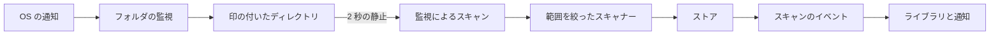
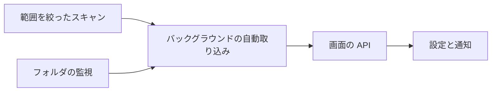

# 実装計画: 変更されたメディアフォルダを自動で取り込む {#implementation-plan-auto-import-changed-media-folders}

**ブランチ**: `feature/042-folder-watch-import` | **親 Issue**: #786

**入力**: 親 Issue。これがこの機能の仕様である。

## 概要 {#summary}

所有者がメディアフォルダでファイルを追加、削除、移動、名前変更すると、VVMDM は OS の変更通知でそれを知り、変更されたディレクトリだけを読み直すので、手動のスキャンなしでライブラリが追従する。何も変わらない間はメディアフォルダを読むものはなく、完全なスキャンは手動のままである。

図は、1 つの変更が通知からライブラリに届くまでの経路を示す。



| 関心事 | 方針 |
| --- | --- |
| 通知 | fsnotify。Linux と Windows で、ディレクトリごとに 1 つの監視 ([R-1](research.md#r-1-fsnotify-watches-every-directory-on-both-platforms)) |
| 何を読み直すか | 印の付いたディレクトリだけ。削除もそれらに限る ([R-2](research.md#r-2-a-change-marks-a-directory-dirty-and-only-dirty-directories-are-re-read)) |
| コピー中のファイル | ファイルは 10 秒変化がなければ取り込む。追加を削除より先に行う ([R-3](research.md#r-3-a-batch-waits-for-quiet-imports-settled-files-then-removes)) |
| まとまりの実行 | `origin = 'watch'` のスキャンの行。`partial` か `failed` で終わらない限り表示しない ([R-4](research.md#r-4-a-watch-batch-is-a-scan-row-with-origin-watch)) |
| 手動のスキャンとフォルダの変更 | 実行中の監視のまとまりに取って代わる ([R-5](research.md#r-5-a-manual-scan-or-a-media-folder-change-supersedes-a-watch-batch)) |
| 失われたイベント、監視の上限 | Settings で知らせ、決してスキャンで補わない ([R-6](research.md#r-6-lost-events-and-watch-limits-are-reported-never-repaired-by-a-scan)) |
| 設定 | `settings.library.auto_import`。ないときはオン ([R-7](research.md#r-7-the-setting-is-a-stored-key-that-defaults-to-on)) |

親 Issue のとおり範囲外のもの: 定期的なスキャン、起動時のあらゆる確認、通知が届かない環境 (コンテナの中でマウントした NFS や SMB、Docker Desktop のバインドマウント) での自動取り込み、メディアフォルダを追加したときにスキャンを始めること。

## 技術的な文脈 {#technical-context}

**正本の定義**:

| 項目 | 出典 |
| --- | --- |
| 境界、依存の方向、「メディアフォルダに触れるのはスキャンだけ」という不変条件 | [ARCHITECTURE.md](../../ARCHITECTURE.md)、[.golangci.yml](../../.golangci.yml) (depguard) |
| スキャン、取り込み、削除、同じパスでの継承 | [internal/scanner/scanner.go](../../internal/scanner/scanner.go)、[internal/app/scans.go](../../internal/app/scans.go)、[internal/store/scans.go](../../internal/store/scans.go)、[internal/store/scan_index.go](../../internal/store/scan_index.go)、[030 データモデル、Carry-over of content at the same path](../030-video-versions/data-model.md#carry-over-of-content-at-the-same-path) |
| 取り込みの進み具合、問題、`scan` イベント | [024 の契約](../024-import-progress/contracts/scan-api.md)、[024 データモデル](../024-import-progress/data-model.md) |
| 起動と停止の順序 | [process-lifecycle.md](../../docs/design-docs/process-lifecycle.md)、[cmd/mdm/main.go](../../cmd/mdm/main.go) |
| 保存する設定と Settings 画面 | [internal/store/settings.go](../../internal/store/settings.go)、[037 のネットワーク設定の契約](../037-windows-app/contracts/network-settings-api.md) |
| 画面の API と生成コード | [api/openapi.yaml](../../api/openapi.yaml)、`task generate` |
| 検査 | [Taskfile.yml](../../Taskfile.yml) (`task check`、`task check-docs`、`task build-windows-check`) |

**この機能に固有の文脈**:

- 新しい Go の依存: `github.com/fsnotify/fsnotify` v1.10.1 (これは `golang.org/x/sys` を必要とし、それはすでに `go.mod` にある)。
- マイグレーションを 1 つ、`00033_scan_origin.sql` ([data-model.md](data-model.md#migration))。
- `Scanner` ポートが範囲を持つ。`Scan(ctx)` は完全なスキャンになり、新しい範囲を絞ったスキャンは印の付いたディレクトリを受け取る。今の削除はすべてのルートを辿ることを前提にしており、部分的に辿った範囲の外にあるすべての動画を削除してしまう。
- Windows のコードを実行する CI のランナーはない。Windows 側は `task build-windows-check` と [quickstart.md](quickstart.md) の Windows の行で確認する。

## Constitution Check {#constitution-check}

| 規則 (出典) | 判定 |
| --- | --- |
| アダプターは互いにも `internal/app` にも依存しない (ARCHITECTURE.md、depguard) | 適合: 監視は新しいアダプター `internal/watcher` である。`internal/app` が使うポートを宣言し、`cmd/mdm` が組み立てる |
| 「メディアフォルダを辿るのはユーザーが始めたスキャンだけ」(ARCHITECTURE.md、Cross-cutting invariants) | `要件 1` により意図して変える: 不変条件は「メディアフォルダのファイルを読むのはスキャンだけであり、全体を辿るのは手動のスキャンだけ」になる。フォルダの監視はディレクトリのエントリだけを読む。ARCHITECTURE.md の編集は監視を加える単位に含める |
| 実行中のスキャンは 1 つで、データベースが強制する (ARCHITECTURE.md) | 適合: 監視のまとまりは同じインデックスの下のスキャンの行である ([R-4](research.md#r-4-a-watch-batch-is-a-scan-row-with-origin-watch)) |
| コミット後のイベント (ARCHITECTURE.md) | 適合: 新しいドメインイベントはない。監視によるスキャンは手動のものと同じく `ScanChanged` を発行する |
| `internal/app` は自分のインターフェースを通してだけ外に届く (ARCHITECTURE.md) | 適合: 監視のポートと範囲を絞ったスキャンは `internal/app` のインターフェースである |
| 生成ファイルを手で編集しない (AGENTS.md) | 適合: `api/openapi.yaml` を変え、`task generate` を実行する |
| 制約はテストできる (core-beliefs.md) | 適合: まとめる規則は `internal/app` のテストで偽の監視と時計に対して動く |

違反はないので、複雑さの追跡はない。

## プロジェクトの構成 {#project-structure}

### 文書 (この機能) {#documentation-this-feature}

```text
specs/042-folder-watch-import/
├── plan.md
├── research.md
├── data-model.md
├── quickstart.md
└── contracts/
    └── screen-api.md
```

`ui-design.md` は `design` 段階が書く (Issue に `ui` ラベルがある)。

### ソースコード {#source-code}

**影響する境界**:

| 境界 | この機能で受け持つもの |
| --- | --- |
| `internal/scanner` | 範囲を絞ったスキャン: 印の付いたディレクトリを辿る、追加を削除より先に行う、範囲を絞った削除 |
| `internal/store` | `scans.origin`、監視によるスキャンでの問題の引き継ぎ、`done` の監視によるスキャンでの継承、`library.auto_import` キー |
| `internal/watcher` (新規) | fsnotify の監視、それを張るためにディレクトリを辿ること、イベントから印の付いたディレクトリへの対応付け、監視の問題 |
| `internal/app` | `AutoImport`: 印の付いたディレクトリの集合、静止と落ち着きのタイマー、`Scans` を通じた監視によるスキャンの実行、取って代わる規則、設定 |
| `internal/httpapi`、`api/openapi.yaml` | `Scan.origin`、`/api/settings/auto-import` |
| `cmd/mdm` | 組み立て、`ResumeInterrupted` の後の起動、バスが閉じる前の停止 |
| `web/src/shell`、`web/src/settings` | 監視の進み具合を隠すこと、失敗の通知、切り替えと監視の状態 |

**新しいパス**: `internal/watcher/`、`internal/app/auto_import.go`、`internal/store/migrations/00033_scan_origin.sql`、`docs/design-docs/folder-watching.md`。

**構成の決定**: 監視は `internal/scanner` の一部ではなく独立したアダプターにする。監視は長く生きる OS のハンドルとゴルーチンを持つが、スキャナーは終わりのある呼び出しだからである。depguard が両者を分けておく。

## 実装作業 {#implementation-work}

図は、どの単位が先に入る必要があるかを示す。



### スキャンの範囲を変更されたディレクトリに絞り、誰が始めたかを記録する {#scope-a-scan-to-changed-directories-and-record-who-started-it}

**範囲**: スキャナーの範囲を絞ったスキャンと、[data-model.md、Rules](data-model.md#rules) のストアの変更: `scans.origin` とそのマイグレーション、範囲を絞った削除、追加を削除より先に行うこと、取って代わられたときの停止、問題の引き継ぎ、`done` の監視によるスキャンでの継承、起動時に手動のスキャンだけを再開すること。完全なスキャンの振る舞いは変わらない。

**依存**: なし。

**受け入れ**: `task check` が通り、スキャナーとストアのテストが次を示す: 1 つのディレクトリの範囲を絞ったスキャンは、その外のすべての場所を残す。1 つのまとまりの中で、印の付いた 2 つのディレクトリの間を移動したファイルは、動画の id、タグ、再生位置を保つ。削除された印の付いたサブツリーは場所を失う。取って代わられたスキャンは何も削除せず `done` で閉じる。監視によるスキャンは、範囲の外では前のスキャンの問題を保つ。中断された監視によるスキャンは起動時に閉じられ、再開されない。

### fsnotify でメディアフォルダの変更を監視する {#watch-media-folders-for-changes-with-fsnotify}

**範囲**: アダプター `internal/watcher` ([R-1](research.md#r-1-fsnotify-watches-every-directory-on-both-platforms)、[R-2](research.md#r-2-a-change-marks-a-directory-dirty-and-only-dirty-directories-are-re-read)、[R-6](research.md#r-6-lost-events-and-watch-limits-are-reported-never-repaired-by-a-scan)): ディレクトリだけを読んでメディアフォルダの集合に監視を張る、スキャナーが除外するディレクトリとシンボリックリンクを飛ばす、作られたディレクトリごとに監視を加える、各変更をディレクトリと再帰のフラグとして知らせる、あふれ、監視の上限、権限、届かないフォルダの問題を知らせる。fsnotify の依存を加える。

**依存**: なし。

**受け入れ**: `task check` と `task build-windows-check` が通る。一時ディレクトリでの Linux のテストが次を示す: 作られた、削除された、名前を変えたファイルはそれぞれ親を知らせる。作られた、または削除されたディレクトリは自分を再帰として知らせる。新しく作られたサブディレクトリの中のファイルが知らされる。強制したあふれと読めないディレクトリはそれぞれの問題を知らせる。

### 変更されたフォルダをバックグラウンドで取り込む {#import-changed-folders-in-the-background}

**範囲**: `internal/app` の `AutoImport` ([R-3](research.md#r-3-a-batch-waits-for-quiet-imports-settled-files-then-removes)、[R-5](research.md#r-5-a-manual-scan-or-a-media-folder-change-supersedes-a-watch-batch)、[R-7](research.md#r-7-the-setting-is-a-stored-key-that-defaults-to-on)、[R-8](research.md#r-8-an-interrupted-watch-batch-is-closed-not-resumed)): 印の付いたディレクトリの集合、2 秒の静止と 10 秒の落ち着きのタイマー、監視によるスキャンの実行、手動のスキャンやメディアフォルダの変更で取って代わることとフォルダの変更の後に監視を張り直すこと、保存する設定、[contracts/screen-api.md](contracts/screen-api.md#get-apisettingsauto-import) の監視の状態、`cmd/mdm` での組み立てと順序。ARCHITECTURE.md (不変条件とサブシステムの地図)、process-lifecycle.md、running-vv.md (「Scans are manual」) を更新し、設計文書の索引からリンクした `docs/design-docs/folder-watching.md` を加える。

**依存**: スキャンの範囲を変更されたディレクトリに絞り、誰が始めたかを記録する。fsnotify でメディアフォルダの変更を監視する。

**受け入れ**: `task check` と `task check-docs` が通り、偽の監視と時計を使う `internal/app` のテストが次を示す: イベントが 2 秒以内に届き続ける間はスキャンしない。静止の後、ちょうど印の付いたディレクトリを対象に監視によるスキャンを 1 回行う。落ち着いていないファイルは印の付いたまま残り、落ち着いたら取り込まれる。手動のスキャン中の変更はその後に取り込まれる。手動の開始が実行中のまとまりに取って代わる。設定をオンにしてもスキャンは始まらない。実行中の監視によるスキャンは `Busy` を真にしない。

### 自動取り込みの設定とスキャンの起点を画面の API に出す {#expose-the-auto-import-setting-and-scan-origin-in-the-screen-api}

**範囲**: [contracts/screen-api.md](contracts/screen-api.md) のための `api/openapi.yaml`、ハンドラー、生成コード: `Scan.origin` と `GET`/`PUT /api/settings/auto-import`。

**依存**: 変更されたフォルダをバックグラウンドで取り込む。

**受け入れ**: `task check` が通り、`task generate` で差分が出ない。ハンドラーのテストが次を示す: 新しいデータベースで `GET` が `enabled: true` と監視の状態を返す。`PUT` はスキャンを始めずに選択を保存する。ゲストは所有者専用の応答を受け取る。`scan` イベントが `origin` を運ぶ。

### Settings の自動取り込みの切り替えと、目立たない自動取り込みの通知 {#auto-import-toggle-in-settings-and-quiet-auto-import-notices}

**範囲**: `ui-design.md` に従う: Settings の切り替えと監視の状態、`watch` のスキャンでは右下に進み具合を出さないこと、`watch` のスキャンが `partial` か `failed` で終わったときの失敗の通知 (`要件 6`、`要件 7`、`UI品質` の節)。

**依存**: 自動取り込みの設定とスキャンの起点を画面の API に出す。

**受け入れ**: `task check` が通り、e2e の spec が次を示す: 進行中の `watch` のスキャンは右下に何も出さない。`partial` で終わったものは通知を出し、その問題を Settings に出す。切り替えは選択を保存し、再読み込みの後も残る。ゲストには切り替えが見えない。画面が変わるので、実装は `ui-design.md` に照らした見た目のレビューを負い、単位が入ったら [quickstart.md](quickstart.md) の行を実行する。
