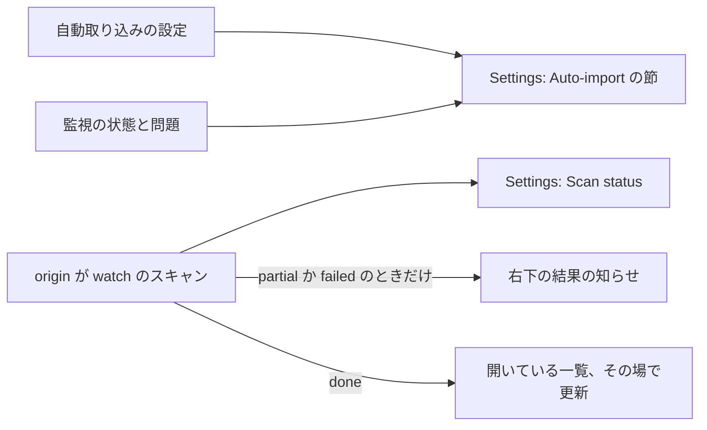
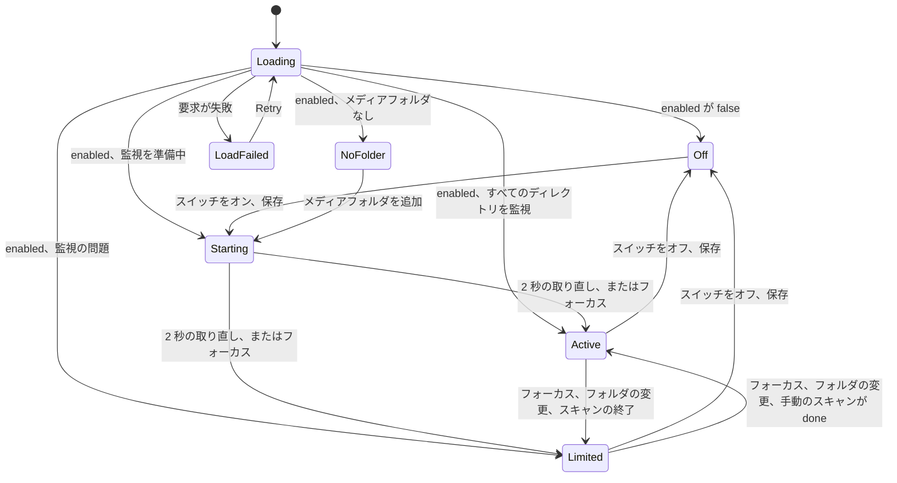

# UI 設計: 変更されたメディアフォルダを自動で取り込む {#ui-design-auto-import-changed-media-folders}

**機能**: [親 Issue #786](https://github.com/syudead/vv/issues/786) · [plan.md](plan.md) · [research.md R-4](research.md#r-4-a-watch-batch-is-a-scan-row-with-origin-watch) · [R-5](research.md#r-5-a-manual-scan-or-a-media-folder-change-supersedes-a-watch-batch) · [R-6](research.md#r-6-lost-events-and-watch-limits-are-reported-never-repaired-by-a-scan) · [R-7](research.md#r-7-the-setting-is-a-stored-key-that-defaults-to-on) · [contracts/screen-api.md](contracts/screen-api.md) · [quickstart.md](quickstart.md)

すでに決めている出典。ここでは繰り返さずにリンクする。

| 項目 | 出典 |
| --- | --- |
| トークン、閉じたスケール、ライブラリの密度 | [design-system.md、基礎](../../docs/design-docs/design-system.md#foundations)。[`web/src/ui/tokens.css`](../../web/src/ui/tokens.css) の `@theme` の値。ここでは名前で示し、決してコピーしない |
| `SettingsPage`、`PageSection`、`FormRow`: 題目ごとに 1 つの節、設定ごとに 1 つの行、すぐに効く設定には `Switch` | [patterns.md、設定ページ](../../web/registry/rules/patterns.md#settings-page) と [節](../../web/registry/rules/patterns.md#sections) |
| `Switch`、`Alert`、`Badge`、`Sonner`: それぞれ何に使うか | [components.md、Checkbox と Switch](../../web/registry/rules/components.md#checkbox-and-switch)、[Alert](../../web/registry/rules/components.md#alert)、[Badge](../../web/registry/rules/components.md#badge)、[Sonner](../../web/registry/rules/components.md#sonner) |
| `Scan status` の節、右下の表示、概要のポップオーバー、状態の言葉、問題の一覧 | [024 UI 設計](../024-import-progress/ui-design.md)。現在の [`ScanStatusSection.tsx`](../../web/src/settings/ScanStatusSection.tsx) と [`ScanProgressIndicator.tsx`](../../web/src/shell/ScanProgressIndicator.tsx) |
| `Scan library`、右下の表示の開き方、閉じ方、消し方、8 秒の結果 | [library-ui.md、スキャンの入口と進み具合](../../docs/design-docs/library-ui.md#scan-entry-and-progress) |
| すぐに保存する設定のスイッチ: 保存中の押した状態、誤り、元に戻す動き | `Network` の節、[`NetworkSection.tsx`](../../web/src/settings/NetworkSection.tsx) ([037 ネットワーク設定の契約](../037-windows-app/contracts/network-settings-api.md)) |
| ゲストには Settings も、スキャンの状態も、右下の表示も見えない | [016 UI 設計、トップバー](../016-single-account-auth/ui-design.md#top-bar)。[`ScanProvider.tsx`](../../web/src/shell/ScanProvider.tsx) |
| 画面の文言 | [`web/src/i18n/en.ts`](../../web/src/i18n/en.ts) (`shell.scan`、`settings.scanStatus`、`settings.mediaFolders`)。この機能は `settings.autoImport` と下の言葉を加える |

図は、この機能が触れる 3 つの面と、それぞれに何が届くかを示す。

変わらないもの: `manual` のスキャンが示すものすべてと、それをどこにどう示すか (024、library-ui.md)、問題の一覧、トップバー、動画ページ、空のライブラリやフォルダの `Scan` リンク。

## この形にする理由 {#why-this-shape}

設定は `Scan status` のすぐ下の独立した `Auto-import` の節で、その中の行ではない。`Scan status` は最新の取り込みの結果で、状態、進み具合、失敗、一覧の順に上から下へ読む (024)。その先頭に設定の行を置くと状態の言葉が下へ押され、問題の一覧の下に置くと画面の半分の高さになりうる領域の下に沈む。すぐ下の独立した節なら、2 つは一目の距離に収まり (`UI品質`)、題目ごとに 1 つの節という設定ページの規則にも従う。節の説明が自動取り込みのすることと `Scan library` に残すことを言うので、所有者がスイッチだけから推し量ることは決してない。

監視によるスキャンは 024 の 3 つの面がすでに読んでいるのと同じ `Scan` なので (R-4)、画面に新しく載る事実はその出所と監視の状態だけである。出所はバッジを足すのではなく状態の言葉を変える。所有者が何も始めていないのに右下に「Some failed」が出ると、忘れていたスキャンのように読めるが、「Auto-import: some failed」なら同じ場所で同じ Settings への道筋のまま原因を名指しする。結果の知らせは Sonner のトーストではなく右下の表示の終端の状態を使い回す。失敗は所有者が Settings で対処するもので、Sonner はそのためのものではなく、右下の表示はすでにそこへ導き、読む間は止まり、消すこともできるからである。

終わった監視によるスキャンは、今日の手動のスキャンの終了のように一覧を消して最初のページから読み直すのではなく、開いている一覧をスクロール位置と選択を保ったままその場で更新する。手動のスキャンは所有者が待っているところで終わるが、監視によるスキャンは所有者が見ている最中に終わる。3 ページ目にいるのに一覧の先頭へ送られるのは、Issue が除外する割り込みそのものである。

## 文言 {#words}

文言は `web/src/i18n/en.ts` に置く。利用者のデータ (パス) は引数として埋め込む。

| 場所 | 文言 | 備考 |
| --- | --- | --- |
| Settings の節の見出し | Auto-import | `settings.autoImport.heading` |
| 節の説明 | Files added, removed, moved or renamed in a media folder are picked up as they happen, without a scan. Changes made while it's off or while VVMDM isn't running are picked up by “Scan library” under Scan status. | 見出しの下の 1 つの `
` |
| スイッチの行のラベル | Pick up changes as they happen | `Switch` の名前はこのラベル |
| 状態の行、オフ | Off. Changes are picked up by the next scan. | 行の説明 |
| 状態の行、オン、メディアフォルダなし (`watch.state` が `off`) | Add a media folder below to watch it. | |
| 状態の行、`starting` | Starting to watch the media folders… | |
| 状態の行、`active` | Watching the media folders. | |
| 状態の行、`limited` | Watching, but some changes may be missed. | 下の問題の行がどれかを言う |
| 保存中の行 | Saving… | `Network` の節と同じ |
| 保存の失敗 | Couldn't change the setting: {reason} | `destructive` の `Alert` |
| 読み込みの失敗 | Couldn't load the auto-import settings: {reason} | `Retry` 付きの `ErrorState` |
| 問題 `watch_limit` | The limit on watched folders was reached, so changes under {path} aren't picked up. Raise the limit (`fs.inotify.max_user_watches` on Linux) and turn auto-import off and on, then start a scan to pick up what was missed. | 題: Some folders aren't watched |
| 問題 `events_lost` | Too many changes arrived at once and some were lost. Start a scan under Scan status to pick them up. | 題: Some changes were lost |
| 問題 `folder_unreachable` | {path} can't be reached. Changes there aren't picked up until it is back and auto-import is turned off and on. Then start a scan to pick up what was missed. | 題: A media folder can't be reached |
| 問題 `permission_denied` | VVMDM can't read {path}. Changes there aren't picked up until it can, and auto-import is turned off and on. Then start a scan to pick up what was missed. | 題: A folder can't be read |
| 状態の言葉、監視によるスキャンの `finding` か `running` | なし | バッジなし: 走っている監視によるスキャンはどこにも示さない (`要件 7`) |
| 状態の言葉、監視によるスキャンの `done` | Auto-imported | 「Done」を置き換える |
| 状態の言葉、監視によるスキャンの `partial` | Auto-import: some failed | 「Some failed」を置き換える |
| 状態の言葉、監視によるスキャンの `failed` | Auto-import failed | 「Scan failed」を置き換える |
| 読み上げ、監視によるスキャンの `partial` | Auto-import finished with some failures. {N videos} may not be usable. | `role="status"`。024 と同じ |
| 読み上げ、監視によるスキャンの `failed` | Auto-import failed. | |
| Media folders の説明の最後の文 | After adding or changing a folder, start a scan with “Scan library” under Scan status. Auto-import doesn't start one. | 「After a change, start a scan with “Scan library” under Scan status. Scans don't start automatically.」を置き換える |

ほかの状態の言葉、進み具合の文、詳細の行 (「Finished {date and time}」)、問題の数、問題の一覧は、どちらの出所でも 024 の言葉を保つ。「{path}」は `watch.path` のディレクトリで、文がそれを含むときは `Media folders` の行がパスを示すのと同じく、独立した行の `<code>` に置く。

## Settings: Auto-import の節 {#settings-auto-import-section}

`Scan status` と `Media folders` の間の `PageSection` である。取り込みに関わる 3 つの節が並び、`Scan library` はスイッチの一目上にある。見出しの行は題と説明を持ち、操作は持たない。本体は 1 つの `FormRow` と、あるときだけ 1 つの問題の行である。

| 行 | 内容 |
| --- | --- |
| スイッチの行 | ラベル「Pick up changes as they happen」、説明としての状態の行、唯一の操作としての `Switch` を持つ `FormRow`。`enabled` が `true` のとき checked |
| 問題の行 | `watch.state` が `limited` の間だけ。`warning` の `Alert` (`TriangleAlert`、`AlertTitle`、問題の文とパスを持つ `AlertDescription`) |
| 保存中の行 | 変更の送信中だけ。回る `LoaderCircle` 付きの「Saving…」、`text-xs` `text-muted-foreground`。`Network` の節と同じ |
| 保存の失敗 | `PUT` が失敗したあとだけ。スイッチの行の下の `destructive` の `Alert`。スイッチは保存されている値に戻る |

状態の行はどの幅でも 1 行で、その場で変わる。行は状態の間で決して伸び縮みしないので、監視が始まる間も下の `Media folders` の節は動かない。高さを足す要素は問題の行だけで、問題が消えるまで残る ([contracts/screen-api.md、`GET`](contracts/screen-api.md#get-apisettingsauto-import))。

### 状態 {#states}

図は、節の状態と、何がその間を移すかを示す。

| 状態 | 節が示すもの |
| --- | --- |
| Loading | 操作の枠にスイッチの高さの `Skeleton` を置いたスイッチの行とラベル。状態の行はなく、節はちらつかない |
| Load failed | 本体に「Couldn't load the auto-import settings: {reason}」と `Retry` の `ErrorState`。スイッチはない |
| Off | スイッチは unchecked。「Off. Changes are picked up by the next scan.」 |
| オン、メディアフォルダなし | スイッチは checked。「Add a media folder below to watch it.」 |
| Starting | スイッチは checked。「Starting to watch the media folders…」。節は `starting` を抜けるまで 2 秒ごとに状態を読み直す (契約、クライアントの使い方)。バーも、スピナーも、右下の表示もない |
| Active | スイッチは checked。「Watching the media folders.」 |
| Limited | スイッチは checked。「Watching, but some changes may be missed.」。`watch.problem` の題、文、パスを持つ問題の行 |
| Saving | スイッチは押した先の状態を示す。保存中の行。応答までスイッチは 2 度目の押下に反応しない |
| Save failed | スイッチは保存されている値に戻る。理由を持つ `destructive` の `Alert`。状態の行は押す前のまま |

スイッチをオンにすると節は Starting へ移り、どの画面でもほかには何も起きない。`Scan status` にバーは出ず、右下の表示も、知らせもない (`要件 6`)。オフにすると節はすぐ Off へ移る。そのとき走っている監視によるスキャンはそのまま終わる。

節は、取り付けられたとき、ウィンドウがフォーカスを取り戻したとき、このページでメディアフォルダを追加、変更、削除したあと、最新のスキャンが終わったときに状態を読み直す。そのため消えた問題 ([contracts/screen-api.md、`GET`](contracts/screen-api.md#get-apisettingsauto-import)) は、読み込み直さなくても画面から消える。

## Settings: 監視によるスキャンがあるときの Scan status {#settings-scan-status-with-a-watch-scan}

`Scan status` は出所にかかわらず最新のスキャンを、024 のレイアウトと要素で示す。`origin` が `watch` のときに違うもの:

| 要素 | 手動のスキャン | 監視によるスキャン |
| --- | --- | --- |
| 状態のバッジ | 「Scanning」、「Done」、「Some failed」、「Scan failed」 | 走っている間はなし。終わると「Auto-imported」、「Auto-import: some failed」、「Auto-import failed」 |
| `Scan library` ボタン | スキャン中は理由の行とともに押せない | 監視によるスキャン中も押せる。手動のスキャンを始めるとそれに取って代わる (R-5)。理由の行はない |
| `Media folders` のロック (「You can't change media folders while a scan is running」) | スキャン中に示す | 示さない。フォルダの変更は監視によるスキャンに取って代わる (R-5) |
| 進み具合のバー、進み具合の文 | 024 のとおり | 走っている間も終わってからも示さない: 監視によるスキャンの進み具合はどこにも示さない |
| 詳細の行、問題の数、問題の一覧 | 024 のとおり | 終わると 024 のとおり。問題の一覧は前のスキャンから引き継いだ問題とこのスキャンの問題を持つ ([data-model.md、規則](data-model.md#rules)) |
| 取り込み自体の失敗 (`failed`) | `destructive` の `Alert` の中の理由 | 同じ |

したがって `Scan library` ボタンが押せないと読める理由は、所有者 (または別のタブ) が始めた手動のスキャンの 1 つだけで、フォルダの行は所有者が始めていないもののせいで決してロックされない。

## 右下の表示と結果の知らせ {#bottom-right-indicator-and-result-notice}

右下の表示は 024 と library-ui.md の置き場所、面、内容、開き方、閉じ方、消し方を保つ。`origin` が `watch` のときは、いつ示すかだけが変わる。

| 監視によるスキャンの状態 | 右下 | 読み上げ |
| --- | --- | --- |
| `finding`、`running` | 示さない。概要のポップオーバーは存在しない (`要件 7`) | なし |
| `done`、要確認があってもなくても | 示さない | なし |
| `partial`、新しい失敗がある | 結果として示す: 「Auto-import: some failed · K failed」を 8 秒間。`×` で消すか、押して消す (`/settings#scan-status` へ移る)。概要はホバーとフォーカスで開き、024 の内容と「See Settings for the list.」を持つ | 「Auto-import finished with some failures. N videos may not be usable.」 |
| `partial`、新しい失敗がない | 示さない | なし |
| `failed` | 結果として示す: 「Auto-import failed」を 8 秒間。消し方と押し方は上と同じ | 「Auto-import failed.」 |

監視によるスキャンの結果の知らせは何もないところから現れる。その前に走っている表示はなかった。そのため知らせは手動の結果と同じ枠、位置、大きさを持ち、手動のスキャンの終わりを見たことのある所有者はそれと分かり、状態の言葉が何についてかを言う。動画ページでも 024 の右下の位置と `z-index` を保つ (右上には閉じる `×` がある)。

`partial` の監視によるスキャンの問題の一覧は、前のスキャンから引き継いだ失敗を持つ ([data-model.md、規則](data-model.md#rules))。そのため状態だけでは古い失敗をもう一度知らせてしまう。クライアントが `partial` の監視によるスキャンを知らせるのは、`GET /api/scans/current/issues` が、パスと種類が前のスキャンについて最後に読んだ一覧にない失敗の項目を返したときだけである。それ以前に読んだ一覧がなければ知らせる。種類が変わった失敗は新しいものと数える。所有者が前に消し、まだ同じままの失敗は、もう一度は知らせない。新しい失敗のない `partial` のスキャンは何も示さず、Settings は引き続きすべての問題を一覧にする。

所有者の前の知らせが消されている間に `partial` で終わった監視によるスキャンは示す。消すのはスキャンの id ごとである (library-ui.md)。走っている監視によるスキャンに取って代わる手動のスキャンは「Starting」から自分の表示を示す。取って代わられたスキャンは `done` で閉じ、何も示さない。

## 監視によるスキャンのあとの開いている一覧 {#open-lists-after-a-watch-scan}

監視によるスキャンが `done`、`partial`、`failed` で終わると (`failed` のスキャンは止まるまでに追加を書き込んでいることがある)、画面の一覧 (ライブラリ、フォルダページ、ルートのフォルダ一覧) はその結果をその場で取り込む:

| 観点 | 規則 |
| --- | --- |
| 何を更新するか | すでに読み込んだページを取り直して置き換える。新しいものが届くまで一覧は今の項目を示し続け、`LoadingState` も空の枠もない |
| スクロール位置 | 保つ。ウィンドウは動かない。所有者が見ている項目は、その前の項目が追加か削除されない限りその場に留まり、されたときはその項目の高さだけずれる |
| 選択 | 保つ。選択した id は選択されたままで、選択バーとその数はひとりでには変わらない |
| 新しい動画 | 読み込んだページの中で、今の並び順が与える位置に現れる。読み込んだページより後ろに並ぶ動画は次の `Load more` で届く |
| 削除された動画 | 一覧から消える。後ろのカードが隙間を詰める |
| 移動または名前変更された動画 | 同じカードのまま、タグ、再生位置、お気に入りを保つ。並び順やカードがファイル名を示すときは新しい名前になる |
| 絞り込み、検索、並び順 | 更新で変わらない |
| 動画ページ | 変わらない。移動した動画は id を保ち、ページは再生を続ける |
| 手動のスキャン | 今日の動き: 所有者が終わるのを見たスキャンが終わると、一覧を消して最初のページから読み直す ([`LibraryPage.tsx`](../../web/src/library/LibraryPage.tsx)) |

更新は設計として静かである。「3 videos added」のトーストも、数のバッジも、新しいカードの強調もない。知っているカードの中の新しいカードは、フォルダの中の新しいファイルと同じように気づかれる。強調すると、すべてのまとまりが出来事になってしまう。

## レスポンシブの振る舞い {#responsive-behaviour}

| 幅 | レイアウト |
| --- | --- |
| 360px | スイッチの行は積む: ラベルと状態の行を上に、スイッチを下の行の先頭に (`sm` 未満の `FormRow`)。問題の `Alert` は文を折り返し、パスは単語の中で折る (`break-all`) ので節を決して広げない。結果の知らせは 024 の 360px と同じく 1 行で、「Auto-import: some failed」はそのまま保ち、問題の数はアイコンと数字に減らす |
| 768px | ラベルと状態の行を左に、スイッチを同じ行の右に。問題の `Alert` は 1 行か 2 行。結果の知らせは 1280px と同じ |
| 1280px | 設定の列 (`max-w-3xl`) の中で 768px と同じ。節の見出し、説明、行は `Scan status` と `Media folders` と左端をそろえる |

## レビューの基準 {#review-criteria}

自動取り込みがオンで、2 つのファイルが失敗して `partial` で終わった監視によるスキャンのあとと、`done` で終わったもののあとに、360px、768px、1280px で Settings とライブラリを見て判断する。

1. **視覚的な階層**: Settings で、`Auto-import` の節は `Scan status` と `Media folders` の兄弟として読める。同じ `text-lg` の見出し、同じ `text-sm` `text-muted-foreground` の説明、同じカードの本体。節の中では行のラベルが最も強い要素で、状態の行が二次で、問題の `Alert` が唯一の色の付いた要素である。
2. **情報の密度**: 節は 2 行から 3 行の高さである。スイッチの行と、問題があるときだけの問題の行。数も、監視しているフォルダの一覧も、最後のまとまりの時刻もない。上の `Scan status` は監視によるスキャンのために状態の言葉以外の要素を得ない。
3. **余白のリズム**: `Scan status` と `Auto-import` の間隔は `Auto-import` と `Media folders` の間隔に等しい。スイッチの行の余白は `Network` の行のものに等しい。状態の行はラベルの下の `FieldDescription` の距離にあり、行の高さは Off、Starting、Active、Limited で同じである。
4. **タイポグラフィ**: 状態の行は `text-sm` `text-muted-foreground` で、360px でもどの状態でも 1 行である。問題の題は `Alert` の題の太さで、パスは `<code>` である。`Scan status` と右下の状態の言葉は、置き換える手動の言葉と同じ大きさと太さである。
5. **操作の優先順位**: スイッチは節の唯一の操作である。問題の `Alert` にボタンはなく、その文は上にある唯一の操作 `Scan library` を名指しする。監視によるスキャンが走っている間も `Scan library` は押せたままで、`Media folders` の行は編集できたままである。
6. **取り込み中は静か**: 監視によるスキャンの間、`Scan status`、ライブラリ、フォルダページ、動画ページには新しいものが何も出ない。バッジも、進み具合のバーや文も、右下の表示も、トーストもない。スキャンが `done` で終わると、開いている一覧には並び順どおりに新しいカードがあり、ウィンドウはスクロールしていない。選択していたカードは選択されたままである。
7. **失敗だけを知らせる**: 監視によるスキャンが新しい失敗を伴って `partial` で終わると、右下の結果が「Auto-import: some failed」と失敗した数で現れ、8 秒後に隠れ、押すと同じ状態の言葉と一覧の 2 つのファイルを持つ `Scan status` が開く。`done` で終わると、右下には何も現れない。
8. **オンにしても静か**: 自動取り込みをオンにすると、状態の行は「Starting to watch the media folders…」を経て「Watching the media folders.」へ移り、`Scan status` にバーは出ず、右下の表示もトーストもなく、行が変わる間に `Media folders` の節は動かない。
9. **問題は色なしで読める**: `events_lost` のとき、`Alert` のアイコンと題が何が起きたかを言い、文が何をすべきかを言う。状態の行は変更が漏れうることを言う。画面から色を取り除いても何も失われない。
10. **ゲスト**: ゲストとしてサインインすると、Settings、スイッチ、右下の表示、読み上げは存在しない。
