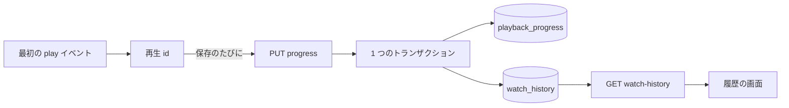
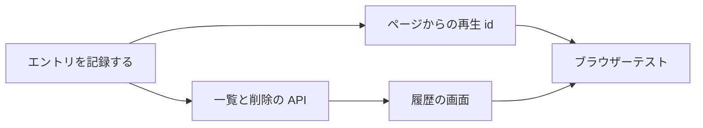

# 実装計画: 視聴履歴の画面 {#implementation-plan-watch-history-screen}

**ブランチ**: `feature/043-watch-history` | **親 Issue**: #792

**入力**: 親 Issue。これがこの機能の仕様である。

## 概要 {#summary}

動画を再生するたびに所有者の視聴履歴にエントリが 1 つ加わる。履歴の画面はそれらを新しい順に挙げ、エントリから動画を開き、エントリを 1 つまたはすべて削除する。再生位置、視聴状態、「Last played」の順序には触れない。

図は、1 回の視聴が最初の `play` から履歴の画面が挙げるエントリまでたどる経路を示す。



| 関心事 | 方針 |
| --- | --- |
| 保存 | 再生した内容の鍵をキーにし、タイトルのスナップショットを持ち、外部キーを持たない `watch_history` テーブル ([R-1](research.md#r-1-a-watch_history-table-keyed-by-content-key-with-a-title-snapshot)、[data-model.md](data-model.md#migration)) |
| 1 回の視聴に 1 つのエントリ | 既存の再生位置の保存に載せる、クライアントが生成する再生 id。位置のトランザクションの中での `insert or ignore` ([R-2](research.md#r-2-one-entry-per-playback-identified-by-a-client-generated-playback-id)) |
| エントリの時刻と順序 | その id を持つ最初の保存のサーバー時刻。`played_at`、次に `id` の降順 ([R-3](research.md#r-3-the-entrys-time-is-the-server-time-of-the-first-save-with-its-id)) |
| 既存の記録 | マイグレーションが埋める。`playback_progress` の行ごとに 1 つのエントリ ([R-4](research.md#r-4-existing-playback-records-are-backfilled-by-the-migration)) |
| なくなった、または置き換わった内容 | エントリは残る。内容がライブラリにある間だけ `video` を持つ ([R-5](research.md#r-5-an-entry-whose-content-left-the-library-stays-without-a-video)) |
| 削除 | 1 つまたはすべてを `DELETE` する。消えたエントリへの `404` で画面は読み直す ([R-6](research.md#r-6-deleting-entries-is-a-plain-delete-a-vanished-entry-answers-404-and-the-screen-reloads)) |
| 誰が | 所有者だけ。既存のゲートとルートの規則による ([R-7](research.md#r-7-watch-history-is-one-more-owner-only-screen-and-route-with-the-existing-gate-rules)) |

Issue には `ui` ラベルがあるので、一覧のレイアウト、日付でのまとめ方、文言、削除と全消去の操作の配置は、次の段階の `ui-design.md` が親 Issue の `UI品質` に照らして決める。

親 Issue のとおり範囲外のもの: 履歴の検索と絞り込み、自動の整理と保持期間の設定、記録の一時停止、再生位置や視聴状態のリセット、外部 API、ゲストの視聴、統計。

## 技術的な文脈 {#technical-context}

**正本の定義**:

| 項目 | 出典 |
| --- | --- |
| 境界、依存の方向、ユーザーデータと作り直せるインデックス、認証の境界 | [ARCHITECTURE.md](../../ARCHITECTURE.md)、[.golangci.yml](../../.golangci.yml) (depguard) |
| 再生位置: 保存、規則、ページの保存のフック | [internal/store/progress.go](../../internal/store/progress.go)、[internal/domain/progress.go](../../internal/domain/progress.go)、[internal/httpapi/progress.go](../../internal/httpapi/progress.go)、[web/src/player/useProgressSaving.ts](../../web/src/player/useProgressSaving.ts) |
| ユーザーキー、継承、まとまり、動画ごとの公開範囲 | [030 データモデル](../030-video-versions/data-model.md)、[internal/store/user_keys.go](../../internal/store/user_keys.go)、[internal/store/successions.go](../../internal/store/successions.go) (`moveUserData`)、[internal/store/visibility.go](../../internal/store/visibility.go) (`visibleVideoCondition`) |
| 所有者専用の画面、ゲート、サイドバー | [016 の UI 設計](../016-single-account-auth/ui-design.md)、[web/src/auth/AuthGate.tsx](../../web/src/auth/AuthGate.tsx)、[web/src/shell/navigation.ts](../../web/src/shell/navigation.ts) |
| 不透明なカーソル | [024 の scan-api](../024-import-progress/contracts/scan-api.md#get-apiscanscurrentissues)、[internal/domain/scan_issue.go](../../internal/domain/scan_issue.go) |
| 画面の API と生成コード | [api/openapi.yaml](../../api/openapi.yaml)、`task generate` |
| 画面と Web のテスト | [design-system.md](../../docs/design-docs/design-system.md)、[web-testing.md](../../docs/design-docs/web-testing.md)、[i18n.md](../../docs/design-docs/i18n.md) |
| 検査 | [Taskfile.yml](../../Taskfile.yml) (`task check`、`task check-docs`、`task test-e2e`) |

**この機能に固有の文脈**:

- マイグレーションを 1 つ、`00034_watch_history.sql`。埋め戻しを含む ([data-model.md、Migration](data-model.md#migration))。
- 変わる既存のルートは `PUT /api/videos/{id}/progress` だけである。履歴の 3 つのルートは新しい ([contracts/screen-api.md](contracts/screen-api.md))。
- 新しい依存はない: 再生 id は `crypto.getRandomValues()` から作る RFC 4122 バージョン 4 の id である。`crypto.randomUUID()` は安全なコンテキストを必要とし、所有者はローカルネットワークで平文の HTTP で vv を開けるからである ([running-vv.md](../../docs/how-to/running-vv.md)。[web/src/player/liveOffset.ts](../../web/src/player/liveOffset.ts) の `newAttempt` も同じ理由でそれを避けている)。

## Constitution Check {#constitution-check}

| 規則 (出典) | 判定 |
| --- | --- |
| アダプターは互いにも `internal/app` にも依存しない (ARCHITECTURE.md、depguard) | 適合: 変更は `internal/store` と `internal/httpapi` にあり、両者は `internal/httpapi` が宣言する `Playback` インターフェースを通じてやり取りする。`internal/app` のユースケースはない |
| ドメインが決め、ストアが強制する (ARCHITECTURE.md) | 適合: `ValidatePlaybackID` とカーソルは `internal/domain` にある。id ごとに 1 つのエントリであることは一意インデックスが保つ |
| コミット後のイベント (ARCHITECTURE.md) | 適合: 新しいドメインイベントはない ([R-6](research.md#r-6-deleting-entries-is-a-plain-delete-a-vanished-entry-answers-404-and-the-screen-reloads)) |
| ユーザーデータは作り直しの後も残る (ARCHITECTURE.md) | 適合: 内容の鍵をキーにし、外部キーを持たない。不変条件の一覧と復旧の表に `watch_history` を加える |
| すべての読み取りは閲覧者を知る (ARCHITECTURE.md) | 適合: ルートは所有者専用であり、`ListWatchHistory` は HTTP の境界からリクエストの分類された `domain.Audience` を受け取り、それで `visibleVideoCondition` を通じて動画を読む |
| 生成ファイルを手で編集しない (AGENTS.md) | 適合: `api/openapi.yaml` を変え、`task generate` を実行する |
| 画面の前に design-system.md を読む。最も低いレベルでテストする (AGENTS.md) | 適合: 画面はレジストリのページパターンを組み合わせ、それは `ui-design.md` で決める。ページの外の規則はロジックのテストを持つ |

違反はないので、複雑さの追跡はない。

## プロジェクトの構成 {#project-structure}

### 文書 (この機能) {#documentation-this-feature}

```text
specs/043-watch-history/
├── plan.md
├── research.md
├── data-model.md
├── quickstart.md
└── contracts/
    └── screen-api.md
```

`ui-design.md` は `design` 段階が書く (Issue に `ui` ラベルがある)。

### ソースコード {#source-code}

**影響する境界**:

| 境界 | この機能で受け持つもの |
| --- | --- |
| `internal/domain` | `Play`、`ValidatePlaybackID`、`WatchHistoryEntry`、`WatchHistoryPage`、カーソル |
| `internal/store` | マイグレーションと埋め戻し、`PlaybackStore` のエントリの書き込み、一覧、削除、全消去、継承での引き継ぎ |
| `internal/httpapi`、`api/openapi.yaml` | 再生位置の保存の `playbackId`、履歴の 3 つのルート |
| `web/src/player`、`web/src/api` | `useProgressSaving` と `client.ts` の再生 id、`history.ts` |
| `web/src/history` (新規)、`web/src/app`、`web/src/shell`、`web/src/auth`、`web/src/i18n` | 画面、そのルート、サイドバーの項目、所有者専用のパス、カタログの文言 |
| `web/e2e` | 流れのブラウザーテスト |

**新しいパス**: `internal/store/migrations/00034_watch_history.sql`、`internal/store/watch_history.go`、`internal/domain/watch_history.go`、`internal/httpapi/watch_history.go`、`web/src/api/history.ts`、`web/src/history/`、`web/e2e/history.e2e.ts`。

**構成の決定**: 履歴は新しい役割ではなく `PlaybackStore` に置く。エントリは位置のトランザクションの中で書かれ、1 つのテーブルを 2 つの役割の下に置くと 1 つの業務操作が分かれるからである ([data-model.md、Store operations](data-model.md#store-operations-playbackstore))。画面は `versions/` や `tags/` と同じく独自のディレクトリにする。カードの一覧と共有するものはサムネイルのほかにないからである。

## 実装作業 {#implementation-work}

図は、どの単位が先に入る必要があるかを示す。



### 再生ごとに視聴履歴のエントリを記録する {#record-a-watch-history-entry-for-each-playback}

**範囲**: マイグレーションと埋め戻し、`domain.Play`、`ValidatePlaybackID` と `WatchHistoryEntry`、トランザクションの中でエントリを書く `PlaybackStore.SaveProgress`、継承での引き継ぎ、`PUT /api/videos/{id}/progress` の `playbackId` とそのハンドラー ([data-model.md](data-model.md)、[contracts/screen-api.md、`playbackId`](contracts/screen-api.md#playbackid-on-put-apivideosidprogress))。ARCHITECTURE.md と running-vv.md の一覧に `watch_history` を加える。

**依存**: なし。

**受け入れ**: `task check` と `task check-docs` が通り、`task generate` で差分が出ない。ストアとハンドラーのテストが次を示す: `playbackId` のない保存はエントリを書かない。1 つの id での 2 回の保存は 1 つのエントリを書き、その時刻は最初の保存のものである。1 つの動画への 2 つの id での保存は 2 つのエントリを書く。エントリが削除された後の保存は新しいエントリを書く。形式の誤った id は `400` である。`playback_progress` の行を 3 つ持ち、そのうち 1 つがまとまりのキーの下にあるデータベースは、マイグレーションの後に、記録の時刻と今のタイトルで 3 つのエントリを持つ。マイグレーションの時点で内容が動画を持たない `playback_progress` の行もエントリを得て (タイトルは表示名、なければ空)、内容が再スキャンされると、そのエントリは再び動画を持つ。同じパスでの継承はエントリを新しいキーに移し、新しいキー自身のエントリを保つ。エントリを削除しても `playback_progress` は変わらない。

### 視聴履歴の一覧と削除のエンドポイントを画面の API に加える {#add-the-watch-history-list-and-delete-endpoints-to-the-screen-api}

**範囲**: `GET /api/watch-history`、`DELETE /api/watch-history/{id}`、`DELETE /api/watch-history`、スキーマ、カーソル、`PlaybackStore.ListWatchHistory`、`DeleteWatchHistoryEntry`、`ClearWatchHistory` ([contracts/screen-api.md](contracts/screen-api.md)、[data-model.md、Store operations](data-model.md#store-operations-playbackstore))。

**依存**: 再生ごとに視聴履歴のエントリを記録する。

**受け入れ**: `task check` が通り、`task generate` で差分が出ない。テストが次を示す: 一覧は新しい順で、同じ時刻は `id` で決まる。`nextCursor` からの 2 ページ目は繰り返さずに続く。内容が場所を持たないエントリは `video` を持たず、ライブラリにある内容の別のエントリは動画を `progress` 付きで持つ。ストアの読み取りは、境界が分類した audience を受け取る。まとまりの代表でないメンバーのエントリはそのメンバーを持つ。削除は `204`、次に `404` を返す。全消去は空の履歴にも `204` を返す。ゲストは 3 つすべてで `401` を受け取る。`limit` 201 と読めないカーソルは `400` である。

### 動画のページから最初の再生以降に再生 id を送る {#send-a-playback-id-from-the-video-page-from-the-first-play-on}

**範囲**: id、`markPlayed()` と `markEnded()` を持つ `useProgressSaving`、`crypto.getRandomValues()` からの id の生成、`VideoPlayer` の `onPlay`、`saveProgress` と `beaconProgress` の `playbackId` ([contracts/screen-api.md、Client use](contracts/screen-api.md#client-use)、[R-2](research.md#r-2-one-entry-per-playback-identified-by-a-client-generated-playback-id))。

**依存**: 再生ごとに視聴履歴のエントリを記録する。

**受け入れ**: `task check` が通る。フックとクライアントのロジックのテストが次を示す: 最初の再生の前の保存は id を持たない。生成した id は、`crypto.randomUUID` を使わずに 36 文字の RFC 4122 の形である。プレーヤーが `positioned` を知らせる前の最初の再生は、そうなるまで何も送らず、それから落ち着いた位置で id 付きの即時の保存を 1 回送り、その間に送った離れるときのビーコンは id を持たない。その後の保存、一時停止の保存、離れるときのビーコンは同じ id を持つ。同じ動画 id の下でプレーヤーを再マウントしても id を保つ。`ended` での保存は id を持ち、次の `play` (Replay) は新しい id を得る。新しい動画 id は新しい id を得る。動画のページのページテストが、id がリクエストの本文に届くことを示す。

### 所有者のサイドバーに視聴履歴の画面を加える {#add-the-watch-history-screen-to-the-sidebar-for-the-owner}

**範囲**: `web/src/history/` (ページ、その一覧のフック、確認付きの削除と全消去の操作)、`web/src/api/history.ts`、`/history` のルート、サイドバーの項目、ゲートの所有者専用のパス、カタログの文言。レイアウト、まとめ方、文言、操作の配置は `ui-design.md` に従う。

**依存**: 視聴履歴の一覧と削除のエンドポイントを画面の API に加える。`design` 段階の `ui-design.md`。

**受け入れ**: この単位は画面を変えるので、`ui-design.md` と親 Issue の `UI品質` に照らした見た目と操作のレビューが必要である。`task check` が通る。ページテストが次を示す: エントリは時刻とタイトル付きで新しい順に並ぶ。`video` を持つエントリは `/videos/{id}` を開き、持たないものはリンクではなく、再生できないと読める。さらに読み込むと前の `nextCursor` を送る。1 つを削除するとその行が消え、他は残る。削除への `404` はメッセージなしで一覧を読み直す。失敗した削除は行を残し、トーストを出す。全消去はまず確かめ、キャンセルは何も変えず、確定すると空の状態を出す。ゲストのサイドバーには項目がなく、`/history` のゲストはログインのページに送られる。

### 視聴履歴の流れをブラウザーテストで覆う {#cover-the-watch-history-flow-in-a-browser-test}

**範囲**: 実際のサーバーとメディアに対する `web/e2e/history.e2e.ts` ([web-testing.md、Test levels](../../docs/design-docs/web-testing.md#test-levels))。

**依存**: 動画のページから最初の再生以降に再生 id を送る。所有者のサイドバーに視聴履歴の画面を加える。

**受け入れ**: `task test-e2e -- e2e/history.e2e.ts` が通り、次を示す: 動画を数秒再生すると、時刻付きで履歴の先頭に入る (受け入れ条件 1)。再生せずに動画を開いても何も加わらない (2)。一時停止と再開を 2 回しても 1 つのエントリのままである (3)。2 回目の訪問は 2 つ目のエントリを加える (4)。エントリを開くと保存した位置から再開する (5)。エントリを 1 つ削除してもカードの進み具合のバーと視聴状態は残る (6)。確認付きの全消去で一覧が空になる (7)。ゲストには項目が見えず、`/history` はログインのページを出す (9)。
