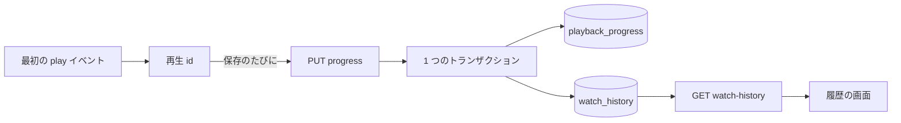
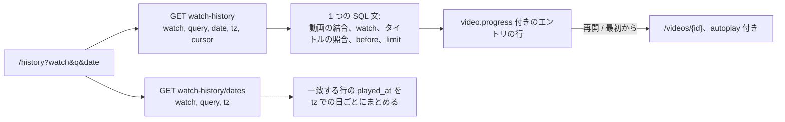
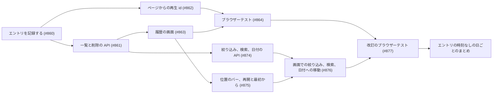

# 実装計画: 視聴履歴の画面 {#implementation-plan-watch-history-screen}

**ブランチ**: `feature/043-watch-history` | **親 Issue**: #792

**入力**: 親 Issue。これがこの機能の仕様である。

## 概要 {#summary}

動画を再生するたびに所有者の視聴履歴にエントリが 1 つ加わる。履歴の画面はそれらを新しい順に挙げ、エントリから動画を開き、エントリを 1 つまたはすべて削除する。再生位置、視聴状態、「Last played」の順序には触れない。改訂 (要件 12 から 18) は、所有者が動画の今の視聴状態とタイトルの検索で一覧を絞り込み、エントリのある日か月に移動し、各エントリの今の位置を見て、そこから、または最初から再生を始められるようにする。2 回目の改訂 (要件 3、`UI品質` の節、受け入れ条件 1) は、日を画面の唯一の時間の単位にする: エントリは日ごとに 1 つの見出しの下に並び、どのエントリも時刻を示さず、一覧のどこも日より細かく時間の流れを描かない。

図は、1 回の視聴が最初の `play` から履歴の画面が挙げるエントリまでたどる経路を示す。



| 関心事 | 方針 |
| --- | --- |
| 保存 | 再生した内容の鍵をキーにし、タイトルのスナップショットを持ち、外部キーを持たない `watch_history` テーブル ([R-1](research.md#r-1-a-watch_history-table-keyed-by-content-key-with-a-title-snapshot)、[data-model.md](data-model.md#migration)) |
| 1 回の視聴に 1 つのエントリ | 既存の再生位置の保存に載せる、クライアントが生成する再生 id。位置のトランザクションの中での `insert or ignore` ([R-2](research.md#r-2-one-entry-per-playback-identified-by-a-client-generated-playback-id)) |
| エントリの時刻と順序 | その id を持つ最初の保存のサーバー時刻。`played_at`、次に `id` の降順 ([R-3](research.md#r-3-the-entrys-time-is-the-server-time-of-the-first-save-with-its-id)) |
| 既存の記録 | マイグレーションが埋める。`playback_progress` の行ごとに 1 つのエントリ ([R-4](research.md#r-4-existing-playback-records-are-backfilled-by-the-migration)) |
| なくなった、または置き換わった内容 | エントリは残る。内容がライブラリにある間だけ `video` を持つ ([R-5](research.md#r-5-an-entry-whose-content-left-the-library-stays-without-a-video)) |
| 削除 | 1 つまたはすべてを `DELETE` する。消えたエントリへの `404` で画面は読み直す ([R-6](research.md#r-6-deleting-entries-is-a-plain-delete-a-vanished-entry-answers-404-and-the-screen-reloads)) |
| 誰が | 所有者だけ。既存のゲートとルートの規則による ([R-7](research.md#r-7-watch-history-is-one-more-owner-only-screen-and-route-with-the-existing-gate-rules)) |
| 絞り込み、検索、日付 (改訂) | 一覧の要求の条件で、ページより前に SQL で適用する ([R-8](research.md#r-8-filter-search-and-date-jump-are-conditions-of-the-list-request))。状態は動画のもので、ライブラリの規則による ([R-9](research.md#r-9-the-state-filter-reads-the-videos-current-watch-state-with-the-librarys-rule))。検索はライブラリの構文で、タイトルの行と畳み込んだスナップショットのタイトルに対する ([R-10](research.md#r-10-title-search-uses-the-librarys-query-syntax-on-the-title-alone)) |
| 日付の一覧と移動 (改訂) | ブラウザーの IANA のタイムゾーンでサーバーが計算する日。一覧の要求の `date` + `tz` ([R-11](research.md#r-11-the-date-list-and-the-jump-are-computed-on-the-server-in-the-viewers-time-zone)) |
| 画面の状態 (改訂) | ライブラリと同じく、URL の `watch`、`q`、`date` ([R-12](research.md#r-12-the-filter-the-search-and-the-date-live-in-the-screens-url)) |
| 再開と最初から (改訂) | `autoplay` 付きの動画のページ。既存の再開の規則が位置を与える ([R-13](research.md#r-13-the-resume-and-restart-actions-open-the-video-page-with-autoplay-and-the-existing-resume-rule-decides-the-position)) |
| 時刻なしの日ごとのまとめ (2 回目の改訂) | エントリは `playedAt` を保つ。画面は閲覧者のローカルの日でまとめ、時刻を示さない ([R-14](research.md#r-14-the-entry-keeps-its-instant-the-screen-shows-only-the-day))。`Timeline` セクションはレジストリを離れる ([R-15](research.md#r-15-the-timeline-section-leaves-the-registry)) |

図は、改訂後の画面の 1 つの表示がどう読まれるかを示す。



Issue には `ui` ラベルがあるので、一覧のレイアウト、日付でのまとめ方、文言、操作の配置は、`ui-design.md` が親 Issue の `UI品質` に照らして決める。改訂の部分 (セグメントの絞り込み、検索ボックス、日付の一覧、位置のバー、再開と最初からの操作、「一致なし」の状態、スマートフォンのレイアウト) は、画面の単位を作る前に `design` 段階が `ui-design.md` に加えた。今の `ui-design.md` はまだ日のタイムラインを記述している: すべての行の縦線、点、時刻と、行のリンクと削除ボタンのアクセシブルな名前の中の時刻である。2 回目の改訂はそれを日ごとにまとめた一覧に置き換えるので、下の最後の単位を作る前に、`design` 段階が `ui-design.md` を再び改訂する (一覧のセクション、行、見出し、読み込み中のスケルトン、時刻を運んでいた語、レビューの幅)。

親 Issue のとおり範囲外のもの: タグや開始日と終了日での絞り込み、自動の整理と保持期間の設定、記録の一時停止、再生位置や視聴状態のリセット、外部 API、ゲストの視聴、統計。

## 技術的な文脈 {#technical-context}

**正本の定義**:

| 項目 | 出典 |
| --- | --- |
| 境界、依存の方向、ユーザーデータと作り直せるインデックス、認証の境界 | [ARCHITECTURE.md](../../ARCHITECTURE.md)、[.golangci.yml](../../.golangci.yml) (depguard) |
| 再生位置: 保存、規則、ページの保存のフック | [internal/store/progress.go](../../internal/store/progress.go)、[internal/domain/progress.go](../../internal/domain/progress.go)、[internal/httpapi/progress.go](../../internal/httpapi/progress.go)、[web/src/player/useProgressSaving.ts](../../web/src/player/useProgressSaving.ts) |
| ユーザーキー、継承、まとまり、動画ごとの公開範囲 | [030 データモデル](../030-video-versions/data-model.md)、[internal/store/user_keys.go](../../internal/store/user_keys.go)、[internal/store/successions.go](../../internal/store/successions.go) (`moveUserData`)、[internal/store/visibility.go](../../internal/store/visibility.go) (`visibleVideoCondition`) |
| 所有者専用の画面、ゲート、サイドバー | [016 の UI 設計](../016-single-account-auth/ui-design.md)、[web/src/auth/AuthGate.tsx](../../web/src/auth/AuthGate.tsx)、[web/src/shell/navigation.ts](../../web/src/shell/navigation.ts) |
| 不透明なカーソル | [024 の scan-api](../024-import-progress/contracts/scan-api.md#get-apiscanscurrentissues)、[internal/domain/scan_issue.go](../../internal/domain/scan_issue.go) |
| 画面の API と生成コード | [api/openapi.yaml](../../api/openapi.yaml)、`task generate` |
| 画面と Web のテスト | [design-system.md](../../docs/design-docs/design-system.md)、[web-testing.md](../../docs/design-docs/web-testing.md)、[i18n.md](../../docs/design-docs/i18n.md) |
| 検査 | [Taskfile.yml](../../Taskfile.yml) (`task check`、`task check-docs`、`task test-e2e`) |

**この機能に固有の文脈**:

- マイグレーションを 1 つ、`00034_watch_history.sql`。埋め戻しを含む ([data-model.md、Migration](data-model.md#migration))。改訂は `00035_watch_history_title_key.sql` と、新しい列の起動時の埋め込みを加える。
- 変わる既存のルートは `PUT /api/videos/{id}/progress` だけである。履歴の 3 つのルートは新しい ([contracts/screen-api.md](contracts/screen-api.md))。改訂は `GET /api/watch-history` に 4 つのパラメーターと、ルート `GET /api/watch-history/dates` を加える。
- 改訂は、タイムゾーンのデータベースのないホストでも `time.LoadLocation` が応答するように `time/tzdata` (標準ライブラリ、約 450 KiB) を埋め込む ([R-11](research.md#r-11-the-date-list-and-the-jump-are-computed-on-the-server-in-the-viewers-time-zone))。コンテナのイメージはすでに `tzdata` を入れている。
- 新しい依存はない: 再生 id は `crypto.getRandomValues()` から作る RFC 4122 バージョン 4 の id である。`crypto.randomUUID()` は安全なコンテキストを必要とし、所有者はローカルネットワークで平文の HTTP で vv を開けるからである ([running-vv.md](../../docs/how-to/running-vv.md)。[web/src/player/liveOffset.ts](../../web/src/player/liveOffset.ts) の `newAttempt` も同じ理由でそれを避けている)。
- 2 回目の改訂はマイグレーション、ルート、スキーマを変えない: `playedAt` はエントリの時点のままであり、日は画面のまとめ方である ([R-14](research.md#r-14-the-entry-keeps-its-instant-the-screen-shows-only-the-day))。デザインシステムのレジストリから `Timeline` セクションを除き ([R-15](research.md#r-15-the-timeline-section-leaves-the-registry))、その `web/registry/r/` の下のビルド済みの項目は `task generate` が作り直す ([design-system.md、Registry and agent route](../../docs/design-docs/design-system.md#registry-and-agent-route))。

## Constitution Check {#constitution-check}

| 規則 (出典) | 判定 |
| --- | --- |
| アダプターは互いにも `internal/app` にも依存しない (ARCHITECTURE.md、depguard) | 適合: 変更は `internal/store` と `internal/httpapi` にあり、両者は `internal/httpapi` が宣言する `Playback` インターフェースを通じてやり取りする。`internal/app` のユースケースはない |
| ドメインが決め、ストアが強制する (ARCHITECTURE.md) | 適合: `ValidatePlaybackID` とカーソルは `internal/domain` にある。id ごとに 1 つのエントリであることは一意インデックスが保つ |
| コミット後のイベント (ARCHITECTURE.md) | 適合: 新しいドメインイベントはない ([R-6](research.md#r-6-deleting-entries-is-a-plain-delete-a-vanished-entry-answers-404-and-the-screen-reloads)) |
| ユーザーデータは作り直しの後も残る (ARCHITECTURE.md) | 適合: 内容の鍵をキーにし、外部キーを持たない。不変条件の一覧と復旧の表に `watch_history` を加える |
| すべての読み取りは閲覧者を知る (ARCHITECTURE.md) | 適合: ルートは所有者専用であり、`ListWatchHistory` と `ListWatchHistoryDays` は HTTP の境界からリクエストの分類された `domain.Audience` を受け取り、それで `visibleVideoCondition` を通じて動画を読む |
| 改訂について、ドメインが決め、ストアが強制する (ARCHITECTURE.md) | 適合: `ParseSearchQuery`、`ParseWatchHistoryFilter`、`ParseWatchHistoryPeriod` は `internal/domain` にある。ストアはそれらを `where` 句にし、`watchCondition` を再利用する |
| 生成ファイルを手で編集しない (AGENTS.md) | 適合: `api/openapi.yaml` を変え、`task generate` を実行する |
| 画面の前に design-system.md を読む。最も低いレベルでテストする (AGENTS.md) | 適合: 画面はレジストリのページパターンを組み合わせ、それは `ui-design.md` で決める。ページの外の規則はロジックのテストを持つ |

違反はないので、複雑さの追跡はない。

## プロジェクトの構成 {#project-structure}

### 文書 (この機能) {#documentation-this-feature}

```text
specs/043-watch-history/
├── plan.md
├── research.md
├── data-model.md
├── quickstart.md
└── contracts/
    └── screen-api.md
```

`ui-design.md` は `design` 段階が書き (Issue に `ui` ラベルがある)、要件 12 から 18 のために同じ段階が改訂し、2 回目の改訂の日ごとにまとめた一覧のために再び改訂する。

### ソースコード {#source-code}

**影響する境界**:

| 境界 | この機能で受け持つもの |
| --- | --- |
| `internal/domain` | `Play`、`ValidatePlaybackID`、`WatchHistoryEntry`、`WatchHistoryPage`、カーソル。改訂: `WatchHistoryFilter`、`WatchHistoryQuery`、`WatchHistoryPeriod` |
| `internal/store` | マイグレーションと埋め戻し、`PlaybackStore` のエントリの書き込み、一覧、削除、全消去、継承での引き継ぎ。改訂: `title_key` のマイグレーションと埋め込み、一覧の条件、`ListWatchHistoryDays` |
| `internal/httpapi`、`api/openapi.yaml` | 再生位置の保存の `playbackId`、履歴の 3 つのルート。改訂: 一覧のパラメーター、日付のルート |
| `cmd/mdm` | 改訂: `title_key` の起動時の埋め込み、`time/tzdata` の import |
| `web/src/player`、`web/src/api` | `useProgressSaving` と `client.ts` の再生 id、`history.ts` |
| `web/src/history` (新規)、`web/src/app`、`web/src/shell`、`web/src/auth`、`web/src/i18n` | 画面、そのルート、サイドバーの項目、所有者専用のパス、カタログの文言。改訂: URL の条件、絞り込み、検索、日付の操作部品、位置のバーと操作。2 回目の改訂: 時刻なしの日ごとにまとめた一覧と、時刻を運んでいた語 |
| `web/src/ui`、`web/src/designSystem`、`web/registry`、`docs/design-docs/design-system.md` | 2 回目の改訂: `Timeline` セクション、その例のブロック、`LoadingState` の `timeline` レイアウト、`timeline-label` と `timeline-time` のトークンがレジストリを離れる。レジストリの規則とデザインシステムの文書はそれらを挙げなくなる ([R-15](research.md#r-15-the-timeline-section-leaves-the-registry)) |
| `web/e2e` | 流れのブラウザーテスト |

**新しいパス**: `internal/store/migrations/00034_watch_history.sql`、`internal/store/watch_history.go`、`internal/domain/watch_history.go`、`internal/httpapi/watch_history.go`、`web/src/api/history.ts`、`web/src/history/`、`web/e2e/history.e2e.ts`。改訂: `internal/store/migrations/00035_watch_history_title_key.sql`、`web/src/history/historyCriteria.ts` (URL のパラメーター。ライブラリに対する `web/src/videoList/listCriteria.ts` にあたる)。

**除くパス** (2 回目の改訂): `web/src/ui/patterns/timeline.tsx`、`web/src/designSystem/blocks/timeline-example.tsx`、それらのビルド済みの項目 `web/registry/r/timeline.json` と `web/registry/r/timeline-example.json`。

**構成の決定**: 履歴は新しい役割ではなく `PlaybackStore` に置く。エントリは位置のトランザクションの中で書かれ、1 つのテーブルを 2 つの役割の下に置くと 1 つの業務操作が分かれるからである ([data-model.md、Store operations](data-model.md#store-operations-playbackstore))。画面は `versions/` や `tags/` と同じく独自のディレクトリにする。カードの一覧と共有するものはサムネイルのほかにないからである。2 回目の改訂の日ごとにまとめた一覧は、改訂した `ui-design.md` が決めるとおりにレジストリのセクションから組み立てる。`Timeline` セクションは後の画面のためにレジストリに残さない ([R-15](research.md#r-15-the-timeline-section-leaves-the-registry))。

## 実装作業 {#implementation-work}

最初の 5 つの単位は親のネイティブのサブ Issue #860 から #864 が、最初の区切り線の後の 4 つの単位は #874 から #877 が持ち、それぞれがその Issue を挙げる。`plan-to-issues` がそれらを表現済みと見て飛ばすように、見出しは書いたときのまま残す。2 つ目の区切り線の後の 1 つの単位が 2 回目の改訂の作業であり、`plan-to-issues` が作る単位はそれだけである。

図は、どの単位が先に入る必要があるかを示す。



### 再生ごとに視聴履歴のエントリを記録する {#record-a-watch-history-entry-for-each-playback}

**Issue**: #860。

**範囲**: マイグレーションと埋め戻し、`domain.Play`、`ValidatePlaybackID` と `WatchHistoryEntry`、トランザクションの中でエントリを書く `PlaybackStore.SaveProgress`、継承での引き継ぎ、`PUT /api/videos/{id}/progress` の `playbackId` とそのハンドラー ([data-model.md](data-model.md)、[contracts/screen-api.md、`playbackId`](contracts/screen-api.md#playbackid-on-put-apivideosidprogress))。ARCHITECTURE.md と running-vv.md の一覧に `watch_history` を加える。

**依存**: なし。

**受け入れ**: `task check` と `task check-docs` が通り、`task generate` で差分が出ない。ストアとハンドラーのテストが次を示す: `playbackId` のない保存はエントリを書かない。1 つの id での 2 回の保存は 1 つのエントリを書き、その時刻は最初の保存のものである。1 つの動画への 2 つの id での保存は 2 つのエントリを書く。エントリが削除された後の保存は新しいエントリを書く。形式の誤った id は `400` である。`playback_progress` の行を 3 つ持ち、そのうち 1 つがまとまりのキーの下にあるデータベースは、マイグレーションの後に、記録の時刻と今のタイトルで 3 つのエントリを持つ。マイグレーションの時点で内容が動画を持たない `playback_progress` の行もエントリを得て (タイトルは表示名、なければ空)、内容が再スキャンされると、そのエントリは再び動画を持つ。同じパスでの継承はエントリを新しいキーに移し、新しいキー自身のエントリを保つ。エントリを削除しても `playback_progress` は変わらない。

### 視聴履歴の一覧と削除のエンドポイントを画面の API に加える {#add-the-watch-history-list-and-delete-endpoints-to-the-screen-api}

**Issue**: #861。

**範囲**: `GET /api/watch-history`、`DELETE /api/watch-history/{id}`、`DELETE /api/watch-history`、スキーマ、カーソル、`PlaybackStore.ListWatchHistory`、`DeleteWatchHistoryEntry`、`ClearWatchHistory` ([contracts/screen-api.md](contracts/screen-api.md)、[data-model.md、Store operations](data-model.md#store-operations-playbackstore))。

**依存**: 再生ごとに視聴履歴のエントリを記録する。

**受け入れ**: `task check` が通り、`task generate` で差分が出ない。テストが次を示す: 一覧は新しい順で、同じ時刻は `id` で決まる。`nextCursor` からの 2 ページ目は繰り返さずに続く。内容が場所を持たないエントリは `video` を持たず、ライブラリにある内容の別のエントリは動画を `progress` 付きで持つ。ストアの読み取りは、境界が分類した audience を受け取る。まとまりの代表でないメンバーのエントリはそのメンバーを持つ。削除は `204`、次に `404` を返す。全消去は空の履歴にも `204` を返す。ゲストは 3 つすべてで `401` を受け取る。`limit` 201 と読めないカーソルは `400` である。

### 動画のページから最初の再生以降に再生 id を送る {#send-a-playback-id-from-the-video-page-from-the-first-play-on}

**Issue**: #862。

**範囲**: id、`markPlayed()` と `markEnded()` を持つ `useProgressSaving`、`crypto.getRandomValues()` からの id の生成、`VideoPlayer` の `onPlay`、`saveProgress` と `beaconProgress` の `playbackId` ([contracts/screen-api.md、Client use](contracts/screen-api.md#client-use)、[R-2](research.md#r-2-one-entry-per-playback-identified-by-a-client-generated-playback-id))。

**依存**: 再生ごとに視聴履歴のエントリを記録する。

**受け入れ**: `task check` が通る。フックとクライアントのロジックのテストが次を示す: 最初の再生の前の保存は id を持たない。生成した id は、`crypto.randomUUID` を使わずに 36 文字の RFC 4122 の形である。プレーヤーが `positioned` を知らせる前の最初の再生は、そうなるまで何も送らず、それから落ち着いた位置で id 付きの即時の保存を 1 回送り、その間に送った離れるときのビーコンは id を持たない。その後の保存、一時停止の保存、離れるときのビーコンは同じ id を持つ。同じ動画 id の下でプレーヤーを再マウントしても id を保つ。`ended` での保存は id を持ち、次の `play` (Replay) は新しい id を得る。新しい動画 id は新しい id を得る。動画のページのページテストが、id がリクエストの本文に届くことを示す。

### 所有者のサイドバーに視聴履歴の画面を加える {#add-the-watch-history-screen-to-the-sidebar-for-the-owner}

**Issue**: #863。

**範囲**: `web/src/history/` (ページ、その一覧のフック、確認付きの削除と全消去の操作)、`web/src/api/history.ts`、`/history` のルート、サイドバーの項目、ゲートの所有者専用のパス、カタログの文言。レイアウト、まとめ方、文言、操作の配置は `ui-design.md` に従う。

**依存**: 視聴履歴の一覧と削除のエンドポイントを画面の API に加える。`design` 段階の `ui-design.md`。

**受け入れ**: この単位は画面を変えるので、`ui-design.md` と親 Issue の `UI品質` に照らした見た目と操作のレビューが必要である。`task check` が通る。ページテストが次を示す: エントリは時刻とタイトル付きで新しい順に並ぶ。`video` を持つエントリは `/videos/{id}` を開き、持たないものはリンクではなく、再生できないと読める。さらに読み込むと前の `nextCursor` を送る。1 つを削除するとその行が消え、他は残る。削除への `404` はメッセージなしで一覧を読み直す。失敗した削除は行を残し、トーストを出す。全消去はまず確かめ、キャンセルは何も変えず、確定すると空の状態を出す。ゲストのサイドバーには項目がなく、`/history` のゲストはログインのページに送られる。

### 視聴履歴の流れをブラウザーテストで覆う {#cover-the-watch-history-flow-in-a-browser-test}

**Issue**: #864。

**範囲**: 実際のサーバーとメディアに対する `web/e2e/history.e2e.ts` ([web-testing.md、Test levels](../../docs/design-docs/web-testing.md#test-levels))。

**依存**: 動画のページから最初の再生以降に再生 id を送る。所有者のサイドバーに視聴履歴の画面を加える。

**受け入れ**: `task test-e2e -- e2e/history.e2e.ts` が通り、次を示す: 動画を数秒再生すると、時刻付きで履歴の先頭に入る (受け入れ条件 1)。再生せずに動画を開いても何も加わらない (2)。一時停止と再開を 2 回しても 1 つのエントリのままである (3)。2 回目の訪問は 2 つ目のエントリを加える (4)。エントリを開くと保存した位置から再開する (5)。エントリを 1 つ削除してもカードの進み具合のバーと視聴状態は残る (6)。確認付きの全消去で一覧が空になる (7)。ゲストには項目が見えず、`/history` はログインのページを出す (9)。

---

**改訂の単位。** 下の単位は要件 12 から 18 を扱い、上の 5 つのどれも扱わない。

### 視聴履歴の API に状態の絞り込み、タイトルの検索、日付の一覧を加える {#add-the-state-filter-title-search-and-date-list-to-the-watch-history-api}

**Issue**: #874。

**範囲**: `00035_watch_history_title_key.sql`、エントリとともに書き、起動時に `cmd/mdm` が埋める `title_key`。`internal/domain` の `WatchHistoryFilter`、`WatchHistoryQuery`、`WatchHistoryPeriod`。`PlaybackStore.ListWatchHistory` の条件、`ListWatchHistoryDays`。`api/openapi.yaml` の `watch`、`query`、`date`、`tz` のパラメーター、`WatchHistoryFilter` と `WatchHistoryDates` のスキーマ、`GET /api/watch-history/dates` と、それらのハンドラー。`time/tzdata` の import。`web/src/api/history.ts` の `listWatchHistory` と `listWatchHistoryDates` のパラメーター ([contracts/screen-api.md、`GET /api/watch-history`](contracts/screen-api.md#get-apiwatch-history)、[`GET /api/watch-history/dates`](contracts/screen-api.md#get-apiwatch-historydates)、[data-model.md、Migration](data-model.md#migration)、[Store operations](data-model.md#store-operations-playbackstore))。

**依存**: 視聴履歴の一覧と削除のエンドポイントを画面の API に加える。

**受け入れ**: `task check` が通り、`task generate` で差分が出ない。ストアとハンドラーのテストが次を示す: 視聴済みの動画 1 つ、視聴中の動画 1 つ、未視聴の動画 1 つ、動画のないエントリ 1 つがあるとき、`watch=inProgress` は視聴中の動画のエントリだけを、`watch=watched` は視聴済みの動画のエントリだけを、`watch=all` は 4 つすべてを挙げ、視聴中の動画の 2 つのエントリはどちらも `inProgress` の下に挙がる。まとまりのメンバーのエントリは、まとまりの共有の進み具合で分類される。`query` は、エントリをその動画のファイルのタイトルの語、その表示名の語、動画のないエントリのスナップショットのタイトルの語で見つけ、相対パスかタグ名にだけある語では見つけない。フレーズ `"Summer Trip"` は、`Summer\nTrip` というタイトルのエントリを、その動画がライブラリにある間も、動画がライブラリを離れた後も見つける。`-word` と `a OR b` を持つ `query` はライブラリと同じく振る舞う。`watch` と `query` を合わせると、両方が許すエントリだけを残す。マイグレーションの前に書かれた行は起動後に `title_key` を持ち、新しいエントリはすぐにそれを持つ。`tz=Asia/Tokyo` と `tz=America/Los_Angeles` での `dates` は、23:50 UTC のエントリと 00:10 UTC のエントリを、それぞれのタイムゾーンの言う日に新しい順で置き、`watch` と `query` に従う。`date=2026-09` は 9 月のエントリを先に挙げ、`nextCursor` は 8 月に届く。`date=2026-09-15` はその日から始まる。`watch=unwatched`、不明な `tz`、`tz` のない `date`、`date=2026-9`、101 文字の `query` は `400 invalid_request` を返す。ゲストは日付のルートで `401` を受け取る。

### 視聴履歴の各エントリに今の位置と、再開と最初からの操作を示す {#show-the-current-position-and-the-resume-and-restart-actions-on-each-watch-history-entry}

**Issue**: #875。

**範囲**: `web/src/history/` のエントリの行: `video.progress` と `video.durationMs` からのバー付きの位置と長さの文言、視聴中の動画の再開の操作と視聴済みの動画の最初からの操作 (どちらも `autoplay` 付きの動画のページへの `Link`)、動画のないエントリではそれらのない行、カタログの文言。見た目と文言は改訂した `ui-design.md` に従う ([R-13](research.md#r-13-the-resume-and-restart-actions-open-the-video-page-with-autoplay-and-the-existing-resume-rule-decides-the-position)、[contracts/screen-api.md、Client use](contracts/screen-api.md#client-use))。

**依存**: 所有者のサイドバーに視聴履歴の画面を加える。`design` 段階が改訂した `ui-design.md`。

**受け入れ**: この単位は画面を変えるので、改訂した `ui-design.md` と親 Issue の `UI品質` に照らした見た目と操作のレビューが必要である。`task check` が通る。ページテストが次を示す: 視聴中のエントリは位置と長さを `16:05 / 42:18` として、その比率のバーと再開の操作とともに示す。視聴済みのエントリは最初からの操作を示し、再開の操作を示さない。動画を持ち進み具合のないエントリは位置を示さない。動画のないエントリはどちらの操作も示さない。再開の操作を押すと、`state.autoplay` を true、`state.from` を履歴の URL として `/videos/{id}` に移動する。行そのものを押すと `autoplay` なしで移動する。動画のページのテストが、履歴からの `autoplay` が `resumePosition(video)` で再生を始め、見終えた動画では 0 であることを示す。

### 視聴履歴の画面で絞り込み、検索し、日付で移動する {#filter-search-and-jump-by-date-on-the-watch-history-screen}

**Issue**: #876。

**範囲**: `web/src/history/historyCriteria.ts` (URL のパラメーター `watch`、`q`、`date`)、セグメントの状態の絞り込み、タイトルの検索ボックス、`GET /api/watch-history/dates` から日と月で作る日付の一覧、空の状態とは別の「一致なし」の状態、条件で読み、それが変わると読み直す `useWatchHistory`、完全な URL を持つ行のリンクの `state.from`、スマートフォンのレイアウト、カタログの文言。レイアウトと文言は改訂した `ui-design.md` に従う ([R-11](research.md#r-11-the-date-list-and-the-jump-are-computed-on-the-server-in-the-viewers-time-zone)、[R-12](research.md#r-12-the-filter-the-search-and-the-date-live-in-the-screens-url)、[contracts/screen-api.md、Client use](contracts/screen-api.md#client-use))。

**依存**: 視聴履歴の API に状態の絞り込み、タイトルの検索、日付の一覧を加える。視聴履歴の各エントリに今の位置と、再開と最初からの操作を示す。`design` 段階が改訂した `ui-design.md`。

**受け入れ**: この単位は画面を変えるので、`ui-design.md` が挙げる幅で、スマートフォンのレイアウトを含め、改訂した `ui-design.md` と親 Issue の `UI品質` に照らした見た目と操作のレビューが必要である。`task check` が通る。条件のロジックのテストが次を示す: `?watch=inProgress&q=a&date=2026-09` を読む。`watch=all`、空の `q`、読めない値は省くか既定として扱う。`q` は 100 コードポイントで切る。ページテストが次を示す: 絞り込みと検索ボックスは、最初のページでも次のページでも `watch` と `query` を送る。日を選ぶと `date` と `tz` を送り、返ってきたページを示す。日付の一覧は今の `watch` と `query` で日付を要求し、応答が与える日と月を挙げ、絞り込みか検索が変わると要求し直す。絞り込みか検索の下で項目のない応答は、空の状態ではなく「一致なし」の状態を示す。検索を消すと絞り込まれていない一覧に戻る。行のリンクの `state.from` は今のクエリ文字列を持つ。`/history?watch=watched` のゲストはログインのページに送られる。

### 履歴の絞り込み、検索、日付への移動、再開の操作をブラウザーテストで覆う {#cover-the-history-filter-search-date-jump-and-resume-actions-in-a-browser-test}

**Issue**: #877。

**範囲**: 実際のサーバーとメディアに対する `web/e2e/history.e2e.ts` ([web-testing.md、Test levels](../../docs/design-docs/web-testing.md#test-levels))。

**依存**: 視聴履歴の画面で絞り込み、検索し、日付で移動する。

**受け入れ**: `task test-e2e -- e2e/history.e2e.ts` が通り、次を示す: 途中で止めた動画 1 つと最後まで再生した動画 1 つがあるとき、視聴中の絞り込みは 1 つ目だけを、視聴済みの絞り込みは 2 つ目だけを、既定は両方を挙げ、ライブラリで視聴済みと示されたカードは視聴済みの絞り込みの下にあるものである (受け入れ条件 10)。タイトルの一部を入力すると一致するエントリだけが挙がり、欄を消すと一覧が戻る (11)。検索付きの視聴中の絞り込みは両方を満たすエントリだけを残す (12)。日付の一覧にはエントリのある日だけがあり、1 つを選ぶとその日からの履歴を示す (13)。途中のエントリは位置と長さを示し、別のタブでさらに見て履歴を開き直すと文言が進んでいる (14)。再開の操作は動画を開き、示した位置から再生が始まる (15)。視聴済みのエントリは最初からの操作を示し、押すと 0 から始まる (16)。

---

**2 回目の改訂の単位。** 下の単位は改訂した要件 3、`UI品質` の節、受け入れ条件 1 を扱い、上の 9 つのどれも扱わない。

### 視聴履歴をエントリの時刻なしで日ごとにまとめる {#group-the-watch-history-by-day-without-the-entry-time}

**範囲**: 改訂した `ui-design.md` が挙げるレジストリのセクションから組み立てる `web/src/history/HistoryPage.tsx` の一覧: ローカルの日ごとに 1 つの見出しを新しい順に置き、その下の行は API の順序で、行に時刻はなく、縦線も点もない ([R-14](research.md#r-14-the-entry-keeps-its-instant-the-screen-shows-only-the-day))。同じ形の読み込み中のスケルトン。時刻を運んでいたカタログの文言 (`web/src/i18n/en.ts` の `history.entryLink`、`history.removeFor`、`history.day.full`) を、改訂した `ui-design.md` が言うとおりにする。`Timeline` セクション (`web/src/ui/patterns/timeline.tsx`)、その例のブロック、`LoadingState` の `timeline` レイアウト、`web/src/ui/tokens.css` の `timeline-label` と `timeline-time` のトークンと `grid-cols-timeline-*` のユーティリティ、`web/registry/rules/patterns.md`、`web/registry/index.md`、`docs/design-docs/design-system.md` のそれらの行、`task generate` が `web/registry/r/` を作り直す元のマニフェストである `web/registry.json` の `timeline` と `timeline-example` の項目を除く ([R-15](research.md#r-15-the-timeline-section-leaves-the-registry))。改訂した `ui-design.md` が一覧を `GroupedList` から組み立てる場合は、その例のブロック (`web/src/designSystem/blocks/grouped-list-example.tsx`) の行の時刻も除き、後の画面が写すブロックを、それが表す履歴に合わせる。サムネイルのトークンは、改訂した `ui-design.md` が与える名前の下に残る。新しい形と語に合わせた `web/src/history/HistoryPage.test.tsx`、`historyDays.ts` のロジックのテスト、`web/e2e/history.e2e.ts`。

**依存**: 履歴の絞り込み、検索、日付への移動、再開の操作をブラウザーテストで覆う。`design` 段階の 2 回目の `ui-design.md` の改訂。

**受け入れ**: この単位は画面を変えるので、1 つの日に 1 つの動画を 2 回視聴した履歴で、`ui-design.md` が挙げる幅で、改訂した `ui-design.md` と親 Issue の `UI品質` に照らした見た目と操作のレビューが必要である。`task check` と `task check-docs` が通り、`task generate` で差分が出ない。ロジックのテストが次を示す: `historyDays.ts` は引き続きエントリを閲覧者のローカルの日で、新しい日を先にまとめ、次のページの最初のエントリを開いている日につなげる。ページテストが次を示す: 一覧は日ごとに 1 つのレベル 2 の見出しを、改訂した `ui-design.md` が与える語で持ち、ある日のすべての行は API の順序でその見出しの下にある。どの行も時刻を示さないので、一覧のどの文言も `formatTime` の形 (`9:42 PM`) に一致せず、文書は `timeline` のスロットを持たない。1 つの日の 1 つの動画の 2 回の視聴は 1 つの見出しの下の 2 つの行である。行のリンクと削除ボタンのアクセシブルな名前は時刻を持たず、改訂した `ui-design.md` が言うとおりに読める。読み込み中の状態、「一致なし」の状態、日付への移動、再開と最初からの操作、削除と全消去は、#863、#875、#876 のページテストがすでに示すとおりに、新しいセクションの上で振る舞う。`web/src/ui` は `Timeline` を export せず、`LoadingState` は `timeline` レイアウトを受け付けず、`web/registry/r/` は `timeline` と `timeline-example` の項目を持たない。`task test-e2e -- e2e/history.e2e.ts` が通り、次を示す: 動画を数秒再生すると、履歴は今日の見出しの下の最初の行としてそれを示し、その行は時刻を持たない (受け入れ条件 1)。条件 2 から 16 のテストは、時刻を持たない名前で引き続き通る。
