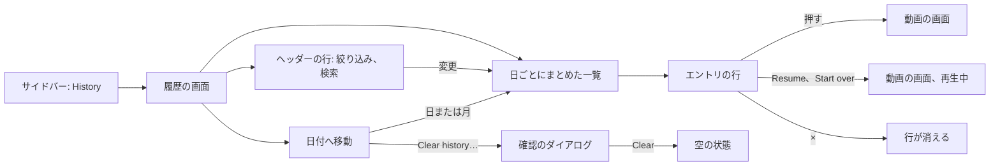
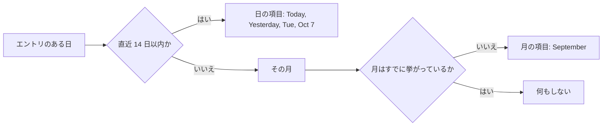
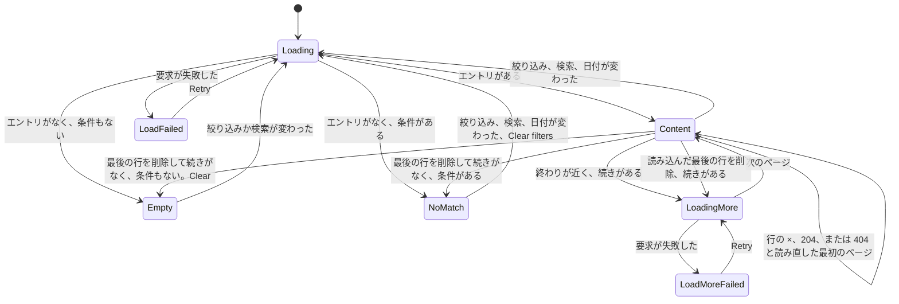

# UI 設計: 視聴履歴の画面 {#ui-design-watch-history-screen}

**機能**: [親 Issue #792](https://github.com/syudead/vv/issues/792) · [plan.md](plan.md) · [research.md R-3](research.md#r-3-the-entrys-time-is-the-server-time-of-the-first-save-with-its-id) · [R-5](research.md#r-5-an-entry-whose-content-left-the-library-stays-without-a-video) · [R-6](research.md#r-6-deleting-entries-is-a-plain-delete-a-vanished-entry-answers-404-and-the-screen-reloads) · [R-7](research.md#r-7-watch-history-is-one-more-owner-only-screen-and-route-with-the-existing-gate-rules) · [R-8](research.md#r-8-filter-search-and-date-jump-are-conditions-of-the-list-request) · [R-9](research.md#r-9-the-state-filter-reads-the-videos-current-watch-state-with-the-librarys-rule) · [R-11](research.md#r-11-the-date-list-and-the-jump-are-computed-on-the-server-in-the-viewers-time-zone) · [R-12](research.md#r-12-the-filter-the-search-and-the-date-live-in-the-screens-url) · [R-13](research.md#r-13-the-resume-and-restart-actions-open-the-video-page-with-autoplay-and-the-existing-resume-rule-decides-the-position) · [R-14](research.md#r-14-the-entry-keeps-its-instant-the-screen-shows-only-the-day) · [R-15](research.md#r-15-the-timeline-section-leaves-the-registry) · [contracts/screen-api.md](contracts/screen-api.md) · [quickstart.md](quickstart.md)

これは画面の 2 度目の改訂である。最初の改訂は、最初の設計（ヘッダーに `More` メニューを持つ、日のカードの `GroupedList`）を、日のタイムライン、絞り込みと検索を持つヘッダーの行、日付への移動と消去の操作を持つ横の列に置き換えた。この改訂は、メンテナーによる要件 3 と `UI品質` の変更に従う。画面の時間の単位は日だけなので、一覧は日ごとにまとめた一覧で、日ごとに見出しを 1 つ持ち、行には時刻も縦の罫線も点もない。最初の改訂のヘッダーの行、横の列、行の内容、Resume と Start over の操作、削除の振る舞い、ダイアログ、動画のないエントリ、ゲートの規則はそのまま有効である。

すでに決めている出典。ここでは繰り返さず、リンクする。

| 話題 | 出典 |
| --- | --- |
| トークン、閉じた段階、ライブラリの密度 | [design-system.md の Foundations](../../docs/design-docs/design-system.md#foundations)。値は [`web/src/ui/tokens.css`](../../web/src/ui/tokens.css) の `@theme` にあり、ここでは名前で参照し、写さない |
| `ListPage`、`PageHeader`、`Toolbar`、状態のブロック、`LoadMoreRow` | [patterns.md の List page](../../web/registry/rules/patterns.md#list-page) と [States](../../web/registry/rules/patterns.md#states) |
| `GroupedList`: 留まる見出し、行、グループの間の間隔 | [patterns.md の Sections](../../web/registry/rules/patterns.md#sections)。この改訂が変える形で |
| `ConfirmDialog`: 何を確認するか、`pending`、その中の失敗の `Alert` | [patterns.md の Confirm dialog](../../web/registry/rules/patterns.md#confirm-dialog) |
| `Button`、`ToggleGroup`、`Input`、`DropdownMenu`、`Tooltip`、`Separator`、`Progress`、`Sonner`、`VideoThumbnail`: それぞれの用途 | [components.md](../../web/registry/rules/components.md) |
| ライブラリの検索欄: `/` でフォーカスし、Esc で消し、クエリは 100 コードポイントで切る | [`SearchBox.tsx`](../../web/src/videoList/SearchBox.tsx)。[013 list-url.md](../013-library-search/contracts/list-url.md) |
| ライブラリの視聴の絞り込みの語と、それを 1 つ選ぶ `ToggleGroup` | [`FilterMenu.tsx`](../../web/src/videoList/FilterMenu.tsx)、[`listSummary.ts`](../../web/src/videoList/listSummary.ts) の `watchLabel` |
| リスト表示の行: タイトルの太さと行数の制限、再生できない動画の警告の行 | [library-ui.md の List view and selection](../../docs/design-docs/library-ui.md#list-view-and-selection)。[`VideoCard.tsx`](../../web/src/videoList/VideoCard.tsx) の `VideoRow` |
| 所有者専用の一覧画面: 入口、ルート、`document.title`、行が消えた後のフォーカス | [030 UI 設計の Duplicates page](../030-video-versions/ui-design.md#duplicates-page) |
| サイドバーの項目、レールとドロワー、ゲストに見えないもの | [016 UI 設計の Sidebar](../016-single-account-auth/ui-design.md#sidebar) と [Guest degradation](../016-single-account-auth/ui-design.md#guest-degradation) |
| 開いたときの自動再生と再開の規則 | [`pageDecisions.ts`](../../web/src/player/pageDecisions.ts) の `autoplayRequested` と `resumePosition` |
| 日付はカタログのロケールで `Intl` が書式化する | [`web/src/i18n/format.ts`](../../web/src/i18n/format.ts) |
| CSS の幅のブレークポイント。人が確かめるレイアウト | [library-ui.md の Width breakpoints](../../docs/design-docs/library-ui.md#width-breakpoints-in-css-and-the-sidebar-exception)、[Layout verified by people](../../docs/design-docs/library-ui.md#layout-verified-by-people-not-machines) |
| 画面の文言 | [`web/src/i18n/en.ts`](../../web/src/i18n/en.ts)（`shell.nav`、`common`、`list`）。この機能は `history` と下の文言を加える |

図は、画面の部分と、それぞれの操作の行き先を示す。

変わらないもの: 動画の画面とその再開のしかた、ライブラリのカードとリスト表示、`Last played` の並べ替え、サイドバーのほかの項目、ゲート。

## この形にした理由 {#why-this-shape}

画面は日ごとにまとめた一覧である。日ごとに見出しが 1 つあり、その日の行はその下にページの背景の上にじかに並び、カードも行の間の線もなく、2 つの日の間の空きは 2 つの行の間の空きより広い。改訂した要件 3 と `UI品質` は、日を振り返りの単位にし、エントリの時刻と、時間の流れを日より細かく描く飾りを認めない。最初の改訂のタイムラインから罫線、点、時刻の列を除いて残るのは日の見出しの下の行であり、それはレジストリの `GroupedList` が担う形である（「the day of a history」、[patterns.md の Sections](../../web/registry/rules/patterns.md#sections)。[R-15](research.md#r-15-the-timeline-section-leaves-the-registry)）。メンテナーはこの形の 2 つの姿をキャンバスで比べた。日ごとに 1 枚のカードに載せた行（レジストリの今の `GroupedList`）と、ページの背景の上の行（最初の改訂の見た目から時刻、罫線、点を除いたもの）であり、後者を選んだ。最初の設計の日のカードは、たまたま見出しを持つ動画の一覧として、動いている画面ですでに採用されなかった。また、日ごとの枠は、間隔だけで区切りが示せるところに、見る人が読まない箱を描く（`UI品質`、`余白のリズム`）。そのため `GroupedList` はバリアントを増やすのではなく形を変える。行はカードと線を失う。履歴がその唯一の利用者なので、素の形の横にカードの形を残すと、どの画面も確かめない規則になる。これは R-15 が `Timeline` を残さない理由と同じである（[デザインシステムの変更](#changes-to-the-design-system)）。日付の列を持つ `DataTable` は引き続き採用しない。日付がすべての行で繰り返され、「先週何を見たか」に答えるまとまりを表では描けない。

見出しが「いつ」のすべてを持つ。「Today」「Yesterday」または曜日、次に薄い色の日付を、1 行に並べる。親 Issue の `UI品質` は、目が止まるのを「何を」とそれが属する日の 2 つにすることを求めている。見出しはその行がスクロールする間トップバーの下に留まるので、日はそれに属する行の上に常に見えており、どの行もそれを繰り返す必要がない。1 つの動画を 1 日に二度見ると、1 つの見出しの下の 2 つの行になり、要件 3 が求めるとおり、順番以外にそれらを見分けるものはない。エントリはどの動画かを言い、日はいつかを言う。

絞り込み、検索、日付の一覧は一覧を絞る道具なので、道具の置かれる場所に、デザインシステムがそれらに用意する控えめな形で置く。ヘッダーの行の分割された `ToggleGroup` と検索の `Input`、そして一覧の後に読まれる横の列の、日付のただの一覧である。ライブラリのような絞り込みのポップオーバーは採用しなかった。Issue は 3 つの状態を画面自身の切り替えとして挙げており、ヘッダーの行の 3 つの語は、ポップオーバーで余分に 1 回押すより負担が小さい。日付の一覧はカレンダーではなく横の列である。エントリのある日だけを挙げるので、カレンダーの空のマスは Q-5 が禁じるプレースホルダーになってしまう。

行は、今の位置を文字とバーで、再開の操作の隣に出す。要件 16 と 17 がそれらを組にしているからである。見る人は自分がどこにいるかを読み、そこから続けるボタンを押す。サムネイルはライブラリのリスト表示の行より広い（`history-thumb`、`lg` 以上の幅で約 192×108 px）。メンテナーのモックアップでは枠が行の唯一の絵であり、その下の位置のバーが読めなければならないからである。それでも行はログの 1 行で、ライブラリのカードより低く、タグ、サイズ、画質、お気に入りを持たない。ライブラリの `list-thumb` の幅は、位置のバーのために採用しなかった。112 px のバーでは、2 時間の動画で 1 分動いた位置を示せない。トークンは最初の改訂が選んだ幅を保ち、それを選んだ画面の名前をとる。`related-thumb` が動画の画面の名前をとるのと同じである（[R-15](research.md#r-15-the-timeline-section-leaves-the-registry)）。

行は 1 行の形を `lg`（1024 px）からとる。日付の一覧が帯から横の列に変わる幅である。`lg` 未満では、行はスマートフォンのコンパクトな形を保つ。最初の設計は `sm`（640 px）で切り替えていたが、#879 のレビューで、レール、ページの余白、192 px のサムネイル、2 つのボタンがそれぞれの幅をとった後、1 行の行ではタイトルの列の幅が 640 px で 0 px、768 px で 126 px になり、タイトルが細い帯に折れた。メンテナーは、より狭い固定の列ではなく、`lg` 未満のすべての幅でコンパクトな形を選んだ。そのため行は、画面のほかの部分がすでに使うブレークポイントの両側で、それぞれ 1 つの形を持つ。

すべてを消す操作は、横の列の最後の項目で、区切りの後にあり、`ghost-destructive` の形をとる。これは列の日付と同じくらい控えめで、どの行の `×` よりも控えめである。Issue はこの操作を横の領域に置き（要件 8）、1 つのエントリの削除より目立たず、誤って押しにくいことを求めている。赤い文字は目を引くので、区切りの後、列の終わりに置く。そこでは何も誤って押されない。そして押すことと失うことの間には、なお `ConfirmDialog` がある。`lg` 未満では、列は操作を持たない日付のチップの帯になり、消去の操作は最初の設計と同じ場所、ヘッダーの `More` メニューの奥にある。

内容がライブラリを離れたエントリは、押せず、再開の操作も持たないまま、スナップショットのタイトルと警告の行を付けて一覧に残る。Issue がエントリを残し、再生できないと分かることを求めているからである（Edge Case）。ファイルが戻るまで行を隠す案は R-5 で採用しなかった。

## 文言 {#words}

文言は `web/src/i18n/en.ts` の `history` の下に置く。キーを挙げたものは除く。ユーザーのデータ（タイトル）は引数として埋め込む。Issue の `続きから` と `最初から` は「Resume」と「Start over」である（[R-13](research.md#r-13-the-resume-and-restart-actions-open-the-video-page-with-autoplay-and-the-existing-resume-rule-decides-the-position)）。画面のどの文字も時刻ではない。`formatTime` は使わない。

| 場所 | 文言 | 備考 |
| --- | --- | --- |
| サイドバーの項目、ページのタイトル、`document.title` | History | `shell.nav.history`、`history.title`、`history.documentTitle` |
| 一覧のアクセシブルな名前 | Watch history | `history.list` |
| 絞り込みのグループのアクセシブルな名前 | Watch status | `list.filter.watch` |
| 絞り込みの選択肢 | All, In progress, Watched | `list.filter.watchOptions.all`、`.inProgress`、`.watched`。`watchLabel` |
| 検索欄のプレースホルダーとアクセシブルな名前。`lg` 未満の検索ボタンとそのツールチップ | Search titles | `history.search.label` |
| 検索を消す | Clear search | `list.search.clear` |
| 日の見出し、前の部分 | Today、Yesterday、それ以外は曜日「Tuesday」 | `history.day.today`、`history.day.yesterday`、それ以外は `formatWeekday`（`weekday: "long"` の `Intl.DateTimeFormat`） |
| 日の見出し、後の部分 | Oct 7。今年以外は Oct 7, 2025 | `formatMonthDay`（`month: "short", day: "numeric"`、その日が今年でないときは `year` も） |
| アクセシブルな名前の中の日 | Today, Oct 7 | `history.day.full(name, date)`: 見出しの 2 つの部分を ", " でつないだもの |
| フォルダの行 | Travel / 2024 | 区切りの間に ` / ` を入れた `video.folder.path`。パスが空のときや `folder` がないときは行がない |
| 位置 | 16:05 / 42:18 | `history.position(position, duration)`。どちらも `formatDuration` を通す |
| 位置のバーのアクセシブルな名前 | Watched portion | カードの `list.card.watchedRatio` |
| 再開の操作、アクセシブルな名前 | Resume。Resume {title} | `history.resume`、`history.resumeFor` |
| 最初からの操作、アクセシブルな名前 | Start over。Start {title} over | `history.startOver`、`history.startOverFor` |
| エントリのリンクのアクセシブルな名前 | {title}, {duration}, played {day} | `history.entryLink(title, duration, day)`。{day} は `history.day.full`。長さがないときは「{title}, played {day}」。時刻はない。[エントリの行](#entry-row)を参照 |
| 削除ボタン、ツールチップ | Remove from history | `history.remove` |
| 削除ボタン、アクセシブルな名前 | Remove "{title}" played {day} from history | `history.removeFor(title, day)`。{day} はエントリのリンクと同じ |
| ライブラリにないエントリ | Not in the library | `history.notInLibrary`。警告の行 |
| スナップショットのタイトルが空のエントリ | Unknown video | `history.unknownTitle` |
| 移動の一覧の見出し、帯のアクセシブルな名前 | Jump to date | `history.jump.title` |
| 移動の一覧の日 | Today、Yesterday、それ以外は Tue, Oct 7 | `history.day.*`、それ以外は `formatWeekdayDate`（`weekday: "short", month: "short", day: "numeric"`、今年以外は `year` も） |
| 移動の一覧の月 | September。今年以外は December 2025 | `formatMonth`（`month: "long"`、加えて `year`） |
| 移動先がない移動の一覧 | No dates to jump to | `history.jump.none` |
| 要求が失敗した移動の一覧 | Couldn't load the dates | `history.jump.loadFailed`。`Retry` は `common.retry` |
| `lg` 未満のヘッダーのメニューボタン、ツールチップとアクセシブルな名前 | More | `common.more` |
| `lg` 未満のメニューの項目。`lg` 以上では横の列の最後の項目 | Clear history… | `history.clear` |
| ダイアログのタイトル | Clear watch history? | `history.clearDialog.title` |
| ダイアログの説明 | Every entry is removed. Playback positions and watched marks stay as they are. | `history.clearDialog.description` |
| ダイアログの操作 | Clear | `history.clearDialog.submit`。`destructive` |
| 送信中のダイアログの操作 | Clearing… | `history.clearDialog.submitting` |
| ダイアログの失敗 | Couldn't clear the history: {reason} | `history.clearDialog.failed`。ダイアログの中の `destructive` の `Alert` |
| 削除の失敗 | {reason} | トーストの `errorText(error)` |
| 空の状態のタイトル | No watch history | `history.empty.title` |
| 空の状態の説明 | Videos you play are listed here, newest first. | `history.empty.description` |
| 一致なしのタイトル | No history matches these conditions | `history.noMatch.title` |
| 一致なしの説明 | Try a different search or change the filters. | `list.noMatchesHint` |
| 一致なしの操作 | Clear filters | `list.filter.clear`。`watch`、`q`、`date` を取り除く |
| 読み込みの失敗 | Couldn't load the history | `history.loadFailed`。`Retry` は `common.retry` |
| 続きの読み込み中、続きの読み込みの失敗 | Loading…, Couldn't load more: {reason} | 既存の `list.loading` と `list.loadMoreFailed` |

## デザインシステムの変更 {#changes-to-the-design-system}

最初の改訂はレジストリに 6 つのものを加えた。5 つはそのまま残る。`Timeline` セクションはこの改訂で外れ、読み込みの状態と名前付きの段階もそれとともに変わる。[patterns.md](../../web/registry/rules/patterns.md) が求めるとおり、それぞれの変更を、画面が使う前にレジストリ、その規則のファイル、[design-system.md](../../docs/design-docs/design-system.md) で行う。

| 変更 | 項目 | 何であるか |
| --- | --- | --- |
| `ListPage` の `aside` スロットと `toolbarRow="header"`（残る） | `list-page` | `aside`: `lg` 以上で本体の右にある列で、幅は `w-list-aside`（「Tue, Oct 7」と「Clear history…」が 1 行に収まる列のための名前付きの段階）、本体がスクロールする間トップバーの下に留まる。`lg` 未満では帯と本体の間に幅いっぱいで描き、その中のセクションが狭い形を決める。`toolbarRow="header"`: `lg` 以上ではヘッダーとツールバーが 1 つの行を共有し、ヘッダーは自分の幅で、ツールバーが残りを埋める。`lg` 未満では今と同じに縦に積む。グリッドは、`grid-cols-term` と同じく `tokens.css` の名前付きのユーティリティである |
| `Toolbar` の `searchPlacement="end"`（残る） | `toolbar` | `page` の配置で、検索が絞り込みの後ろ、行の端へ移り、幅は `max-w-sm` を超えない。ページのタイトルで始まる行のためのものである。`sm` 未満では、今と同じく幅いっぱいの自分の行をとる |
| `JumpList` セクション（残る） | `jump-list` | 移動先の `ToggleGroup type="single"` を、`Separator` で区切ったグループに並べ、最後の区切りの後に省略できる `action` スロットを持つ。`lg` 以上では `h2` の下の縦の一覧で、それ未満では `outline` `sm` のチップの横にスクロールする帯になり、見出しはスクリーンリーダー向けだけで、`action` はない。[日付へ移動](#jump-to-date)を参照 |
| `Button` のバリアント `ghost-destructive`（残る） | `button` | `ghost` の形に `text-destructive` と `bg-destructive-soft` のホバーを持つ。`DropdownMenuItem variant="destructive"` のボタン版である。メニューの外で、ただの操作の間に `Separator` の後に立つ破壊的な操作のためのもので、必ず `ConfirmDialog` を開く。1 画面に 1 つ |
| `Timeline` セクション（取り除く） | `timeline`、ブロック `timeline-example` | 規則の行、`design-system.md` の行、マニフェストの `timeline` と `timeline-example` の項目とともにレジストリから外れる（[R-15](research.md#r-15-the-timeline-section-leaves-the-registry)）。履歴が唯一の利用者だった |
| `GroupedList` セクション（変える） | `grouped-list`、ブロック `grouped-list-example` | 見出しは残る。`text-sm font-semibold` の `h2` で、グループがスクロールする間トップバーの下に留まる。行はカード（`bg-card`、`rounded-md border`）と行の間の線を失う。各行はページの背景の上の `py-2` で、横の余白を持たないので、最初の要素が見出しに揃う。セクションは引き続き、行の 1 行のレイアウト、見出しとその行の間の `gap-2`、グループの間の `gap-6` を受け持つ。規則の行、`design-system.md` の行、例のブロックもそれとともに変わる。ブロックは各行のタイトルの下の時刻も失う。ブロックは履歴を表しており、履歴は時刻を出さないからである。サムネイル、タイトル、`×` は保つ |
| `LoadingState` の `layout="grouped"`（`layout="timeline"` を置き換える） | `loading-state` | まとめた一覧の `Skeleton` の形: 見出しの大きさのバー、その後にページの背景の上の 3 つの行。各行はサムネイルの大きさのブロック（`w-history-thumb-sm`、`lg:w-history-thumb`）と 2 本の文字のバーで、実際の行と同じに、線のない `py-2` である。`timeline` のレイアウトは外れる |

`tokens.css` の名前付きの段階: `list-aside` は残る。`timeline-label` と `timeline-time` はセクションとともに外れ、`grid-cols-timeline-*` のユーティリティも外れる。`timeline-thumb` と `timeline-thumb-sm` は値を保ち、`history-thumb`（`lg` 以上の行のサムネイル、16:9、幅約 192 px）と `history-thumb-sm`（`lg` 未満、幅約 128 px）になる。`related-thumb` が動画の画面にちなんで名付けられているのと同じく、その値を位置のバーが決めた画面にちなんで名付ける。2 つの名前付きのユーティリティ、`grid-cols-history-row`（`lg` 未満: `history-thumb-sm` の列、文字の列、`×` の列）と `grid-cols-history-row-wide`（`lg` 以上: `history-thumb` の列、文字の列、操作の列、`×` の列）が行の列を持つ。`grid-cols-term` が事実の一覧の列を持つのと同じである。新しい色のトークンはないので、`web/src/theme/tokens.test.ts` のコントラストの組は何も増えない。

## サイドバーの項目とルート {#sidebar-entry-and-route}

「History」（lucide `History`、`/history`、`ownerOnly`）は、サイドバーの上のグループの 3 番目の項目で、「Folders」の後、「Tags」の前に置く。これで最初の 3 項目は見るものを探す画面になり、最後の 2 項目は管理になる。ゲストの上のグループは「Library」と「Folders」のままで、変わらない。レールとドロワーはこの項目をほかの項目と同じに扱い、件数のバッジはない。

ルートは `/duplicates` と同じ形である。`AppShell` の中にあり、使うときに読み込まれ、ゲートの所有者専用のパスに含まれる。そのため、`/history` や `/history?watch=watched` を開いたゲストは、完全な URL を持つ `/login?next=…` に送られる（R-7）。`document.title` は「History」である。

URL は、[contracts/screen-api.md の Client use](contracts/screen-api.md#client-use) のとおりに `watch`、`q`、`date` を持つ（R-12）。既定値は省き、読めない値は既定値とする。すべての行のリンクと操作は完全な URL を `state.from` として持つので、動画の画面の `×` と Esc は同じ絞り込み、検索、日付に戻る。

## 履歴の画面 {#history-screen}

`toolbarRow="header"` と `aside` スロットを持ち、帯と選択バーを持たない `ListPage` である。本体は `GroupedList` 1 つで、次のページを読み込む間はその後に `LoadMoreRow` が続く。または状態のブロック 1 つである。ヘッダー、ツールバー、aside はどの状態でも同じ場所にとどまり、本体だけが変わる。

### ヘッダーの行 {#header-row}

`lg` 以上では、行は左から右へ、`PageHeader` のタイトル「History」（`text-xl font-semibold`、件数はない。API は総数を返さず、数字は減らすべきものと読まれてしまう）、視聴の絞り込みを子に持つ `Toolbar`、行の端の検索である。行の中で `primary` で描くのは、押された絞り込みの選択肢の `primary-soft` の塗りだけなので、タイトルが最も強い文字のままである。

| 部分 | 形 |
| --- | --- |
| 視聴の絞り込み | 3 つの文字の項目「All」「In progress」「Watched」を持つ `ToggleGroup type="single" variant="outline" size="sm"`、`aria-label` は「Watch status」。今の値が押された状態（`primary` の文字の `primary-soft`）で、押された状態を解除できないので、常に 1 つの選択肢がオンである。URL の `watch`。「All」は省く |
| 検索 | 構文の説明を持たないライブラリの `SearchBox`。プレースホルダーと名前は「Search titles」、`h-8`。`/` でフォーカスし、Esc で消してフォーカスを外し、文字がある間は消去の `×` が現れ、確定した文字はライブラリのデバウンスの後に `q` に入る。構文（`-word`、`a OR b`、引用符）はライブラリと同じに働くが（R-10）、知らせない。この欄はタイトルの数文字のためのものである |
| `lg` 未満 | `PageHeader` は `actions` に、`ghost` `icon-sm` の検索の切り替え（lucide `Search`、ツールチップと名前は「Search titles」、`aria-expanded`）と、1 項目のメニュー「Clear history…」（lucide `Trash2`、`variant="destructive"`）を開く `ghost` `icon-sm` の `More` ボタン（lucide `Ellipsis`）を持つ。ヘッダーの下のツールバーの行は絞り込みを持ち、検索欄は開いている間だけ持つ |

`lg` 未満の検索の切り替えは、それ自体が絞り込みではない。ツールバーの検索を現すもので、検索は `q` が空でないか欄にフォーカスがある間は現れたままで、Esc か消去の `×` が欄を空にし、フォーカスが離れると再び隠れる。`/` を押すと開いて欄にフォーカスする。`lg` 以上では欄は常に出ており、ヘッダーの 2 つのボタンは描かないので、切り替えが欄と重複することはない。

一覧が読み込み中、失敗、空、一致なしの間は、`More` ボタンと横の列の「Clear history…」を描かない。見えている消すものがなく、何も出していない表示から消すと、見る人が見られないものを削除することになる。

### 日のグループ {#day-groups}

一覧は「Watch history」という名前の `GroupedList` である。日ごとに 1 つの `GroupedListGroup` を新しい日から並べ、その日のエントリを API が返す順に `GroupedListItem` として並べる（R-3）。エントリは、ブラウザのタイムゾーンでの `playedAt` の暦日でまとめる（[R-14](research.md#r-14-the-entry-keeps-its-instant-the-screen-shows-only-the-day)）。見出しの場所、行の余白、すべての間隔はセクションが受け持ち、画面は見出しの語と行の内容を渡す。

| 部分 | 形 |
| --- | --- |
| 日の見出し | セクションの `h2` で、1 行: 「Today」「Yesterday」または曜日を `text-sm font-semibold text-foreground` で、次に支援技術から隠した `·`、次に日付を `text-xs text-muted-foreground` で（「Today · Oct 10」「Tuesday · Oct 7」）。その行がスクロールして過ぎる間トップバーの下（`top-navbar`）に留まり、次の日の見出しがそれを押し出す。どの幅でも同じである |
| 1 日の中の行 | ページの背景の上にじかに、それぞれ `py-2` で、間にカードも線も間隔もない。この改訂が変えるセクションの形である。行の `hover:bg-accent` の塗りが、行が見せる唯一の面である |
| 日のグループの間 | セクションの `gap-6`。2 つの行の間の `py-2` より目に見えて広いので、空きだけが区切りを示し、日はページを下るブロックとして読める |
| ほかには何もない | 縦の罫線も、点も、行の時刻も、行の日付もない（`UI品質`、`時系列の粒度`） |

日の境界は見る人のローカルの午前 0 時なので、午後 11:50 のエントリと午前 0:10 のエントリは 2 つのグループに分かれる。ページングで 1 日が 2 つのページに分かれることがある。次のページの最初のエントリが同じ日なら開いているグループに加わるので、同じ日が二度現れることはない。

「Today」と「Yesterday」は描画時の現在の日付から計算する。画面は、見る人の次のローカルの午前 0 時と、タブが再び見えるようになったときに、一覧を読み直さずに見出しを描き直す。そのため、一晩開いたままの画面は、昨日のエントリを「Yesterday」の下に、その前の日のエントリをその曜日の下に出す。

### エントリの行 {#entry-row}

行は、名前付きの列のグリッドを内容に持つ 1 つの `GroupedListItem` である。`lg` 以上（`grid-cols-history-row-wide`）では、行は 1 行に並ぶ。サムネイル、文字の列、行の端の操作である。`lg` 未満（`grid-cols-history-row`）では、行はコンパクトな形である。左の `history-thumb-sm` のサムネイルとその横の文字の列、行の端の `×`、そして文字の列の下に、その左端に揃えた再開または最初からのボタンがある。サムネイル、タイトル、操作は、リスト表示のセルと同じく、行の中で縦の中央に置く。

| 部分 | 形 |
| --- | --- |
| サムネイル | `lg` 以上では `VideoThumbnail` `w-history-thumb rounded-md`、それ未満では `w-history-thumb-sm`: 画像または「No image」のプレースホルダー、右下に `VideoThumbnailDuration`、動画が視聴途中の間は、カードが描くのと同じに、下端に `watchedRatio(video)` の `VideoThumbnailProgress`。お気に入り、選択の印、公開の印はない |
| タイトル | `text-sm font-medium text-foreground line-clamp-2`、必要なら単語の途中で折り返す。`title` に全文。動画の現在の `video.title` |
| フォルダの行 | `text-xs text-muted-foreground truncate`: フォルダのパス「Travel / 2024」。動画が登録したフォルダの直下にあるときはない |
| 位置の行 | `max` が `durationMs`、`value` が `progress.positionMs`、`progress.completed` が true のときは `durationMs` の `Progress`（`h-1`、`max-w-xs`、`aria-label` は「Watched portion」）。サーバーは終わりの 15 秒または 5% 手前まで見た動画を視聴済みとし、視聴済みの行のバーは満ちているからである。その後に `text-xs text-muted-foreground tabular-nums` で「16:05 / 42:18」。動画が `progress` か `durationMs` を持たないときは行がない |
| 操作 | `lg` 以上では行の端に `shrink-0` で: `outline` `sm` の再開または最初からのボタン、その後に `ghost` `icon-sm` の削除ボタン（lucide `X`、`text-muted-foreground`、ツールチップは「Remove from history」）。`lg` 未満では、ボタンは文字の列の下に、`×` は行の端の、サムネイルの 1 行目の高さにある。画面はタッチでも使うので、どちらも常に描き、ホバーのときだけ現すことはしない |

サムネイルと文字の列は、`state.from` を今の履歴の URL にした `/videos/{video.id}` への 1 つの `Link` である。リンクはサムネイルから操作までの行を覆い、`hover:bg-accent rounded-md` を持つ。`×` と再開または最初からのボタンだけがリンクの外に置かれる。そのため、要件 5 のとおり、ボタン以外の行のどこを押しても動画が開く。動画の画面は自動再生なしに、自身の規則で再開する。

再開と最初からのボタンは、同じ動画への `state: { from, autoplay: true }` の `Link` を囲む `Button asChild` である（R-13）。そのため、それらはリンクのままである。

| 動画の状態（`progress`） | ボタン | 動画の画面がすること |
| --- | --- | --- |
| 視聴途中（`completed` が false） | lucide `Play` 付きの「Resume」 | `resumePosition(video)` から再生を始める。行が出す位置だが、`MinResumeMs`（5 秒）未満のときと、バージョンのまとまりのメンバーの共有された位置がこのバージョンの長さを過ぎているときは 0 から始める（[R-13](research.md#r-13-the-resume-and-restart-actions-open-the-video-page-with-autoplay-and-the-existing-resume-rule-decides-the-position)）。文言は「Resume」のままである。動画を普通に開くときと同じに、既存の再開の規則が開始位置を決める |
| 視聴済み（`completed` が true） | lucide `RotateCcw` 付きの「Start over」 | 0 から再生を始める。行の文字は保存された位置を出したままで、バーは満ちている |
| `progress` がない | なし | 行そのものが動画を開く。この場合はまれ（サーバーが記録したどの視聴にも位置の行がある）なので、3 つ目の語のために 3 つ目のボタンを置く価値はない |

`×` は `Link` ではなく、ボタンの後に置く。そのため、Tab は行のリンク、ボタン、`×` の順に届く。ボタンを押しても、行のリンクは開かない。

同じ動画を 1 日に二度見ると、1 つの見出しの下の、サムネイル、タイトル、今の位置が同じ 2 つの行になる（要件 4 と 16）。何もそれらをまとめず、数えない。それらのリンクと `×` の名前は同じ語で、「{title}, {duration}, played Today, Oct 10」と「Remove "{title}" played Today, Oct 10 from history」である。2 つの行は見出しの下の順番で見分け、画面の上でもそれらを見分けるのは順番だけである。名前で時刻を読む案は R-14 で採用しなかった（要件 3 はエントリから時刻を除いており、目に対してと同じくスクリーンリーダーに対しても除く）。序数（「second viewing」）は、画面が出していないことを言い、1 日を分けたページでは数えられないので採用しなかった。2 つの日に見た 2 回の視聴は、名前に違う日を持つ。目が 2 つの見出しの下でそれらを読むのと同じである。

ライブラリにあるが再生できない動画（`playable` が false）はリンクとボタンを保ち、フォルダの行の下にリスト表示の行の警告の行（`text-xs text-warning`、lucide `AlertTriangle` `size-3`、行の `unplayable` の文言）を出す。そのため、見る人は動画の画面が同じことを言う前にそれを知る。

### ライブラリにないエントリ {#entry-not-in-the-library}

`video` を持たないエントリ（R-5）は、次の違いを除いて同じ行である。

| 部分 | 形 |
| --- | --- |
| サムネイル | 「No image」のプレースホルダー（lucide `ImageOff`）の枠。長さも進み具合もない |
| タイトル | エントリのスナップショットの `title` を `text-muted-foreground` で。空のときは「Unknown video」（内容がすでにライブラリを離れていた、マイグレーションで埋めたエントリ） |
| フォルダ、位置 | なし |
| 警告 | 位置の行があるはずの場所に、「Not in the library」を `text-xs text-warning` で、lucide `AlertTriangle` `size-3` とともに |
| リンクとボタン | なし。サムネイルと行はただの要素で、行にホバーの塗りもポインターのカーソルもなく、「Resume」も「Start over」も描かない（Edge Case: エントリは開くことも再開することもできない） |
| 削除 | ほかのすべての行と同じ |

意味を伝えるのは警告であり、色ではない。薄いタイトルとボタンがないことだけでは、読み込みの不具合と読まれてしまう。再スキャンの後に内容が戻ると、次に一覧を読んだときに行は動画、リンク、サムネイル、ボタンを取り戻す。この画面はそれを見張らない。

### 日付へ移動 {#jump-to-date}

`aside` は、今の絞り込みと検索のもとでエントリを持つ日と月の `JumpList` で、`GET /api/watch-history/dates` から得る（R-11）。`lg` 以上では `h2`「Jump to date」の下の横の列であり、`lg` 未満ではツールバーと一覧の間のチップの帯である。図は、API が返す日が一覧になるまでを示す。

「直近 14 日」はブラウザのタイムゾーンで今日から数える。そのため、日の項目は 2 週間を覆い、月がそれより古いすべてを持つ。月は、その日のいくつにエントリがあっても 1 度だけ挙げる。日がすべて 2 週間の中にある月は挙げない。その日が挙がっているからである。項目は新しい順で、日、`Separator`、月、そして `lg` 以上では `Separator` と「Clear history…」である。

| 部分 | 形 |
| --- | --- |
| `lg` 以上 | 列: `text-sm font-semibold` の `h2`「Jump to date」、その後に項目を、幅いっぱいで左揃えの `ghost` `sm` の大きさの切り替えとして、`text-sm text-muted-foreground` で並べる。選んだ項目は押された状態（`primary-soft` の塗り、`primary` の文字）である。月は日と同じ大きさで読める。列はトップバーの下に留まり（`top-navbar`）、ビューポートより高いときは自身の中でスクロールする |
| `lg` 未満 | 帯: 同じ項目を `outline` `sm` のチップとして、横にスクロールする 1 行に、日、縦の `Separator`、月の順で並べる。見出しは出さず、「Clear history…」はない（`More` にある）。選んだチップは押された状態で、一覧が届いたときにスクロールして見える位置に入る |
| Clear history… | `lg` 以上だけ: 最後の `Separator` の後の、lucide `Trash2` 付きの `ghost-destructive` `sm` の `Button` で、[確認](#clearing-the-history)を開く |
| 移動先がない | 項目の代わりに「No dates to jump to」を `text-xs text-muted-foreground` で（`lg` 以上）。`lg` 未満では帯を描かない |
| 日付の失敗 | `GET /api/watch-history/dates` が失敗すると、項目の代わりに `text-xs text-muted-foreground` の「Couldn't load the dates」と `ghost` `sm` の「Retry」を出す。`lg` 以上では見出しの下に出し、一覧に行があるときは「Clear history…」がその `Separator` の後に残る。`lg` 未満では帯の 1 行として出す。「Retry」は日付を再び求め、その間 `Skeleton` の行を出す。一覧は日付に依存せず、自身の状態を保つ |

項目を選ぶと `date`（日は `YYYY-MM-DD`、月は `YYYY-MM`）を書き、最初のページを読み直す。そのページはその日または月の最も新しいエントリから始まり、`nextCursor` で古いほうへ続く。ウィンドウは先頭までスクロールする。最初の項目を選ぶと、代わりに `date` を取り除く。最も新しい日は一覧の先頭であり、1 つの表示が 2 つの URL を持ってはならないからである。選んだ項目をもう一度押しても `date` を取り除く。日付は、画面を開いたときと、`watch` か `q` が変わったときに求め、`date` が変わったときには求めない。そのため、移動で一覧がちらつかない。新しい一覧が選んだ `date` をもう持たないときは、`date` は URL に残り、どの項目も押された状態にならず、一覧はその日付より前の一致するものを出す。一致なしの状態の「Clear filters」は、ほかの条件とともにそれを取り除く。

### エントリを 1 つ削除する {#removing-one-entry}

`×` を押すと、すぐに `DELETE /api/watch-history/{id}` を送る。確認も成功のトーストもない。行が消えることが結果であり、削除のたびにトーストを出すと、片付けが通知の連続になってしまう。

| 出来事 | 振る舞い |
| --- | --- |
| 押した | ボタンは `disabled` になり、`X` の代わりに `Spinner` を出す。行は残る。二度目に押しても何も起きない |
| `204` | 行が消える。最後の行が消えた日は、見出しとともに消える。フォーカスは次の行の `×`、なければ前の行のもの、なければページのタイトル（`titleRef`）に移る。重複の画面と同じである。移動の一覧は読み直さない。最後のエントリを失った日は、次に日付を読むまで挙がったままで、それを選ぶとその前のエントリを出す。最後に読み込んだ行が消え、`nextCursor` が残っているときは、もっと古いエントリがある。[ページング](#paging)を参照 |
| `404` | 一覧が古い（別のタブで削除された）。画面は、今の行を描いたまま今の条件で最初のページから読み直し、そのページが届いたら、スケルトンもメッセージもなしに行を置き換える（R-6）。ウィンドウは、短くなった一覧が許す限りスクロール位置を保つ。最初のページが空なら空の状態か一致なしの状態になる。読み直しが失敗すると、行を保ち、トーストに `errorText(error)` を出す |
| そのほかの失敗 | 行は残り、ボタンは `X` に戻り、トーストが `errorText(error)` を出す |

別のタブで再生中の動画のエントリを削除しても、何も止めない。そのタブの次の保存が新しいエントリを書き、この画面は次に読んだときにそれを出す（Edge Case）。

### 履歴を消す {#clearing-the-history}

「Clear history…」（`lg` 以上では横の列の最後の項目、`lg` 未満ではヘッダーの `More` メニューの唯一の項目）は `ConfirmDialog` を開く。

| 部分 | 形 |
| --- | --- |
| ダイアログ | `ConfirmDialog`: タイトル「Clear watch history?」、説明「Every entry is removed. Playback positions and watched marks stay as they are.」、先に `Cancel`、その後に `destructive` の操作「Clear」 |
| 送信中 | `pending`: 両方のボタンが無効になり、操作は `Spinner` とともに「Clearing…」と表示され、ダイアログは開いたままである |
| `204` | ダイアログが閉じ、本体は空の状態を出し、移動の一覧は「No dates to jump to」を出し、`watch`、`q`、`date` を URL から取り除き、フォーカスはページのタイトルに移る |
| 失敗 | 説明の下に `destructive` の `Alert`「Couldn't clear the history: {reason}」。ダイアログは開いたままで、後ろの一覧は変わらない |
| Cancel、Esc | ダイアログが閉じ、何も変わらない（受け入れ条件 7） |

説明は残るものを挙げる。所有者がここで恐れる唯一のことは再開の位置を失うことであり（要件 9）、押す前に文言がそれを解消する。消去は絞り込んだものではなくすべてのエントリを取り除き、ダイアログのタイトルがそう言う。成功すると条件を捨てるので、空の状態が一致なしと取り違えられない。

### ページング {#paging}

最初の読み込みは、URL の `watch`、`query`、`date` と `tz` で既定のページ（`limit` 60）を求める。最後の行が下端から 1 ビューポート以内に来ると、ライブラリが `IntersectionObserver` でするのと同じに、`nextCursor` と同じ条件で次のページを求め、一覧の下に `LoadMoreRow` を出す。ページの読み込みが失敗すると、行を保ったまま、同じカーソルへの `Retry` を持つ `LoadMoreRow` の失敗を出す。「Load more」ボタンもページ番号もない。履歴はスクロールで遡って読むものである（要件 6）。

行を削除すると、`nextCursor` がまだ古いエントリを指しているのに、読み込んだ行が 1 つもなくなることがある。そのとき画面はすぐに次のページを求め（またはすでに走っている要求を待ち）、本体には `LoadMoreRow` だけを出し、届いた行を出す。そこでの失敗は、`Retry` を持つ `LoadMoreRow` の失敗である。空の状態と一致なしの状態は、読み込んだ行がなく、`nextCursor` も残っていないときにだけ出る。そのため、古いエントリが再読み込みまで届かなくなることはない。

### 状態 {#states}

図は、本体の状態と、状態の間を移すものを示す。

条件があるとは、`watch` が「All」でないか、`q` が空でないか、`date` があることである。`404` の読み直しはそれだけの状態ではない。最初のページが行を置き換えるまで、本体は行を描いたまま `Content` にとどまる。

| 状態 | 画面に出すもの |
| --- | --- |
| Loading | 本体に `LoadingState` `layout="grouped"`: 見出しの大きさのバーと、ページの背景の上のサムネイルの大きさの 3 つの行。絞り込みと検索を持つヘッダーの行。日付が届いていれば項目を持つ aside、その要求が失敗していれば失敗の形の aside、そうでなければ aside 自身の `Skeleton` の行。`More` も「Clear history…」もない |
| Load failed | 「Couldn't load the history」と `Retry` を持つ `ErrorState`。aside は「No dates to jump to」を出す |
| Empty | lucide `History`、「No watch history」、「Videos you play are listed here, newest first.」を持つ `EmptyState`。操作はない。絞り込みと検索は使えるままだが、何も見つけない。aside は「No dates to jump to」を出す。`lg` 未満では帯はない |
| No match | lucide `SearchX`、「No history matches these conditions」、「Try a different search or change the filters.」と、`watch`、`q`、`date` を取り除く `default` `sm` の操作「Clear filters」を持つ `EmptyState`。絞り込みは押された選択肢を、検索はその文字を保つので、見る人は何がすべてを除いたかが分かる。aside は「No dates to jump to」を出すか、新しい日付がもう持たない `date` のもとでは、何も押されていない日付を出す |
| Content | 日ごとにまとめた一覧。項目（またはその失敗の形）と「Clear history…」を持つ aside。`lg` 未満では `More` |
| Loading more | 一覧、その後に読み込み中の `LoadMoreRow` |
| Load more failed | 一覧、その後に `Retry` を持つ失敗の `LoadMoreRow` |
| Removing a row | その行の `×` が `Spinner`。ほかは変わらない |
| Clearing | 変わらない一覧の上に `pending` の形のダイアログ |

空と一致なしは、ひと目で別のものと読めなければならない。空の状態は `History` のアイコンを持ちボタンを持たない。一致なしの状態は `SearchX` のアイコンと「Clear filters」のボタンを持ち、その上のヘッダーは「All」以外の押された絞り込み、検索の文字、または押された日付を出す。

一覧は、画面を開いたとき、条件が変わったとき、動画の画面からこの画面に戻ったときに読む（`Link` はルートを離れるので、画面は同じ URL で再びマウントされて最初のページを読む）。その動画のどの行も、視聴が達した位置を出す（受け入れ条件 14）。URL に `date` がなく、視聴が絞り込みと検索に合うときは、終えたばかりの視聴が先頭に来る。`date` のもとではページがその日または月から始まるので、新しい視聴はその上にあり、見る人が最初の移動の項目を選ぶと現れる。開いている間に自分で更新はしない。Issue が挙げるタブをまたぐ変化は古くなった削除だけであり、それは `404` の経路が扱う（R-6）。

## レスポンシブな振る舞い {#responsive-behaviour}

実装は下の幅で判断する。レイアウトは `lg`（1024 px: ヘッダーの行、横の列、消去の操作の場所、行の形）で変わる。`sm`（640 px）ではドロワーがレールになる。日の見出しはどの幅でも 1 つの形を持つ。

| 幅 | レイアウト |
| --- | --- |
| 360px | サイドバーはドロワーである。ヘッダーの行は、タイトルと、その右の検索の切り替えと `More` である。その下のツールバーの行を絞り込みの 3 つの選択肢が埋め、検索欄は開いている間、自分の行に現れる。次に日付のチップの帯で、横にスクロールし、選んだチップが見える。各日は、トップバーの下に留まる見出し（「Today · Oct 10」）と、カードも線もなくページの背景の上にある行である。行は、左の `w-history-thumb-sm` のサムネイルと、その横のタイトルと位置の文字、行の端の `×`、そして文字の列の下の `outline` `sm` の「Resume」または「Start over」のボタンである。長いタイトルは 2 行で切り、`×` を行の外に押し出さない。ダイアログはダイアログ自身の余白で幅いっぱいに広がる |
| 768px | レールのサイドバー。ヘッダーの行は 360px と同じ。帯も 360px と同じ。行は 360px のコンパクトな形を保つ。`w-history-thumb-sm` のサムネイルとその横の文字の列、行の端の `×`、文字の下のボタン。文字の列が広いので、長いタイトルのより多くが 2 行に収まる |
| 1280px | 行は `lg` 以上の 1 行の形をとる。`w-history-thumb` のサムネイル、中央にタイトル、フォルダの行、位置のバー、行の端に再開または最初からのボタンと `×`。ヘッダーの行は、タイトル、絞り込み、行の端の検索欄を持つ。検索の切り替えも `More` もない。`w-list-aside` の横の列が、一覧の右に「Jump to date」の下で立ち、トップバーの下に留まり、最後の区切りの後に「Clear history…」を持つ。ダイアログは `max-w-lg` で中央に置く |

## レビューの基準 {#review-criteria}

360px、768px、1280px で画面を見て判断する。履歴は、4 日と、それより古い 2 か月にわたる 30 以上のエントリを持ち、1 日に二度見た動画 1 つ、最後まで見た動画 1 つ、ファイルを削除したエントリ 1 つ、タイトルが空のエントリ 1 つ、サブフォルダにある動画 1 つを含む。

1. **視覚的な階層**: どの行でも、タイトルが最初に、位置が 2 番目に読まれる。サムネイルはタイトルを支え、タイトルと競わない。日の見出しはページのタイトルの次に画面で最も強い文字であり、行の中では進み具合のバーの塗り以外の何も `primary` で描かず、何も `semibold` やより大きなサイズで描かない。`×` は行で最も控えめな要素である。ヘッダーの行の絞り込みと検索、横の列の日付は薄い色とアウトラインの形で描くので、目が止まるのは道具ではなく一覧である（`UI品質`）。
2. **時間の単位は日である**: どの行も時刻や日付を出さず、罫線、点、そのほかの印が 1 日の中の視聴の順番を描くことはない。見出しが日を名指す唯一の場所で、1 日に 1 度である（`UI品質`、`時系列の粒度`。受け入れ条件 1）。1 つの動画を 1 日に二度見た 2 回の視聴は、1 つの見出しの下の 2 つの行で、場所以外に何も違わない。
3. **情報の密度**: 1280×800 ではスクロールせずに 5 つ以上のエントリが画面にあり、360×780 では、日の見出しを行として数えて 4 つ以上ある。どの行も、既定のカードの大きさでのライブラリのカードより低く、サムネイル、タイトル、フォルダの行 1 つ、位置の行 1 つ、ボタン 2 つを持ち、タグ、お気に入り、サイズ、画質を持たない。`lg` 以上では、位置のバーと文字は、サムネイルの高さを超えて行を高くしない。
4. **余白のリズム**: 行の周りにも間にも、カード、枠、線を描かない。2 つの日の間の空きは 2 つの行の間の空きより目に見えて広いので、空きだけで日がページを下るブロックとして読める。ある日の行がスクロールして過ぎるとき、その見出しは次の日の見出しが押し出すまでトップバーの下に留まる。
5. **文字組み**: タイトルはリスト表示の行のタイトルと同じ `text-sm` `font-medium` である。フォルダの行と位置は `text-xs` `text-muted-foreground` で、位置は `tabular-nums` なので、列の位置が揃う。日の見出しは `text-sm` `font-semibold` で、その後に薄い `text-xs` の日付が続く。ライブラリのリスト表示と並べると、タイトルと従の行は同じサイズ、太さ、色である。
6. **操作の優先度**: 行のボタン以外のどこを押しても動画が開き、動画は自身の規則で再開する。「Resume」は行で唯一のアウトラインの操作であり、それ以上押さずに、出している位置から、その位置が 5 秒未満なら 0 から再生を始める。視聴済みの動画の「Start over」は 0 から始める。エントリを 1 つ削除するのは `×` を 1 回押すことである。消すには「Clear history…」（横の列で、または `More` の後にその項目）を押し、その後に「Clear」を押す。消去の項目は列の最後のもので、区切りの後にあり、決して画面で最も目立つ操作にならない。
7. **絞り込みと検索**: 「In progress」を押すと途中の動画のエントリだけが、「Watched」を押すと見終えた動画のものだけが、「All」を押すと両方が並ぶ。ライブラリが視聴済みと印を付ける動画は「Watched」の下にある。1 つの動画の 2 回の視聴は同じ側に入る。タイトルの一部を打つと、デバウンスの後に一覧が絞られ、`×` か Esc で欄を消すと元に戻る。文字のある「In progress」は、両方を満たすエントリだけを残す。URL は `watch` と `q` を持ち、戻ると前の条件に戻る。
8. **一致なしと空**: 何にも一致しない絞り込みか検索のもとでは、本体は `SearchX` のアイコンと「Clear filters」とともに「No history matches these conditions」を出し、ヘッダーは押された選択肢か文字をなお出す。履歴が空で条件がないときは、本体は `History` のアイコンとともに「No watch history」を出し、ボタンはない。2 つはタイトルを読まずに見分けられる。
9. **日付へ移動**: 横の列は、エントリを持つ日と月だけを、直近 2 週間の日とそれより前の月として、新しい順に挙げる。月を選ぶと先頭までスクロールし、一覧はその月の最も新しいエントリから始まり、より古い月へ続く。選んだ項目は押された状態である。最初の項目か押された項目を選ぶと、`date` がなくなって先頭に戻る。360px と 768px のチップは同じ一覧で、選んだチップが見える。移動した表示から動画を開き、`×` で戻ると、同じ日付、絞り込み、検索が出る。
10. **ライブラリにないエントリ**: 削除した動画の行は、タイトルを薄い色で、「Not in the library」を警告のアイコンとともに出し、位置も「Resume」もホバーの塗りもない。押しても何も開かない。その `×` は働く。タイトルが空のエントリは「Unknown video」と読める。ファイルが戻って再スキャンした後、行は再び動画を開き、ボタンを出す。
11. **位置**: 途中の動画の行は「16:05 / 42:18」のような文字とその比率のバーを出し、その 2 つの行で同じである。別のタブでさらに見て履歴を開き直すと、文字とバーが動いている。視聴済みの動画の行は満ちたバーと「Start over」を出す。
12. **削除と消去は再生に触れない**: 行を削除した後と消した後、その動画のライブラリのカードは、前と同じ進み具合のバー、視聴済みの印、「Last played」での位置を出す（受け入れ条件 6）。1 日の最後の行を削除すると、その見出しも一緒に消える。
13. **確認**: 「Clear history…」はダイアログを開く。Cancel と Esc は一覧を変えずにそれを閉じる。「Clear」は「Clearing…」を出し、その後に条件を捨てた空の状態を出す。要求が走る間、どちらのボタンも再び押せない。
14. **古い一覧**: 2 つのタブで一覧を開き、一方でエントリを削除し、次にもう一方で削除すると、2 番目のタブはエラーもトーストもなしに、その条件のもとでの現在の一覧を出す。
15. **ゲスト**: ゲストとしてサインインすると、どの幅でもサイドバーに「History」はなく、`/history` や `/history?watch=watched` を開くとログインの画面が出る（受け入れ条件 9）。
16. **要件を満たさない例**（`UI品質`）: どれかの行の時刻、またはすべての行で繰り返される日付。1 日の中の順番を描く縦の罫線、点、そのほかの印。タイトルと日の見出しが同じサイズと太さ。押された選択肢がどのタイトルより明るい、塗られた、または大きな絞り込み。カードの上や `primary` で描いた横の列。カードの上の 1 日の行、または 2 つの行の間の線。1 つの一覧に続いてしまうほど近い日。すべての行で `default` のシアンのボタンとして描いた「Resume」。すべての行で `destructive` で描いた `×`。日付の上にある、または塗られたボタンとしての「Clear history…」。
