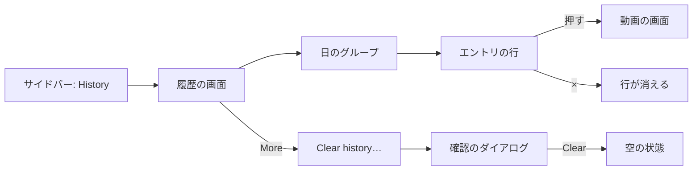
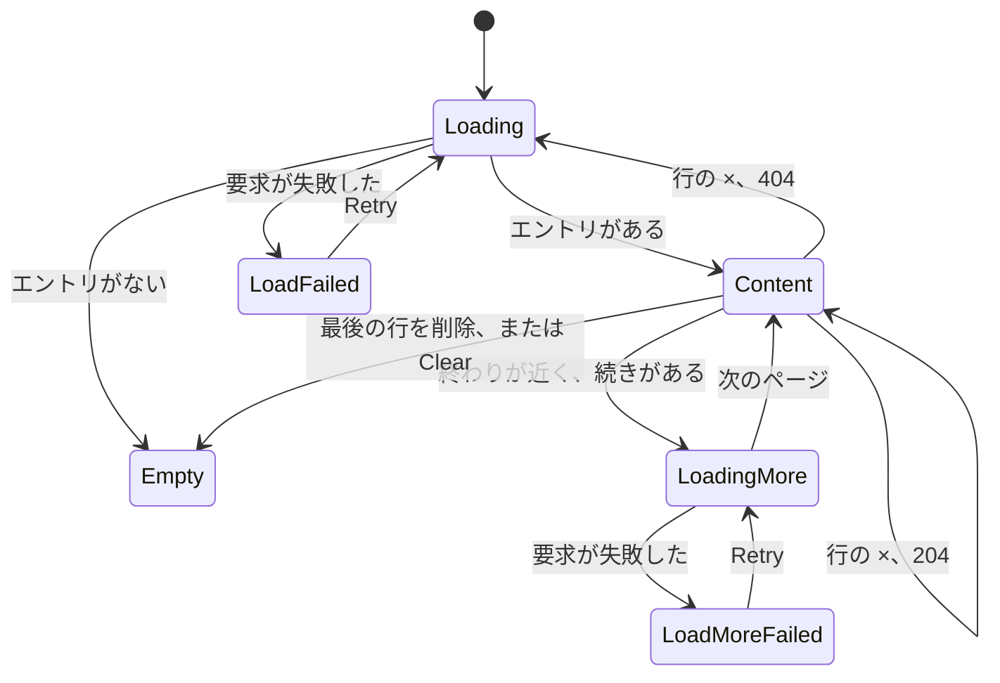

# UI 設計: 視聴履歴の画面 {#ui-design-watch-history-screen}

**機能**: [親 Issue #792](https://github.com/syudead/vv/issues/792) · [plan.md](plan.md) · [research.md R-3](research.md#r-3-the-entrys-time-is-the-server-time-of-the-first-save-with-its-id) · [R-5](research.md#r-5-an-entry-whose-content-left-the-library-stays-without-a-video) · [R-6](research.md#r-6-deleting-entries-is-a-plain-delete-a-vanished-entry-answers-404-and-the-screen-reloads) · [R-7](research.md#r-7-watch-history-is-one-more-owner-only-screen-and-route-with-the-existing-gate-rules) · [contracts/screen-api.md](contracts/screen-api.md) · [quickstart.md](quickstart.md)

すでに決めている出典。ここでは繰り返さず、リンクする。

| 話題 | 出典 |
| --- | --- |
| トークン、閉じた段階、ライブラリの密度 | [design-system.md の Foundations](../../docs/design-docs/design-system.md#foundations)。値は [`web/src/ui/tokens.css`](../../web/src/ui/tokens.css) の `@theme` にあり、ここでは名前で参照し、写さない |
| `ListPage`、`PageHeader`、状態のブロック、`LoadMoreRow` | [patterns.md の List page](../../web/registry/rules/patterns.md#list-page) と [States](../../web/registry/rules/patterns.md#states) |
| `ConfirmDialog`: 何を確認するか、`pending`、その中の失敗の `Alert` | [patterns.md の Confirm dialog](../../web/registry/rules/patterns.md#confirm-dialog) |
| `Button`、`DropdownMenu`、`Tooltip`、`Sonner`、`VideoThumbnail`: それぞれの用途 | [components.md の Button](../../web/registry/rules/components.md#button)、[DropdownMenu](../../web/registry/rules/components.md#dropdownmenu)、[Tooltip](../../web/registry/rules/components.md#tooltip)、[Sonner](../../web/registry/rules/components.md#sonner)、[VideoThumbnail](../../web/registry/rules/components.md#videothumbnail) |
| リスト表示の行: サムネイルの幅、タイトルの太さと行数の制限、再生できない動画の警告の行 | [library-ui.md の List view and selection](../../docs/design-docs/library-ui.md#list-view-and-selection)。[`VideoCard.tsx`](../../web/src/videoList/VideoCard.tsx) の現在の `VideoRow` |
| ツールバーのない所有者専用の一覧画面: 入口、ルート、`document.title`、行が消えた後のフォーカス | [030 UI 設計の Duplicates page](../030-video-versions/ui-design.md#duplicates-page)。現在の [`DuplicatesPage.tsx`](../../web/src/versions/DuplicatesPage.tsx) |
| サイドバーの項目、レールとドロワー、ゲストに見えないもの | [016 UI 設計の Sidebar](../016-single-account-auth/ui-design.md#sidebar) と [Guest degradation](../016-single-account-auth/ui-design.md#guest-degradation)。[`navigation.ts`](../../web/src/shell/navigation.ts)、[`AuthGate.tsx`](../../web/src/auth/AuthGate.tsx) |
| 日付と時刻はカタログのロケールで `Intl` が書式化する | [`web/src/i18n/format.ts`](../../web/src/i18n/format.ts) |
| CSS の幅のブレークポイント。人が確かめるレイアウト | [library-ui.md の Width breakpoints](../../docs/design-docs/library-ui.md#width-breakpoints-in-css-and-the-sidebar-exception)、[Layout verified by people](../../docs/design-docs/library-ui.md#layout-verified-by-people-not-machines) |
| 画面の文言 | [`web/src/i18n/en.ts`](../../web/src/i18n/en.ts)（`shell.nav`、`common`、`list`）。この機能は `history` と下の文言を加える |

図は、画面の部分と、それぞれの操作の行き先を示す。

変わらないもの: 動画の画面とその再開のしかた、ライブラリのカードとリスト表示、`Last played` の並べ替え、サイドバーのほかの項目、ゲート。

## この形にした理由 {#why-this-shape}

画面は、日の見出しの下にまとめたエントリの行を新しい順に並べる `ListPage` である。行はサムネイル、タイトル、時刻だけを持ち、ほかには何も持たない。親 Issue の `UI品質` は、目が止まるのを「いつ」と「何を」だけにし、数十のエントリを一度に見渡せることを求めている。そのため、行はライブラリのリスト表示の行から列を取り除いたものである。カードの `CardGrid` は採用しなかった。カードは 1 画面に並ぶエントリが少なく、履歴のエントリはログの 1 行なのに、どのエントリにもライブラリの項目と同じ重みを与えてしまう。日付の列を持つ `DataTable` も採用しなかった。日付がすべての行で繰り返され、「先週何を見たか」をひと目で答えられるようにする日のまとまりを、表では描けない。

日の見出しが日付を持ち、行は時刻だけを持つので、両者が同じことを二度言うことはない。日のグループの間隔は行の間隔より広い。日の見出しは、そのグループがスクロールする間トップバーの下に留まるので、3 画面下まで進んだ人も、どの日を読んでいるかが分かる。

エントリを 1 つ削除する操作は、行の端の控えめな `×` であり、確認はない。Issue が確認を求めるのはすべてを消す前だけであり（要件 8）、エントリを 1 つ失っても失うのは 1 分ぶんの記憶で、データではない。すべてを消す操作は、ヘッダーの `More` メニューの奥で 2 回押した先にあり、その後に `ConfirmDialog` が出る。ヘッダーに見える「Clear history」ボタンは、主な操作が動画を開くことである画面で最も目立つ操作になってしまい、それは Issue が挙げる要件を満たさない例である。項目が 1 つのメニューは珍しいが、それが狙いである。この操作は、探している人には見つかり、行の `×` に手を伸ばす人には見つからない。

内容がライブラリを離れたエントリは、押せないまま、スナップショットのタイトルと警告の行を付けて一覧に残る。Issue がエントリを残し、再生できないと分かることを求めているからである（Edge Case）。ファイルが戻るまで行を隠す案は R-5 で採用しなかった。

## 文言 {#words}

文言は `web/src/i18n/en.ts` の `history` の下に置く。キーを挙げたものは除く。ユーザーのデータ（タイトル）は引数として埋め込む。

| 場所 | 文言 | 備考 |
| --- | --- | --- |
| サイドバーの項目、ページのタイトル、`document.title` | History | `shell.nav.history`、`history.title`、`history.documentTitle` |
| 日の見出し、今日 | Today | `history.day.today` |
| 日の見出し、前日 | Yesterday | `history.day.yesterday` |
| 日の見出し、それ以外の日 | Sep 27, 2026 | その日の `formatDate` |
| エントリの時刻 | 3:04 PM | `formatTime`。`format.ts` に、カタログのロケールで `timeStyle: "short"` の `Intl.DateTimeFormat` として加える |
| エントリのリンクのアクセシブルな名前 | {title}, {duration} | 既存の `videoLinkLabel` |
| 削除ボタン、ツールチップ | Remove from history | `history.remove` |
| 削除ボタン、アクセシブルな名前 | Remove "{title}" from history | `history.removeFor` |
| ライブラリにないエントリ | Not in the library | `history.notInLibrary`。警告の行 |
| スナップショットのタイトルが空のエントリ | Unknown video | `history.unknownTitle` |
| ヘッダーのメニューボタン、ツールチップとアクセシブルな名前 | More | `common.more` |
| メニューの項目 | Clear history… | `history.clear` |
| ダイアログのタイトル | Clear watch history? | `history.clearDialog.title` |
| ダイアログの説明 | Every entry is removed. Playback positions and watched marks stay as they are. | `history.clearDialog.description` |
| ダイアログの操作 | Clear | `history.clearDialog.submit`。`destructive` |
| 送信中のダイアログの操作 | Clearing… | `history.clearDialog.submitting` |
| ダイアログの失敗 | Couldn't clear the history: {reason} | `history.clearDialog.failed`。ダイアログの中の `destructive` の `Alert` |
| 削除の失敗 | {reason} | トーストの `errorText(error)` |
| 空の状態のタイトル | No watch history | `history.empty.title` |
| 空の状態の説明 | Videos you play are listed here, newest first. | `history.empty.description` |
| 読み込みの失敗 | Couldn't load the history | `history.loadFailed`。`Retry` は `common.retry` |
| 続きの読み込み中、続きの読み込みの失敗 | Loading…, Couldn't load more: {reason} | 既存の `list.loading` と `list.loadMoreFailed` |

## サイドバーの項目とルート {#sidebar-entry-and-route}

「History」（lucide `History`、`/history`、`ownerOnly`）は、サイドバーの上のグループの 3 番目の項目で、「Folders」の後、「Tags」の前に置く。これで最初の 3 項目は見るものを探す画面になり、最後の 2 項目は管理になる。ゲストの上のグループは「Library」と「Folders」のままで、変わらない。レールとドロワーはこの項目をほかの項目と同じに扱い、件数のバッジはない。

ルートは `/duplicates` と同じ形である。`AppShell` の中にあり、使うときに読み込まれ、ゲートの所有者専用のパスに含まれる。そのため、`/history` を開いたゲストは `/login?next=/history` に送られる（R-7）。`document.title` は「History」である。

## 履歴の画面 {#history-screen}

`PageHeader` を持ち、ツールバー、帯、選択バーを持たない `ListPage` である。ヘッダーはタイトル「History」と、`actions` に `ghost` `icon-sm` のボタン 1 つ（lucide `Ellipsis`、`Tooltip`「More」）を持ち、このボタンは[履歴を消す](#clearing-the-history)のメニューを開く。件数は出さない。API は総数を返さず、数字は減らすべきものと読まれてしまう。本体は日のグループで、次のページを読み込む間はその後に `LoadMoreRow` が続く。または状態のブロック 1 つである。

### 日のグループ {#day-groups}

エントリは、ブラウザのタイムゾーンでの `playedAt` の暦日でまとめ、新しい日から並べる。1 日の中では API が返す順に並べる（R-3）。グループは `section` である。見出しの後に、その行を 1 つの `bg-card` の面に `rounded-md border border-border` で置き、行の間を `divide-y divide-border` で区切る。重複の画面が一覧を描くのと同じである。

| 部分 | 形 |
| --- | --- |
| 見出し | `h2`、`text-sm font-semibold text-foreground`、`py-2`。「Today」「Yesterday」、それ以外は `formatDate`。`sticky top-navbar z-10 bg-background` で、その行がスクロールして過ぎる間トップバーの下に留まり、次の日の見出しに押し出される |
| 行 | エントリの行。線で区切り、間隔は空けない |
| グループの間 | ページの本体で `gap-6`。グループの中では見出しとそのカードの間が `gap-2` |

日の境界は見る人のローカルの午前 0 時なので、午後 11:50 のエントリと午前 0:10 のエントリは 2 つのグループに分かれる。ページングで 1 日が 2 つのページに分かれることがある。次のページの最初のエントリが同じ日なら開いているグループに加わるので、同じ日が二度現れることはない。

### エントリの行 {#entry-row}

行は `flex items-center gap-3 p-2` である。左から右へ:

| 部分 | 形 |
| --- | --- |
| サムネイル | リスト表示の行と同じに描く `VideoThumbnail`: `w-list-thumb rounded-sm`、画像または「No image」のプレースホルダー、右下に長さ、動画が視聴途中の間は下端に `VideoThumbnailProgress`。お気に入り、選択の印、公開の印はない |
| タイトル | `text-sm font-medium text-foreground`、`line-clamp-2`、必要なら単語の途中で折り返す。`title` に全文。動画の現在の `video.title` |
| 2 行目 | `text-xs text-muted-foreground tabular-nums`: 時刻「3:04 PM」 |
| 削除 | lucide `X` を `text-muted-foreground` で描く `ghost` `icon-sm` の `Button`。`shrink-0` で行の端に置き、ツールチップは「Remove from history」。画面はタッチでも使うので、常に描き、ホバーのときだけ現すことはしない |

サムネイルと 2 つの行は、`state.from` を `/history` にした `/videos/{video.id}` への 1 つの `Link` である。そのため、動画の画面の `×` と Esc はここに戻る。リンクは削除ボタンまでの行を覆い、行の `hover:bg-accent` の塗りと `rounded-md` を持つ。そのため、`×` 以外の行のどこを押しても動画が開く（`UI品質`、操作の優先度）。動画の画面は、どこから開いたときとも同じに再開する（要件 5）。

同じ動画を二度見ると、サムネイルとタイトルが同じで時刻が違う 2 つの行になる（要件 4）。何もそれらをまとめず、数えない。

ライブラリにあるが再生できない動画（`playable` が false）はリンクを保ち、時刻の下にリスト表示の行の警告の行（`text-xs text-warning`、lucide `AlertTriangle` `size-3`、行の `unplayable` の文言）を出す。そのため、見る人は動画の画面が同じことを言う前にそれを知る。

### ライブラリにないエントリ {#entry-not-in-the-library}

`video` を持たないエントリ（R-5）は、次の違いを除いて同じ行である。

| 部分 | 形 |
| --- | --- |
| サムネイル | 「No image」のプレースホルダー（lucide `ImageOff`）の枠。長さも進み具合もない |
| タイトル | エントリのスナップショットの `title` を `text-muted-foreground` で。空のときは「Unknown video」（内容がすでにライブラリを離れていた、マイグレーションで埋めたエントリ） |
| 2 行目 | 時刻。その後の別の行に、警告「Not in the library」を `text-xs text-warning` で、lucide `AlertTriangle` `size-3` とともに |
| リンク | なし。サムネイルと行はただの要素で、行にホバーの塗りもポインターのカーソルもない |
| 削除 | ほかのすべての行と同じ |

意味を伝えるのは警告であり、色ではない。薄いタイトルとリンクがないことだけでは、読み込みの不具合と読まれてしまう。再スキャンの後に内容が戻ると、次に一覧を読んだときに行は動画、リンク、サムネイルを取り戻す。この画面はそれを見張らない。

### エントリを 1 つ削除する {#removing-one-entry}

`×` を押すと、すぐに `DELETE /api/watch-history/{id}` を送る。確認も成功のトーストもない。行が消えることが結果であり、削除のたびにトーストを出すと、片付けが通知の連続になってしまう。

| 出来事 | 振る舞い |
| --- | --- |
| 押した | ボタンは `disabled` になり、`X` の代わりに `Spinner` を出す。行は残る。二度目に押しても何も起きない |
| `204` | 行が消える。最後の行が消えた日は、見出しとともに消える。フォーカスは次の行の `×`、なければ前の行のもの、なければページのタイトル（`titleRef`）に移る。重複の画面と同じである |
| `404` | 一覧が古い（別のタブで削除された）。画面は最初のページから読み直し、そのページが届いたら、スケルトンもメッセージもなしに表示を置き換える（R-6）。ウィンドウは、短くなった一覧が許す限りスクロール位置を保つ |
| そのほかの失敗 | 行は残り、ボタンは `X` に戻り、トーストが `errorText(error)` を出す |

別のタブで再生中の動画のエントリを削除しても、何も止めない。そのタブの次の保存が新しいエントリを書き、この画面は次に読んだときにそれを出す（Edge Case）。

### 履歴を消す {#clearing-the-history}

ヘッダーの `More` は、項目が 1 つの `DropdownMenu` を開く。項目は「Clear history…」（lucide `Trash2`、`variant="destructive"`）で、`ConfirmDialog` を開く。一覧が読み込み中、失敗、空の間は、メニューボタンを描かない。消すものがないからである。

| 部分 | 形 |
| --- | --- |
| ダイアログ | `ConfirmDialog`: タイトル「Clear watch history?」、説明「Every entry is removed. Playback positions and watched marks stay as they are.」、先に `Cancel`、その後に `destructive` の操作「Clear」 |
| 送信中 | `pending`: 両方のボタンが無効になり、操作は `Spinner` とともに「Clearing…」と表示され、ダイアログは開いたままである |
| `204` | ダイアログが閉じ、本体は空の状態を出し、フォーカスはページのタイトルに移る |
| 失敗 | 説明の下に `destructive` の `Alert`「Couldn't clear the history: {reason}」。ダイアログは開いたままで、後ろの一覧は変わらない |
| Cancel、Esc | ダイアログが閉じ、何も変わらない（受け入れ条件 7） |

説明は残るものを挙げる。所有者がここで恐れる唯一のことは再開の位置を失うことであり（要件 9）、押す前に文言がそれを解消する。

### ページング {#paging}

最初の読み込みは既定のページ（`limit` 60）を求める。最後の行が下端から 1 ビューポート以内に来ると、ライブラリが `IntersectionObserver` でするのと同じに `nextCursor` で次のページを求め、最後のグループの下に `LoadMoreRow` を出す。ページの読み込みが失敗すると、行を保ったまま、同じカーソルへの `Retry` を持つ `LoadMoreRow` の失敗を出す。「Load more」ボタンもページ番号もない。履歴はスクロールで遡って読むものである（要件 6）。

### 状態 {#states}

図は、本体の状態と、状態の間を移すものを示す。

| 状態 | 画面に出すもの |
| --- | --- |
| Loading | `More` のないヘッダー。本体に見出しの高さの `Skeleton` 1 つと、行の高さの `Skeleton` 6 つ。`aria-hidden` |
| Load failed | 「Couldn't load the history」と `Retry` を持つ `ErrorState`。`More` はない |
| Empty | lucide `History`、「No watch history」、「Videos you play are listed here, newest first.」を持つ `EmptyState`。操作も `More` もない。消した後と、最後の行を削除した後も同じブロック |
| Content | 日のグループ。ヘッダーに `More` |
| Loading more | グループ、その後に読み込み中の `LoadMoreRow` |
| Load more failed | グループ、その後に `Retry` を持つ失敗の `LoadMoreRow` |
| Removing a row | その行の `×` が `Spinner`。ほかは変わらない |
| Clearing | 変わらない一覧の上に `pending` の形のダイアログ |

一覧は、画面を開いたときと、動画の画面からこの画面に戻ったときに読む（`Link` はルートを離れるので、画面は再びマウントされて最初のページを読み、終えたばかりの視聴がその先頭に来る）。開いている間に自分で更新はしない。Issue が挙げるタブをまたぐ変化は古くなった削除だけであり、それは `404` の経路が扱う（R-6）。

## レスポンシブな振る舞い {#responsive-behaviour}

実装は下の幅で判断する。

| 幅 | レイアウト |
| --- | --- |
| 360px | サイドバーはドロワーである。行は、サムネイル（`w-list-thumb`）、残りの幅のタイトルと時刻、端の `×` である。長いタイトルは 2 行で切り、`×` を行の外に押し出さない。日の見出し、カード、ヘッダーはページの `p-3` の端を共有する。ダイアログはダイアログ自身の余白で幅いっぱいに広がる |
| 768px | レールのサイドバー。同じ行で、タイトルの余地が広い。ほとんどのタイトルは 1 行に収まる |
| 1280px | 768px と同じ。行は重複の画面の行と同じに本体の幅まで伸び、タイトルはそれでもサムネイルのすぐ後から始まる。ダイアログは `max-w-lg` で中央に置く |

## レビューの基準 {#review-criteria}

360px、768px、1280px で画面を見て判断する。履歴は 4 日にわたる 30 以上のエントリを持ち、1 日に二度見た動画 1 つ、ファイルを削除したエントリ 1 つ、タイトルが空のエントリ 1 つを含む。

1. **視覚的な階層**: どの行でも、タイトルが最初に、時刻が 2 番目に読まれる。サムネイルはタイトルを支え、タイトルと競わない。日の見出しはページのタイトルの次に画面で最も強い文字であり、行の中の何も `primary`、`semibold`、より大きなサイズでは描かない。`×` は行で最も控えめな要素であり、`More` はヘッダーで最も控えめな要素である。
2. **情報の密度**: 1280×800 ではスクロールせずに 8 つ以上のエントリが画面にあり、360×780 では 5 つ以上ある。同じ幅でのライブラリのカードのグリッドはそれより少ない。行はサムネイル、タイトル、従の行 1 つを持ち、タグ、お気に入り、サイズ、画質、場所を持たない。
3. **余白のリズム**: 2 つの日のグループの間隔は、見出しとその行の間隔より目に見えて広く、グループの中の行は間隔なしに線で区切られる。そのため、日がブロックとして読める。2 日分をスクロールすると、現在の日の見出しがトップバーの下に留まり、次の日の見出しが来るとそれに置き換わる。
4. **文字組み**: タイトルはリスト表示の行のタイトルと同じ `text-sm` `font-medium` である。時刻は `tabular-nums` の `text-xs` `text-muted-foreground` で、1 日の時刻が揃う。日の見出しは `text-sm` `font-semibold` である。ライブラリのリスト表示と並べると、タイトルと従の行は同じサイズ、太さ、色である。
5. **操作の優先度**: 行の `×` 以外のどこを押しても動画が開き、動画は保存された位置から再開する。エントリを 1 つ削除するのは `×` を 1 回押すことである。消すには `More`、「Clear history…」、「Clear」と進み、最初の 2 つは決して画面で最も目立つ操作にならない。
6. **ライブラリにないエントリ**: 削除した動画の行は、タイトルを薄い色で、「Not in the library」を警告のアイコンとともに出し、ホバーの塗りはない。押しても何も開かない。その `×` は働く。タイトルが空のエントリは「Unknown video」と読める。ファイルが戻って再スキャンした後、行は再び動画を開く。
7. **削除と消去は再生に触れない**: 行を削除した後と消した後、その動画のライブラリのカードは、前と同じ進み具合のバー、視聴済みの印、「Last played」での位置を出す（受け入れ条件 6）。
8. **同じ動画を二度**: 1 日の 2 回の視聴は時刻の違う 2 つの行であり、画面の何もそれらを数えず、まとめない。
9. **確認**: 「Clear history…」はダイアログを開く。Cancel と Esc は一覧を変えずにそれを閉じる。「Clear」は「Clearing…」を出し、その後に空の状態を出す。要求が走る間、どちらのボタンも再び押せない。
10. **古い一覧**: 2 つのタブで一覧を開き、一方でエントリを削除し、次にもう一方で削除すると、2 番目のタブはエラーもトーストもなしに現在の一覧を出す。
11. **ゲスト**: ゲストとしてサインインすると、どの幅でもサイドバーに「History」はなく、`/history` を開くとログインの画面が出る（受け入れ条件 9）。
12. **要件を満たさない例**（`UI品質`）: タイトルと時刻が同じサイズと太さ。ヘッダーでタイトルの隣にある「Clear history」ボタン。すべての行で繰り返される日付。行の代わりのカード。すべての行で `destructive` で描いた `×`。
