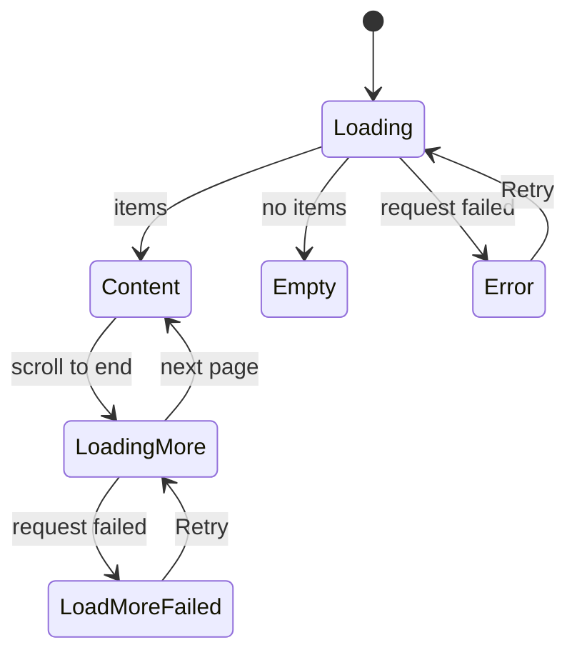

# Page patterns rules

Every new screen is one page skeleton from `web/src/ui/patterns`, filled with
sections, components and one state block where data is missing. The skeleton
and the sections own every margin, maximum width and gap; the screen passes
content into their slots and writes no spacing classes around them. The
reasons are in
[design-system.md, Page patterns](../../../docs/design-docs/design-system.md#page-patterns).

To build a screen: pick the skeleton from the table below, copy its example
block (`npx shadcn view ./registry/r/<name>-example.json`), then replace the
sample text and data with the screen's own, keeping the structure.

## Choosing the skeleton

| The screen                                                 | Skeleton         | Item               | Example block              |
| ---------------------------------------------------------- | ---------------- | ------------------ | -------------------------- |
| Lists many items the viewer browses, filters and selects   | `ListPage`       | `list-page`        | `list-page-example`        |
| Manages records in rows with bulk actions                  | `AdminTablePage` | `admin-table-page` | `admin-table-page-example` |
| Changes settings, one value per row                        | `SettingsPage`   | `settings-page`    | `settings-page-example`    |
| Shows one item to view, with its facts beside it           | `DetailPage`     | `detail-page`      | `detail-page-example`      |
| Exists only to submit one form (sign-in, first setup)      | `CenteredForm`   | `centered-form`    | `centered-form-example`    |
| Asks for a few values without leaving the current screen   | `FormDialog`     | `form-dialog`      | `form-dialog-example`      |
| Asks the viewer to confirm an action that cannot be undone | `ConfirmDialog`  | `confirm-dialog`   | `confirm-dialog-example`   |

The states of a list or table are shown in `list-states-example`.

Do not nest skeletons, and do not put a skeleton inside a `PageSection` or a
dialog. When no skeleton fits, add one to the design system first, with its
example block and a section here.

## Shared rules

- **Slots, not wrappers**: pass the header, toolbar, band, aside and body
  through the skeleton's props. Do not wrap a slot in a `div` with margins,
  padding, a gap or a maximum width; the skeleton already sets them.
- **No `className` on patterns**: skeletons and sections take no `className`.
  If a screen needs a different spacing, the pattern is wrong for it; change
  the pattern in the design system for every screen, or pick another one.
- **Density**: `ListPage`, `AdminTablePage`, `SettingsPage`, `CenteredForm`
  and the dialogs are library density (`sm` controls, `text-sm`, `p-3` rows).
  `DetailPage` is viewing density: its sections switch to `p-4` rows and
  `text-base` by themselves, and its controls use `default` and `lg`.
- **Text**: patterns hold no text. Every title, label, count and message comes
  from the caller through `t`.
- **One primary action per area**: the header's `actions`, a dialog footer, an
  empty state and a centered form each hold at most one `default` button.

## List page

Item `list-page`. `ListPage` stacks, top to bottom, with `gap-3` and `p-3`
(`p-4` from `sm`):

| Slot           | Put in it                                                                                   | Never                                                                   |
| -------------- | ------------------------------------------------------------------------------------------- | ----------------------------------------------------------------------- |
| `header`       | `PageHeader` with the title, the count and the one main action                              | Filters or view controls                                                |
| `toolbar`      | `Toolbar` with search, filter triggers and the view controls                                | The main action; a second row of filters                                |
| `band`         | The active filters (removable tag chips), when any apply                                    | Controls that change the view                                           |
| `aside`        | Tools that narrow the body and are read after it, such as a `JumpList`; at most one section | The body's content, the main action, filters that belong on the toolbar |
| children       | `CardGrid`, `DataTable` or `GroupedList`, then `LoadMoreRow`; or one state block            | A heading, a toolbar, page margins                                      |
| `selectionBar` | `SelectionBar`, only while something is selected                                            | Actions that do not use the selection                                   |

`toolbarRow="header"` puts the header and the toolbar on one row from `lg`,
the header at its own width and the toolbar filling the rest, for a page
whose title is short and whose toolbar is a filter and a search; below `lg`
they stack. `aside` is a column at the right of the body from `lg`,
`list-aside` wide (the named utility `grid-cols-list-aside`), stuck under the
top bar and scrolling inside itself when taller than the viewport; below
`lg` it is drawn full width between the band and the body, and the section
in it draws its own narrow form. The header, the toolbar and the aside stay
where they are in every state of the body.

A list people browse (the library, folder pages) puts its toolbar in the
shell's top bar: pass a `Toolbar` with `placement="topBar"` wrapped in the
shell's `TopBarPortal` as `toolbar`. The portal draws nothing in the page, so
the page starts with the header. The body is the only part that changes
between states: the header and the toolbar stay where they are while the body
shows loading, empty or an error.

## Admin table page

Item `admin-table-page`. `AdminTablePage` is one column, at most `max-w-4xl`,
centered. The header and the band stick under the top bar, so the create
action, the tabs and the selection stay in reach while the rows scroll; pass
`bandRef` to measure the stuck band, pass its bottom to the `DataTable`'s
`stickyHeaderTop` so the column header sticks right under it, and keep a
focused row clear of both:

| Slot           | Put in it                                                                                                                                      | Never                           |
| -------------- | ---------------------------------------------------------------------------------------------------------------------------------------------- | ------------------------------- |
| `toolbar`      | A `Toolbar` with `placement="topBar"` in the shell's `TopBarPortal`                                                                            | The create action               |
| `header`       | `PageHeader` with the title, the count and the create action; while rows are selected, a `SelectionBar` with `placement="header"` in its place | Bulk actions in the page header |
| `band`         | A `TabsList` that narrows the rows, then the active filter chips                                                                               | Controls that act on one row    |
| children       | `DataTable` with a check column, or one state block                                                                                            | Cards; a second table           |
| `selectionBar` | Only a bottom `SelectionBar` when the header cannot hold it                                                                                    | Actions that need no selection  |

Each row ends with a `DropdownMenu` of its own actions behind an `icon-sm`
ghost button. The destructive item opens a `ConfirmDialog`.

## Settings page

Item `settings-page`. `SettingsPage` is one column, at most `max-w-3xl`, with
the header and then `PageSection`s `gap-8` apart.

- One `PageSection` per topic, titled with a noun ("Library", "Server").
- Inside a section, one `FormRow` per setting, or a `FactList` for values the
  viewer cannot change.
- A setting that acts at once is a `Switch` or a `Select`; an action (scan,
  sign out) is an `outline` `sm` button in its own `FormRow`.

Do not put a save button at the end of the page: each row takes effect when it
changes. A group of values saved together belongs in a `FormDialog`.

## Detail page

Item `detail-page`. `DetailPage` fills the window edge to edge: a sticky header
band `navbar` high with a bottom border, then a main column and an aside
divided by a vertical border. The aside is `detail-aside` wide
(`detail-aside-wide` from `xl`); the columns sit `gap-6` apart inside `px-6`.
Below `lg` everything stacks: the media runs edge to edge under the band, and
the content below it and the aside keep `px-4` (`px-6` from `sm`) side
padding, with a border above the aside.

From `lg`, a screen that keeps the page at the viewport's height (it puts
`DetailPage` in a `lg:h-dvh` flex column) gets a main column that scrolls on its
own and an aside that is a flex column, so a list in it can scroll under its
heading while the header band and the media stay in view. Otherwise the page
scrolls as one under the sticky band.

| Slot     | Put in it                                                                       | Never                   |
| -------- | ------------------------------------------------------------------------------- | ----------------------- |
| `header` | The band's content: the brand or a ghost `Back` button, the location, a close × | A page title block      |
| `media`  | The player or image                                                             | Text or controls        |
| children | The title, tags and controls about the item, then its facts as one icon row     | A card around the facts |
| `aside`  | A small heading and a plain list of related items                               | Main actions; long text |

## Centered form

Item `centered-form`. `CenteredForm` centres one card, at most `max-w-sm`, in
the area around it, with the title, an optional description, the fields
(`Field` with `FieldLabel`) and one submit button as wide as the card. The
`footer` under the card holds a line of help or a link to another such screen.

Use it only for a screen that is nothing but the form. A form inside another
screen is a `FormDialog` or `FormRow`s in a `PageSection`.

## Form dialog

Item `form-dialog`. `FormDialog` is a `Dialog`, at most `max-w-lg` (32rem)
wide, with a title, an optional description, the fields and a footer with
`Cancel` and one `default` submit button named by what it does ("Create",
"Merge"). Below `sm` it spans the screen with a 16px margin. On a short
screen only the fields scroll; the title and the footer stay in the dialog.

Keep it to a few fields that belong to one action. Show a field's error with
`FieldError` under it and keep the dialog open; close it only when the action
has succeeded.

- Pass `pending` while the request runs: the submit button and `Cancel` are
  disabled, and the caller ignores closing until the request settles.
- Pass `submitDisabled` while a required value is missing or still being
  counted, and `submitRef` or `cancelRef` to move the focus back to a button
  after a failure. `initialFocus` names the element focused on open; without
  it the first focusable element is.
- Opened without a `trigger`, the dialog returns the focus to the element that
  had it before; an Esc that cancels an IME composition does not close it.

## Confirm dialog

Item `confirm-dialog`. `ConfirmDialog` is an `AlertDialog` that says what will
happen ("Delete "Travel"?"), what it affects, and offers `Cancel` and a
`destructive` action named by its verb ("Delete", "Reject"), never "OK" or
"Yes". Use it only before an action that cannot be undone; an action that can
be undone runs at once and offers its undo in a toast.

When the action is a request, pass `pending`: the action no longer closes the
dialog, both buttons are disabled while the request runs, and the caller
closes the dialog when the request succeeds. Show a failure as a
`destructive` `Alert` in `children` and keep the dialog open.
`actionDisabled` holds the action back until the dialog has what it needs,
such as the count of affected videos.

## Sections

| Section        | Item            | What it is                                                                                                                                                                                                                                                                                                                                                                                     |
| -------------- | --------------- | ---------------------------------------------------------------------------------------------------------------------------------------------------------------------------------------------------------------------------------------------------------------------------------------------------------------------------------------------------------------------------------------------- |
| `PageHeader`   | `page-header`   | The page title (`h1`, `text-xl`), a count, a one-line description, `leading` (Back, breadcrumb), actions; `titleRef` makes the title focusable for when nothing else can take the focus; `titleHidden` keeps the title for screen readers only, when a breadcrumb already shows the same name                                                                                                  |
| `Toolbar`      | `toolbar`       | Search, filter triggers, then view controls and actions; `page` wraps and collapses the view controls below `lg`, `topBar` is one row in the top bar that collapses them per control; `searchPlacement="end"` puts the search after the filters at the row's end                                                                                                                               |
| `PageSection`  | `page-section`  | A titled card (`h2`, `text-lg`); each direct child is one row, divided by a line and padded by the section                                                                                                                                                                                                                                                                                     |
| `FormRow`      | `form-row`      | A setting: label and description on the left, one control on the right; stacked below `sm`                                                                                                                                                                                                                                                                                                     |
| `FactList`     | `fact-list`     | Term and value pairs in two columns                                                                                                                                                                                                                                                                                                                                                            |
| `CardGrid`     | `card-grid`     | Cards at least `card-0` to `card-3` wide, stretched to fill the row, so both edges line up with the toolbar                                                                                                                                                                                                                                                                                    |
| `GroupedList`  | `grouped-list`  | Rows under headings (`h2`, `text-sm font-semibold`, with an optional `detail` after a `·` in `text-xs` muted on the same line) that stick under the top bar while their group scrolls; each row `py-2` on the page background with no card, no line and no horizontal padding, `gap-2` between a heading and its rows, and groups `gap-6` apart                                                |
| `JumpList`     | `jump-list`     | A `ToggleGroup type="single"` of jump targets in groups divided by `Separator`s; from `lg` a vertical list of full-width, left-aligned `sm` toggles in the muted colour under an `h2` (`text-sm font-semibold`) with an optional `action` after a last divider, and below `lg` one horizontally scrolling line of outlined `sm` chips with the heading for screen readers only and no `action` |
| `DataTable`    | `data-table`    | A `Table` on a card with its border; rows, heads and cells come from `table`; `stickyHeaderTop` sticks the column header that many px from the top, under an admin table page's stuck band                                                                                                                                                                                                     |
| `SelectionBar` | `selection-bar` | The count of selected items, `Clear selection` and the bulk actions; stuck to the bottom of the page, or in place of an admin table page's header (`placement="header"`)                                                                                                                                                                                                                       |

- `Toolbar`: put the search in `search`, filter triggers as children, view
  controls (sort, view mode, card size) in `view`, and actions that work
  without a selection in `actions`. Each `view` entry is `{ id, label,
control }`: inline, the controls stand without a visible name, so each needs
  an `aria-label`; collapsed, the popover shows `label` above each control. A
  control renders in both places, so give it no `id`.
  - `placement="page"` (default) sits in the page, wraps, and collapses all
    view controls into a labelled `View and sort` button below `lg`.
  - `placement="topBar"` sits in the top bar through `TopBarPortal` and never
    wraps: the search takes the remaining width, and each entry joins the row
    from its `inlineFrom` (`md`, `lg` or `xl`, default `lg`). Below that width
    it moves into an icon-only `View and sort` button. An entry can pass
    `compact` for its popover form (the sort's two radio columns, with
    `compactLabelled` when that form has its own legend) and `hideBelowSm`
    when it means nothing in one column (card size).
- `GroupedList`: pass a `label`, then one `GroupedListGroup` per heading
  (`heading`, and `detail` for the muted second part, such as the date after a
  day's name) with its rows as `GroupedListItem`s. A row lays its children
  out in one line; put the row's own content in it and write no padding,
  border, card or gap around the rows. A row's first element aligns with the
  heading, so a hover fill on a pressable row reaches the heading's edge. Use it when the headings carry information the rows then leave
  out, such as the day of a history; a table with a repeated column, or cards,
  is the wrong shape for it. Example block `grouped-list-example`.
- `Toolbar` `searchPlacement="end"` (`page` only): the search moves after the
  filters to the row's end, no wider than `max-w-sm`, for a row that begins
  with the page title (`ListPage toolbarRow="header"`); below `sm` it still
  takes its own line. `searchHiddenBelowLg` leaves it out below `lg` while the
  screen's own header toggle has not revealed it.
- `JumpList`: put it in `ListPage`'s `aside`. Pass the `title`, the `groups`
  of items (`{ value, label }`, newest first), the pressed `value` and
  `onValueChange`, which receives `null` when the pressed item is pressed
  again. While the items load pass `loading`; when there are none pass
  `emptyText`, shown from `lg` (below `lg` the strip is not drawn); when they
  failed pass `failed` with the message and `Retry`. `action` is the one
  quiet action that ends the column from `lg`, a `ghost-destructive` `sm`
  `Button`; below `lg` the screen offers it elsewhere, such as a `More` menu.
  The pressed chip is scrolled into view in the strip. Use it for jumping
  within one long list; a calendar would draw empty days.
- `PageSection`: put rows directly inside; do not add padding or borders to a
  row. Free text goes in one `
`, which becomes one padded row.
- `SelectionBar`: use `ghost` `sm` buttons with a visible name at every width,
  so the actions read on devices without hover; the bar wraps to a second line
  when they do not fit. A `destructive` action goes only through a
  `ConfirmDialog`.
  While a bulk action is in flight, disable the actions and pass
  `clearDisabled` so `Clear selection` is disabled too.

## States

Every list, table and section shows its data or exactly one of these blocks,
in the body slot of its skeleton, so the header and the toolbar never move.

| State            | Block                            | Shows                                                                                                |
| ---------------- | -------------------------------- | ---------------------------------------------------------------------------------------------------- |
| Loading          | `LoadingState` (`loading-state`) | `Skeleton` shapes of the final layout: `grid` cards, `table` rows or `grouped` rows under a heading  |
| Empty            | `EmptyState` (`empty-state`)     | An icon, a title saying why, a description, and the action that fills it when the viewer can take it |
| Error            | `ErrorState` (`error-state`)     | A `destructive` `Alert`: what failed, and `Retry` when retrying can help                             |
| Loading more     | `LoadMoreRow` (`load-more-row`)  | The content, then a `Spinner` row at the end                                                         |
| Load more failed | `LoadMoreRow` (`load-more-row`)  | The content kept, then an `Alert` row with `Retry`, which requests the same page again               |

Do not show a spinner over a whole page, replace the content with an error
when only the next page failed, or leave the body blank while loading.
