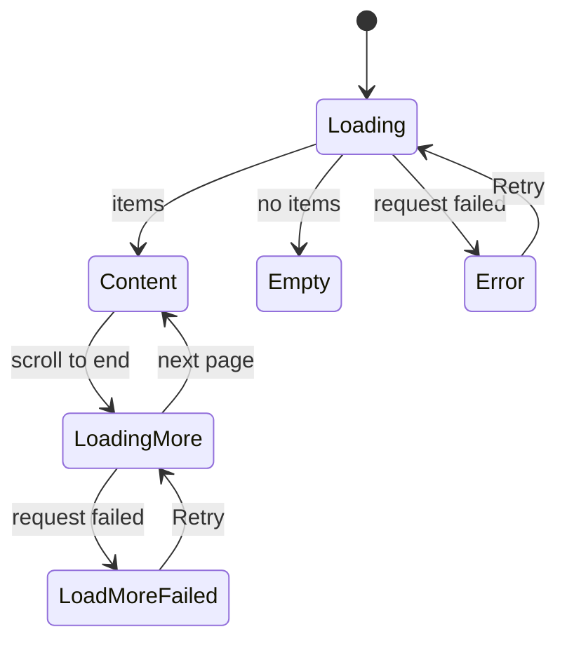

# Page patterns rules

Every new screen is one page skeleton from `web/src/ui/patterns`, filled with
sections, components and one state block where data is missing. The skeleton
and the sections own every margin, maximum width and gap; the screen passes
content into their slots and writes no spacing classes around them. The
reasons are in
[design-system.md, Page patterns](../../../docs/design-docs/design-system.md#page-patterns).

To build a screen: pick the skeleton from the table below, copy its example
block (`npx shadcn view ./registry/r/<name>-example.json`), then replace the
sample text and data with the screen's own, keeping the structure.

## Choosing the skeleton

| The screen                                                 | Skeleton         | Item               | Example block              |
| ---------------------------------------------------------- | ---------------- | ------------------ | -------------------------- |
| Lists many items the viewer browses, filters and selects   | `ListPage`       | `list-page`        | `list-page-example`        |
| Manages records in rows with bulk actions                  | `AdminTablePage` | `admin-table-page` | `admin-table-page-example` |
| Changes settings, one value per row                        | `SettingsPage`   | `settings-page`    | `settings-page-example`    |
| Shows one item to view, with its facts beside it           | `DetailPage`     | `detail-page`      | `detail-page-example`      |
| Exists only to submit one form (sign-in, first setup)      | `CenteredForm`   | `centered-form`    | `centered-form-example`    |
| Asks for a few values without leaving the current screen   | `FormDialog`     | `form-dialog`      | `form-dialog-example`      |
| Asks the viewer to confirm an action that cannot be undone | `ConfirmDialog`  | `confirm-dialog`   | `confirm-dialog-example`   |

The states of a list or table are shown in `list-states-example`.

Do not nest skeletons, and do not put a skeleton inside a `PageSection` or a
dialog. When no skeleton fits, add one to the design system first, with its
example block and a section here.

## Shared rules

- **Slots, not wrappers**: pass the header, toolbar, band, aside and body
  through the skeleton's props. Do not wrap a slot in a `div` with margins,
  padding, a gap or a maximum width; the skeleton already sets them.
- **No `className` on patterns**: skeletons and sections take no `className`.
  If a screen needs a different spacing, the pattern is wrong for it; change
  the pattern in the design system for every screen, or pick another one.
- **Density**: `ListPage`, `AdminTablePage`, `SettingsPage`, `CenteredForm`
  and the dialogs are library density (`sm` controls, `text-sm`, `p-3` rows).
  `DetailPage` is viewing density: its sections switch to `p-4` rows and
  `text-base` by themselves, and its controls use `default` and `lg`.
- **Text**: patterns hold no text. Every title, label, count and message comes
  from the caller through `t`.
- **One primary action per area**: the header's `actions`, a dialog footer, an
  empty state and a centered form each hold at most one `default` button.

## List page

Item `list-page`. `ListPage` stacks, top to bottom, with `gap-3` and `p-3`
(`p-4` from `sm`):

| Slot           | Put in it                                                         | Never                                    |
| -------------- | ----------------------------------------------------------------- | ---------------------------------------- |
| `header`       | `PageHeader` with the title, the count and the one main action    | Filters or view controls                 |
| `toolbar`      | `Toolbar` with search, filter triggers and the view controls      | The main action; a second row of filters |
| children       | `CardGrid` or `DataTable`, then `LoadMoreRow`; or one state block | A heading, a toolbar, page margins       |
| `selectionBar` | `SelectionBar`, only while something is selected                  | Actions that do not use the selection    |

The body is the only part that changes between states: the header and the
toolbar stay where they are while the body shows loading, empty or an error.

## Admin table page

Item `admin-table-page`. `AdminTablePage` puts a band between the header and
the table:

| Slot           | Put in it                                                            | Never                          |
| -------------- | -------------------------------------------------------------------- | ------------------------------ |
| `header`       | `PageHeader` with the title, the count and the create action         | Bulk actions                   |
| `band`         | A `TabsList` that narrows the rows, then a `Toolbar` with the search | Controls that act on one row   |
| children       | `DataTable` with a check column, or one state block                  | Cards; a second table          |
| `selectionBar` | `SelectionBar` with the bulk actions, while rows are selected        | Actions that need no selection |

Each row ends with a `DropdownMenu` of its own actions behind an `icon-sm`
ghost button. The destructive item opens a `ConfirmDialog`.

## Settings page

Item `settings-page`. `SettingsPage` is one column, at most `max-w-3xl`, with
the header and then `PageSection`s `gap-8` apart.

- One `PageSection` per topic, titled with a noun ("Library", "Server").
- Inside a section, one `FormRow` per setting, or a `FactList` for values the
  viewer cannot change.
- A setting that acts at once is a `Switch` or a `Select`; an action (scan,
  sign out) is an `outline` `sm` button in its own `FormRow`.

Do not put a save button at the end of the page: each row takes effect when it
changes. A group of values saved together belongs in a `FormDialog`.

## Detail page

Item `detail-page`. `DetailPage` puts the header band above a main area and an
information aside `detail-aside` wide; below `lg` the aside goes under the main
area. It is at most `max-w-7xl` wide, with `p-4` (`p-6` from `lg`) and `gap-6`.

From `lg`, a screen that keeps the page at the viewport's height (it puts
`DetailPage` in a `lg:h-dvh` flex column) gets a main area and an aside that
each scroll on their own, so the header and the media at the top of the main
area stay in view while the viewer browses the aside. Otherwise the page
scrolls as one.

| Slot     | Put in it                                                                | Never                       |
| -------- | ------------------------------------------------------------------------ | --------------------------- |
| `header` | `PageHeader` with a ghost `Back` button in `leading`, the title, actions | The media itself            |
| children | The media (player, image), then `PageSection`s about it                  | Facts that fit a `FactList` |
| `aside`  | `PageSection`s holding `FactList`s, tags and related items               | Main actions; long text     |

## Centered form

Item `centered-form`. `CenteredForm` centres one card, at most `max-w-sm`, in
the area around it, with the title, an optional description, the fields
(`Field` with `FieldLabel`) and one submit button as wide as the card. The
`footer` under the card holds a line of help or a link to another such screen.

Use it only for a screen that is nothing but the form. A form inside another
screen is a `FormDialog` or `FormRow`s in a `PageSection`.

## Form dialog

Item `form-dialog`. `FormDialog` is a `Dialog`, at most `max-w-lg` (32rem)
wide, with a title, an optional description, the fields and a footer with
`Cancel` and one `default` submit button named by what it does ("Create",
"Merge"). Below `sm` it spans the screen with a 16px margin.

Keep it to a few fields that belong to one action. Show a field's error with
`FieldError` under it and keep the dialog open; close it only when the action
has succeeded.

## Confirm dialog

Item `confirm-dialog`. `ConfirmDialog` is an `AlertDialog` that says what will
happen ("Delete "Travel"?"), what it affects, and offers `Cancel` and a
`destructive` action named by its verb ("Delete", "Reject"), never "OK" or
"Yes". Use it only before an action that cannot be undone; an action that can
be undone runs at once and offers its undo in a toast.

## Sections

| Section        | Item            | What it is                                                                                                                               |
| -------------- | --------------- | ---------------------------------------------------------------------------------------------------------------------------------------- |
| `PageHeader`   | `page-header`   | The page title (`h1`, `text-xl`), a count, a one-line description, `leading` (Back, breadcrumb), actions                                 |
| `Toolbar`      | `toolbar`       | Search, filter triggers, then view controls and actions at the end; below `lg` the view controls collapse into a `View and sort` popover |
| `PageSection`  | `page-section`  | A titled card (`h2`, `text-lg`); each direct child is one row, divided by a line and padded by the section                               |
| `FormRow`      | `form-row`      | A setting: label and description on the left, one control on the right; stacked below `sm`                                               |
| `FactList`     | `fact-list`     | Term and value pairs in two columns                                                                                                      |
| `CardGrid`     | `card-grid`     | Cards at least `card-0` to `card-3` wide, stretched to fill the row, so both edges line up with the toolbar                              |
| `DataTable`    | `data-table`    | A `Table` on a card with its border; rows, heads and cells come from `table`                                                             |
| `SelectionBar` | `selection-bar` | The count of selected items, `Clear selection` and the bulk actions, stuck to the bottom of the page                                     |

- `Toolbar`: put the search in `search`, filter triggers as children, view
  controls (view mode, card size, sort) in `view`, and actions that work
  without a selection in `actions`. Each `view` entry is `{ id, label,
control }`: from `lg` the controls stand inline without a visible name, so
  each needs an `aria-label`; below `lg` the popover shows `label` above each
  control. A control renders in both places, so give it no `id`.
- `PageSection`: put rows directly inside; do not add padding or borders to a
  row. Free text goes in one `
`, which becomes one padded row.
- `SelectionBar`: icon-only actions get an `aria-label` and a `Tooltip`; use
  `ghost` `sm` buttons, and a `destructive` action only through a
  `ConfirmDialog`.

## States

Every list, table and section shows its data or exactly one of these blocks,
in the body slot of its skeleton, so the header and the toolbar never move.

| State            | Block                            | Shows                                                                                                |
| ---------------- | -------------------------------- | ---------------------------------------------------------------------------------------------------- |
| Loading          | `LoadingState` (`loading-state`) | `Skeleton` shapes of the final layout: `grid` cards or `table` rows                                  |
| Empty            | `EmptyState` (`empty-state`)     | An icon, a title saying why, a description, and the action that fills it when the viewer can take it |
| Error            | `ErrorState` (`error-state`)     | A `destructive` `Alert`: what failed, and `Retry` when retrying can help                             |
| Loading more     | `LoadMoreRow` (`load-more-row`)  | The content, then a `Spinner` row at the end                                                         |
| Load more failed | `LoadMoreRow` (`load-more-row`)  | The content kept, then an `Alert` row with `Retry`, which requests the same page again               |

Do not show a spinner over a whole page, replace the content with an error
when only the next page failed, or leave the body blank while loading.
